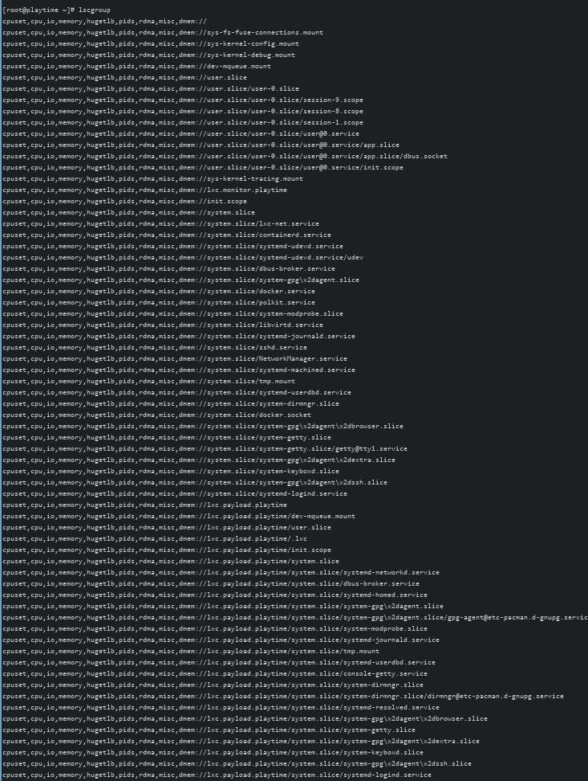
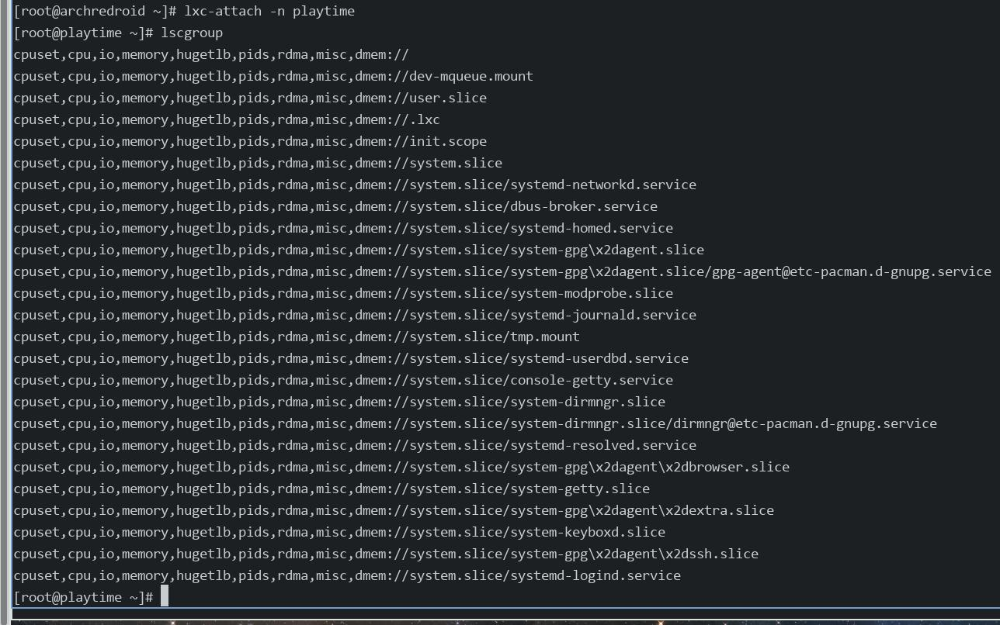

# 20250626
### 1. lxc debugging
Start lxc instance with debugging:      

```
lxc-start -n redroid11 --logfile=./redroid11.log --logpriority=DEBUG
lxc-start -n redroid11 --logfile=./redroid11.log --logpriority=TRACE
```
### 2. cgroup
Install `libcgroup` under archlinux, then use `lscgroup` to view the difference between lxc and `libvirt_lxc`.     

virsh based:     



lxc based:      



ubuntu based:    

```
root@2c245635395c:/# lscgroup 
cpuset,cpu,io,memory,hugetlb,pids,rdma,misc,dmem:/
```

arch/ubuntu based(privileged):    

```
# docker run --privileged  -it archlinux:latest /bin/bash
[root@4803b7b9d788 /]# lscgroup 
cpuset,cpu,io,memory,hugetlb,pids,rdma,misc,dmem://
```
### 3. libcgroup
Install via yay:     

```
yay -S libcgroup --mflags "--skippgpcheck"
```
