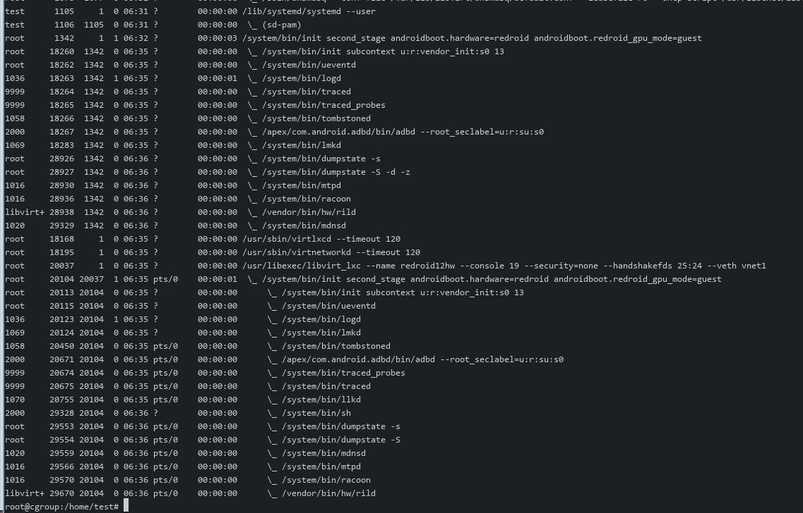
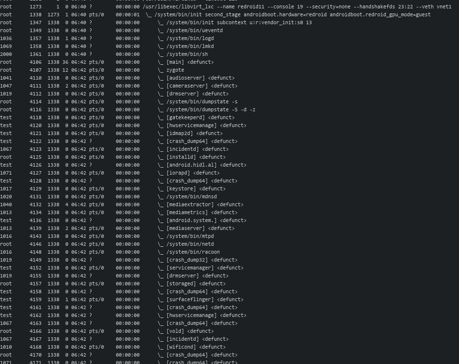
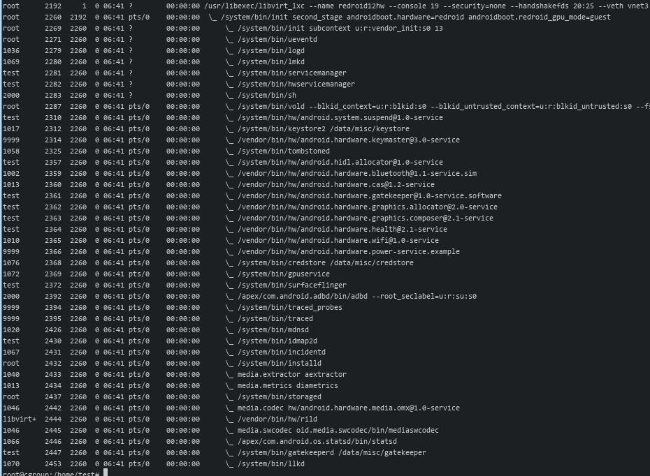

# 20250627
### 1. lxc/libvirt verification(ubuntu20.04)
Steps:     

```
modprobe binder_linux devices="binder,hwbinder,vndbinder"
$ uname -r
5.4.0-216-generic
```
Under the 5.4.x kernel(won't start up):       

```
root        6352       1  0 03:53 ?        00:00:00 /usr/libexec/libvirt_lxc --name redroid12hw --console 20 --security=none --handshakefds 28:27 --veth vnet335
root        6355    6352  0 03:53 ?        00:00:00  \_ /usr/libexec/libvirt_lxc --name redroid12hw --console 20 --security=none --handshakefds 28:27 --veth vnet335
```
Change to 5.15.0-139 via `apt install -y linux-image-generic-hwe-20.04`, could not run libvirt_lxc(official 6.0.0.).    

Download libvirt-6 and verify:         

```
tar xJvf libvirt-6.6.0.tar.xz
cd  libvirt-6.6.0
mkdir build
apt install -y python3-pip libtirpc-dev
cd build
 ../configure  --with-lxc --with-interface --with-init-script=systemd  --prefix=/usr
make -j8
make install
systemctl enable libvirtd
systemctl enable --now virtqemud.socket
systemctl enable --now virtlxcd.socket
systemctl enable --now virtnetworkd
reboot
```
Change to  `/usr/libexec/libvirt_lxc`, then start the instance.     

```
Stuck on :   
root        5971       1  0 06:22 ?        00:00:00 /usr/libexec/libvirt_lxc --name redroid11 
```

Build 8.0.0 version:      

```
 tar xJvf libvirt-8.0.0.tar.xz 
 cd libvirt-8.0.0

make modifications(`https://bugzilla.opensuse.org/attachment.cgi?id=863686&action=diff`):    

root@cgroup:/home/test# diff libvirt-8.0.0/src/lxc/lxc_process.c 8/libvirt-8.0.0/src/lxc/lxc_process.c 
56,58d55
< #include "virstring.h"
< #include "vircgroupbackend.h"
< #include "virsystemd.h"
1202,1206d1198
< 	    virCgroupBackend **cgroupBackends = virCgroupBackendGetAll();
< 	    g_autofree char *pidFile = NULL;
< 	    g_autofree char *pidStr = NULL;
< 	    g_auto(GStrv) pidList = NULL;
< 	    pid_t checkPid = 0;
1476,1497d1467
<     /* In an environment with hybrid cgroups and systemd the v2 backend is not available.
< 	     * Systemd however depends on V2 for unit naming. This causes the next two checks to fail.
< 	     * To work around this issue we retrieve the actual container pid and check on that instead. */
< 	    if (virSystemdHasMachined() == 0 && cgroupBackends[VIR_CGROUP_BACKEND_TYPE_V2]->available() == false) {
< 	        pidFile = g_strdup_printf("/proc/%lld/task/%lld/children", (long long int)vm->pid, (long long int)vm->pid);
< 	        if (virFileReadAll(pidFile, 1024 * 1024, &pidStr) < 0)
< 	            goto cleanup;
< 	
< 	        virTrimSpaces(pidStr, NULL);
< 	
< 	        pidList = g_strsplit(pidStr, " ", 2);
< 	        if (!pidList)
< 	            goto cleanup;
< 	
< 	        if (virStrToLong_i(pidList[0], NULL, 10, &checkPid) < 0)
< 	            goto cleanup;
< 	
< 	    } else {
< 	        checkPid = vm->pid;
< 	    }
< 
< 
1507c1477
<                                   checkPid, -1, priv->machineName,
---
>                                   vm->pid, -1, priv->machineName,

configure/build/make install
```
Result: redroid11 still not start OK.   



Change the kernel options:       

```
systemd.unified_cgroup_hierarchy=1
update-grub2 && reboot
```
Lots of defucnct in redroid11:    



redroid12, also not ok:    



Reverse the changes for `lxc_process.c` and rebuild, reboot.      

```
root@cgroup:/home/test# virsh -c lxc:/// start redroid12hw
error: Failed to start domain 'redroid12hw'
error: error from service: GDBus.Error:org.freedesktop.machine1.NoMachineForPID: PID 1360 does not belong to any known machine

```

have to adjust the cgroupfs now.      

### 2. xrandr set
for getting 1920x1080 resolution commands:      

```
  xrandr --newmode $(gtf 1920 1080 60 | grep Modeline | sed s/Modeline\ // | tr -d '"')
  xrandr --addmode VGA-1 1920x1080_60.00
``` 

