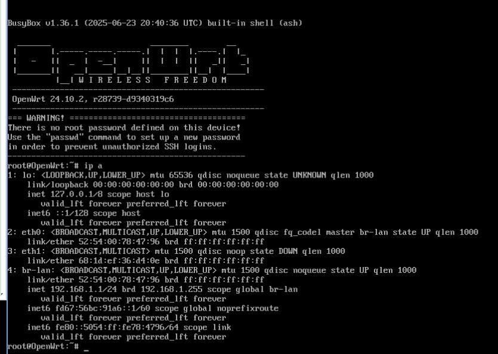
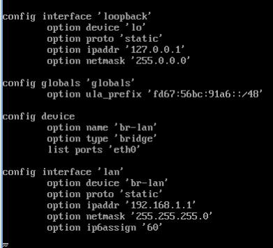
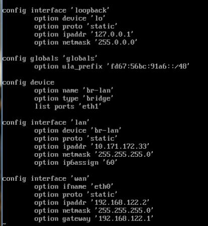
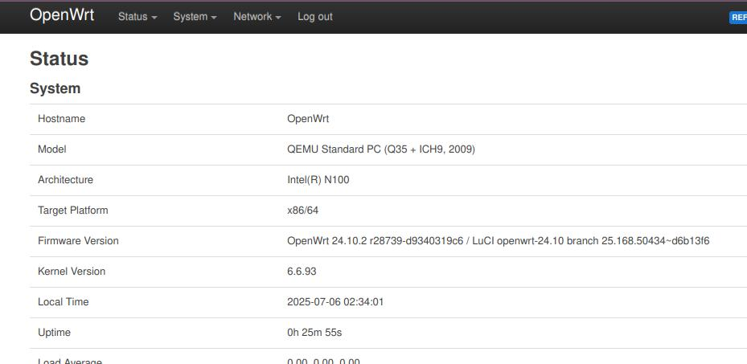
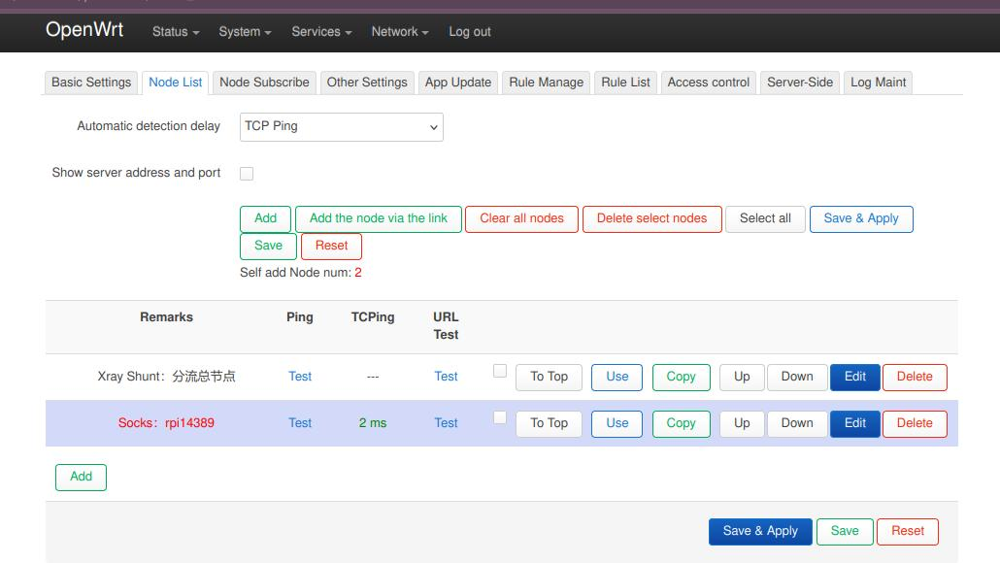
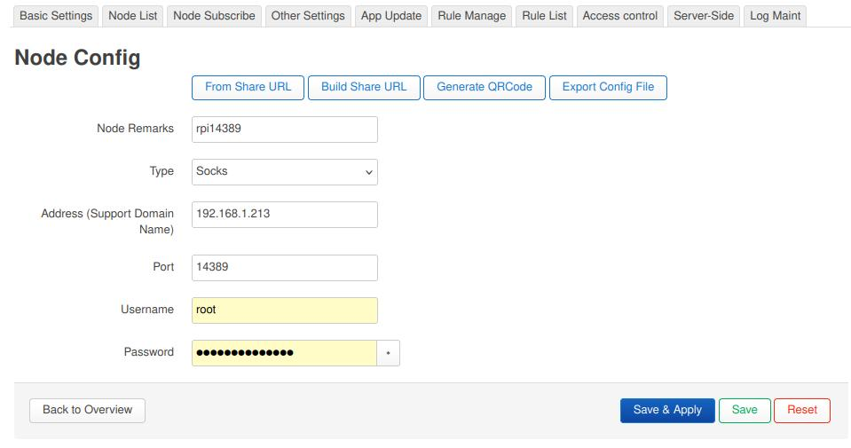
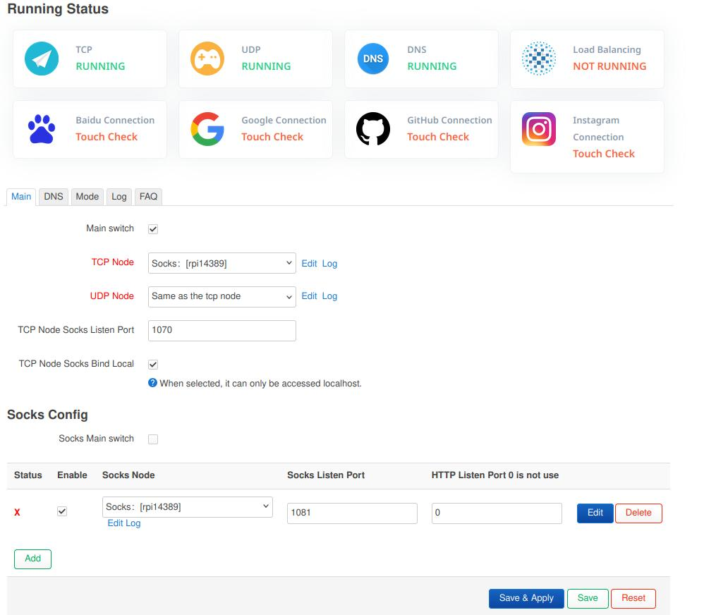
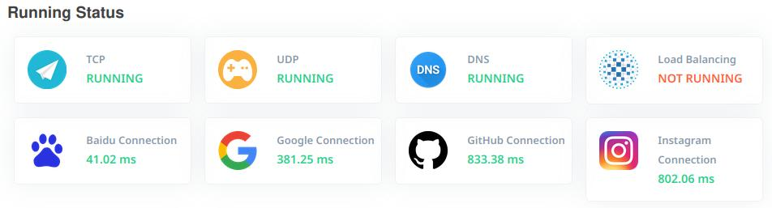
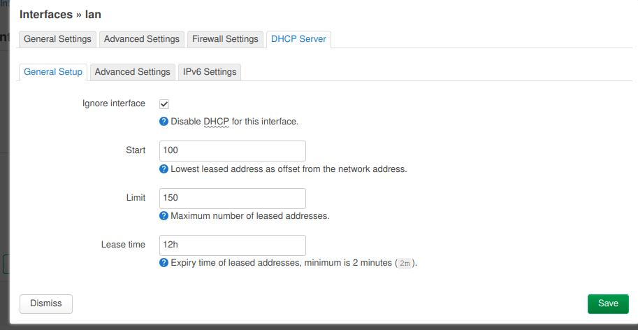

# 20250706
### 1. n100 openwrt
Enable `intel_iommu`:      

```
# cat /etc/nix/configuration.nix
......
    boot.kernelParams = [
    "quiet"
    "splash"
    "net.ifnames=0"
    "biosdevname=0"
    "ipv6.disable=1"
    "i915.force_probe=46d1"
    "intel_iommu=on"
    "intel_iommu=pt"
    #"usbcore.quirks=0bda:8153:k"
    #"drm_kms_helper.edid_firmware=edid/1920x1080.bin"
    #"video=DP-1:e"
  ];

```
Added eth0, passthrough to vm ,then in vm:    



Default network configuration:    



Make modifications to networking:     



Apply the modifications via `service networking restart`. Then setup the passwd for root `passwd root`.      

Enable access luci from wan:     

```
uci set firewall.wan_https_allow=rule
uci set firewall.wan_https_allow.name='Allow Luci from WAN'
uci set firewall.wan_https_allow.src='wan'
uci set firewall.wan_https_allow.proto='tcp'
uci set firewall.wan_https_allow.dest_port='80 443'
uci set firewall.wan_https_allow.target='ACCEPT'
uci commit firewall
/etc/init.d/firewall reload

```
Enable ssh from wan:     

```
uci add firewall wan_ssh_allow
uci set firewall.wan_ssh_allow=rule
uci set firewall.wan_ssh_allow.name='Allow SSH from WAN'
uci set firewall.wan_ssh_allow.src='wan'
uci set firewall.wan_ssh_allow.proto='tcp'
uci set firewall.wan_ssh_allow.dest_port='22'
uci set firewall.wan_ssh_allow.target='ACCEPT'
/etc/init.d/firewall reload
```
On nixos, do port forwarding:    

```
ssh -L 0.0.0.0:18880:192.168.122.2:80 root@192.168.122.2
```



Configuration for passwall:   



no passwd:    



Add a socks config, and check `Main switch`:     



Check status:    



Disable default dhcp server on this server:     



