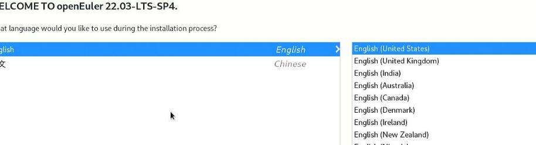
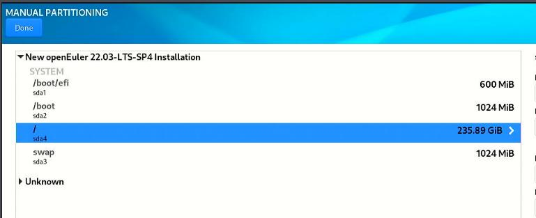
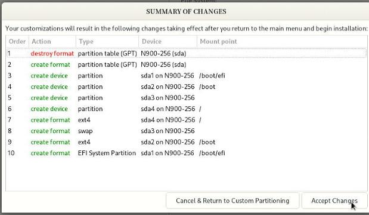
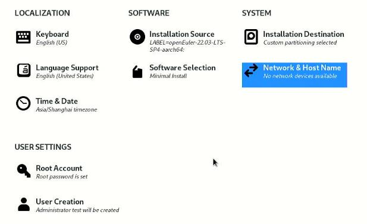
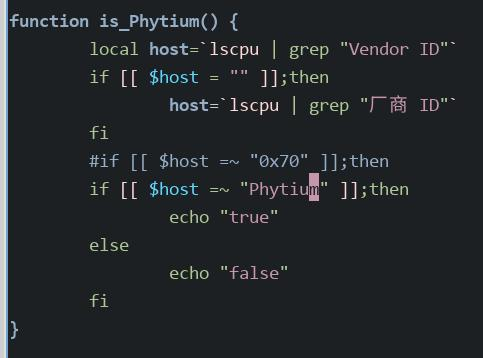
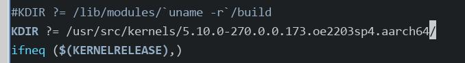
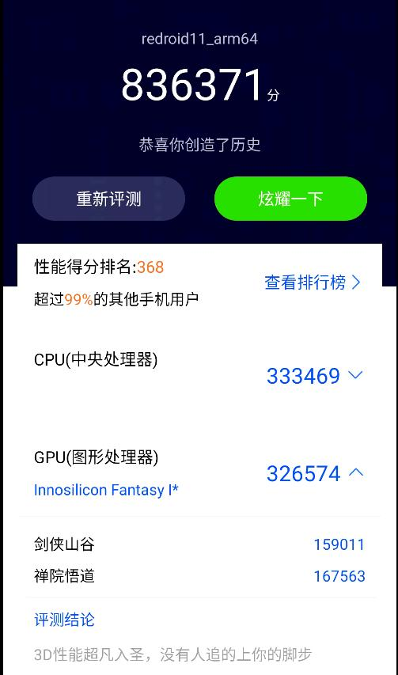
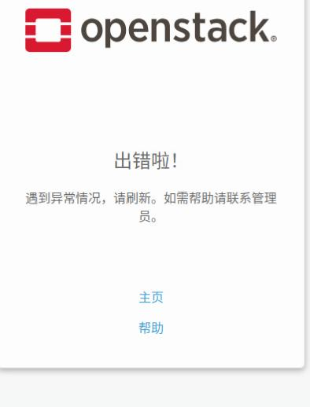
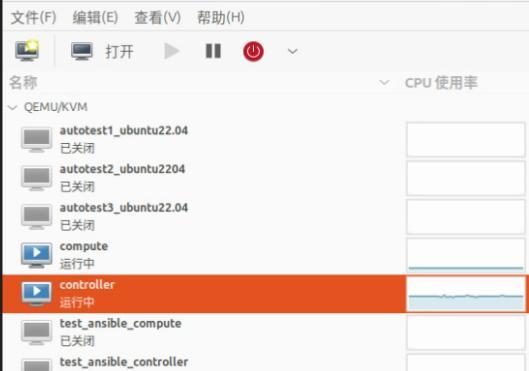

# 20250707
### 1. ibox on openeuler
Install OpenEuler 22.03.4(`sudo dd if=./openEuler-22.03-LTS-SP4-aarch64-dvd.iso of=/dev/sdb bs=10M && sudo sync`):     



disk layout:    







Replace repository:     

```
sudo sed -E 's#https?://(repo|mirrors)\.openeuler\.org/#https://mirrors.ustc.edu.cn/openeuler/#g' \
         -i.bak \
         /etc/yum.repos.d/openEuler.repo$a
yum makecache
scp root@192.168.1.33:/home/xxx/2.4.zip .
yum install -y tar unzip vim net-tools pciutils
```
Kernel related:     

```
yum update -y
# cat /etc/selinux/config | grep disable
SELINUX=disabled
# systemctl disable --now firewalld.service
# vim /etc/yum.repos.d/docker-ce.repo
[docker-ce-stable]
name=Docker CE Stable - $basearch
baseurl=https://repo.huaweicloud.com/docker-ce/linux/centos/7/$basearch/stable
enabled=1
gpgcheck=1
gpgkey=https://repo.huaweicloud.com/docker-ce/linux/centos/gpg
 
[docker-ce-stable-debuginfo]
name=Docker CE Stable - Debuginfo $basearch
baseurl=https://repo.huaweicloud.com/docker-ce/linux/centos/7/debug-$basearch/stable
enabled=0
gpgcheck=1
gpgkey=https://repo.huaweicloud.com/docker-ce/linux/centos/gpg
 
[docker-ce-stable-source]
name=Docker CE Stable - Sources
baseurl=https://repo.huaweicloud.com/docker-ce/linux/centos/7/source/stable
enabled=0
gpgcheck=1
gpgkey=https://repo.huaweicloud.com/docker-ce/linux/centos/gpg
 
[docker-ce-test]
name=Docker CE Test - $basearch
baseurl=https://repo.huaweicloud.com/docker-ce/linux/centos/7/$basearch/test
enabled=0
gpgcheck=1
gpgkey=https://repo.huaweicloud.com/docker-ce/linux/centos/gpg
 
[docker-ce-test-debuginfo]
name=Docker CE Test - Debuginfo $basearch
baseurl=https://repo.huaweicloud.com/docker-ce/linux/centos/7/debug-$basearch/test
enabled=0
gpgcheck=1
gpgkey=https://repo.huaweicloud.com/docker-ce/linux/centos/gpg
 
[docker-ce-test-source]
name=Docker CE Test - Sources
baseurl=https://repo.huaweicloud.com/docker-ce/linux/centos/7/source/test
enabled=0
gpgcheck=1
gpgkey=https://repo.huaweicloud.com/docker-ce/linux/centos/gpg
 
[docker-ce-nightly]
name=Docker CE Nightly - $basearch
baseurl=https://repo.huaweicloud.com/docker-ce/linux/centos/7/$basearch/nightly
enabled=0
gpgcheck=1
gpgkey=https://repo.huaweicloud.com/docker-ce/linux/centos/gpg
 
[docker-ce-nightly-debuginfo]
name=Docker CE Nightly - Debuginfo $basearch
baseurl=https://repo.huaweicloud.com/docker-ce/linux/centos/7/debug-$basearch/nightly
enabled=0
gpgcheck=1
gpgkey=https://repo.huaweicloud.com/docker-ce/linux/centos/gpg
 
[docker-ce-nightly-source]
name=Docker CE Nightly - Sources
baseurl=https://repo.huaweicloud.com/docker-ce/linux/centos/7/source/nightly
enabled=0
gpgcheck=1
gpgkey=https://repo.huaweicloud.com/docker-ce/linux/centos/gpg
# yum makecache
# yum install docker-ce docker-ce-cli containerd.io
# systemctl enable docker
# systemctl start docker
```
Build dkms:      

```
cd dkms_target
dkms add .
dkms install -m innogpu-kernel -v 2.4.4.17
reboot
```
Check the status:     

```
[root@euler ~]# lspci -vvnn -s 07:00.0 | grep -i Kernel
	Kernel driver in use: inno-drv
	Kernel modules: innogpu
[root@euler ~]# lspci | grep -i vga
07:00.0 VGA compatible controller: Device 1ec8:8810
```
Import docker images:      

```
# cat inno-11-arm64-release-redroid_2.4.4.17.tar | docker import -c 'ENTRYPOINT ["/init", "qemu=1","androidboot.hardware=innogpu"]' - inno-11-arm64-release-redroid_2.4.4.17
sha256:d7008492c97f9ed42fef05c8d53ecab858e0d95eea57afae9a7d99e700784288
# docker images
REPOSITORY                               TAG       IMAGE ID       CREATED          SIZE
inno-11-arm64-release-redroid_2.4.4.17   latest    d7008492c97f   37 seconds ago   1.71GB
```
kernel rebuild:      

```
# pahole related: 
yum install -y cmake
wget https://git.kernel.org/pub/scm/devel/pahole/pahole.git/snapshot/pahole-1.23.tar.gz
cd pahole-1.23.tar.gz 
tar xzvf pahole-1.23.tar.gz 
cd pahole-1.23
cd lib/bpf/
wget https://github.com/libbpf/libbpf/archive/refs/tags/v0.6.0.zip
unzip v0.6.0.zip 
mv libbpf-0.6.0/* .
cd ../../
mkdir build
cd build
 cmake -D__LIB=lib -DCMAKE_INSTALL_PREFIX=/usr -DBUILD_SHARED_LIBS=ON ..
make install
cp /usr/lib/libdwarves* /usr/lib64/
# kernel rebuild
dnf install -y kernel-source
dnf install -y rpm-build openssl-devel bc rsync gcc gcc-c++ flex bison m4 elfutils-libelf-devel
cd /usr/src/linux-5.10.0-270.0.0.173.oe2203sp4.aarch64/
vim Makefile 
make openeuler_defconfig
make menuconfig
make binrpm-pkg -j8
ls /root/rpmbuild/RPMS/aarch64/ -l -h
# kernel output rpms
total 645M
-rw-r--r-- 1 root root 643M Jul  7 14:13 kernel-5.10.1-2.aarch64.rpm
-rw-r--r-- 1 root root 1.4M Jul  7 14:08 kernel-headers-5.10.1-2.aarch64.rpm
# Install kernel
yum install ./kernel-5.10.1-2.aarch64.rpm ./kernel-headers-5.10.1-2.aarch64.rpm
grubby --set-default /boot/vmlinuz-5.10.1 
# After reboot
[root@euler ~]# uname -a
Linux euler 5.10.1 #2 SMP Mon Jul 7 14:05:22 CST 2025 aarch64 aarch64 aarch64 GNU/Linux
[root@euler ~]# grep "ashmem" /proc/misc
 61 ashmem
```
make modifications for env:     

```
# vim env
CONTAINER_DNS=10.0.110.2
BINDER_KO_PATH=/root/Code/2.4.4.17/drivers/binderfs/5.10/
AOSP_BINDER_KO_PATH=/root/DRIVER/drivers/aosp_binder
#ASHMEM_KO_PATH=/root/DRIVER/drivers/ashmem/5.4
INNGPU_KO_PATH=/root/Code/2.4.4.17/dkms_target/
#INNGPU_KO_PATH=/lib/modules/5.4.93/updates/dkms/
CONTAINER_DATA_PATH=`pwd`/data/
ANDROID_IMG=inno-11-arm64-release-redroid_2.4.4.17
```
Change modifications:    



Make modifications to `/root/Code/2.4.4.17/drivers/binderfs/5.10/Makefile`:    

   

Create ibox:     

```
./ibox.sh install
./ibox.sh start 1 2
```
Result:    



### 2. zue on openstack
Followed via `https://asterfusion.com/blog20240802-openstack-zun/?srsltid=AfmBOorLissgEI9JbeZp4MZJKlvECiwKRjGk8lAQvXMCPWyvOYzRUB4n`, but failed with many issues:      



```
docker run --net test_net -it cirros /bin/sh
docker: Error response from daemon: failed to create endpoint nifty_bell on network test_net: NetworkDriver.CreateEndpoint: 500 Internal Server Error: The server encountered an internal error and was unable to complete your request. Either the server is overloaded or there is an error in the application.
ERRO[0001] error waiting for container: context canceled 
```
Environment:      




