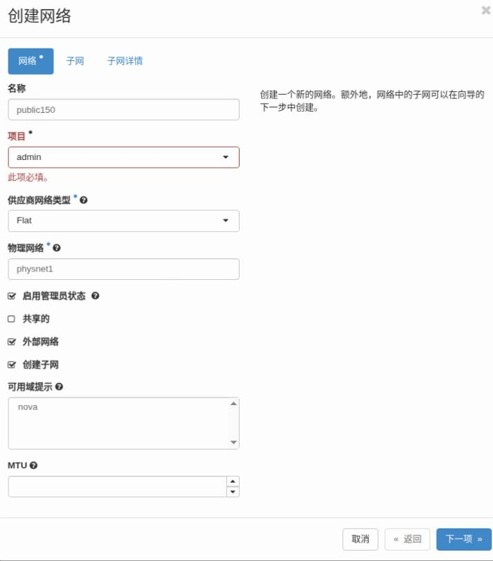
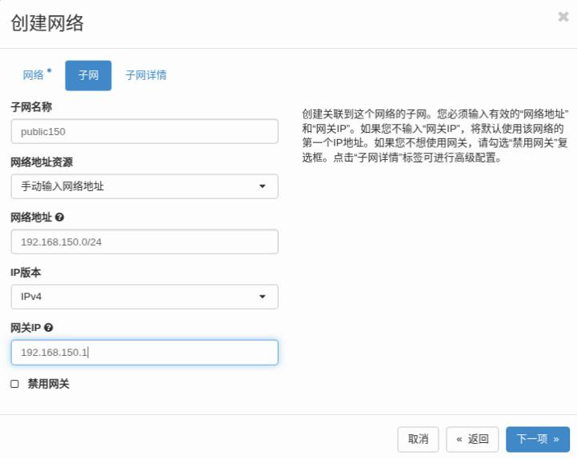
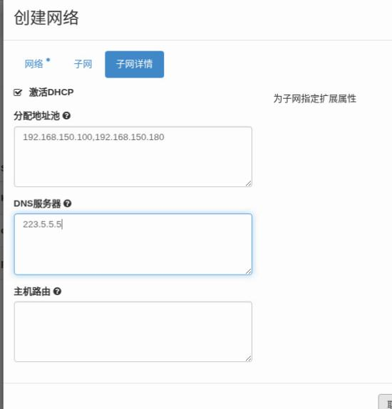

# 20250709
### 1. kolla(2024.1)
Deployment for kolla(zun disabled), succeed:      

```
vim /etc/kolla//globals.yml
    enable_zun: "no"
kolla-ansible prechecks -i ./multinode -e prechecks_enable_host_ntp_checks=false
kolla-ansible pull -i ./multinode 
kolla-ansible deploy -i ./multinode 
kolla-ansible post-deploy -i ./multinode 
cat /etc/kolla/admin-openrc.sh 
pip3 install python-openstackclient
pip3 install python-zunclient
###. kolla-ansible/tools/init-runonce 

```
Deployment for kolla(zun enabled):      

Succeed.     

Create network:    







NOT OK via webpage.      

commands for creating network:      

```
 openstack router create Ext-Router
 openstack network create --internal --provider-network-type vxlan int-net
 openstack subnet create int-net-sub --network int-net --subnet-range 177.77.77.0/24 --gateway 177.77.77.1 --dns-nameserver 114.114.114.114
 openstack router add subnet Ext-Router int-net-sub
 openstack network create --provider-physical-network physnet1 --provider-network-type flat  --external ext-net
 openstack subnet create ext-net-sub --network ext-net --subnet-range 192.168.150.40/24  --allocation-pool start=192.168.150.100,end=192.168.150.200 --gateway 192.168.150.1 --dns-nameserver 114.114.114.114 --dhcp
 openstack router set Ext-Router --external-gateway ext-net

```
### 2. run redroid under zun
Command:     

```
docker run -itd --privileged --name redroid12 -v ~/data:/data     -p 5555:5555      redroid12houdini:latest
```
openstack appcontainer:     

```
openstack appcontainer run --privileged --name mm --image-pull-policy=never --net network=bb819c23-cdfc-43b4-8de9-928332045211  --cpu 4 --memory 8192  redroid12houdini:latest
```

??? 
### 3. kolla ansible testing
Testing:    

```
cp /media/sda/images/kolla_ansible1.qcow2.beforezun /media/sda/images/kolla_ansible1.qcow2 && cp /media/sdb/images/kolla_ansible2.qcow2.beforezun /media/sdb/images/kolla_ansible2.qcow2 && cp /media/sdc/images/kolla_ansible3.qcow2.beforezun /media/sdc/images/kolla_ansible3.qcow2 && virsh start kolla_ansible1 && virsh start kolla_ansible2 && virsh start kolla_ansible3
```
After pull image, then :      

```
cp /media/sda/images/kolla_ansible1.qcow2 /media/sda/images/kolla_ansible1.qcow2.pullimage && cp /media/sdb/images/kolla_ansible2.qcow2 /media/sdb/images/kolla_ansible2.qcow2.pullimage  && cp /media/sdc/images/kolla_ansible3.qcow2 /media/sdc/images/kolla_ansible3.qcow2.pullimage && virsh start kolla_ansible1 && virsh start kolla_ansible2 && virsh start kolla_ansible3
```

Redeploy:     

```
cp /media/sda/images/kolla_ansible1.qcow2.pullimage /media/sda/images/kolla_ansible1.qcow2 && virsh start kolla_ansible1
cp /media/sdb/images/kolla_ansible2.qcow2.pullimage /media/sdb/images/kolla_ansible2.qcow2 && virsh start kolla_ansible2
cp /media/sdc/images/kolla_ansible3.qcow2.pullimage /media/sdc/images/kolla_ansible3.qcow2 && virsh start kolla_ansible3
```
