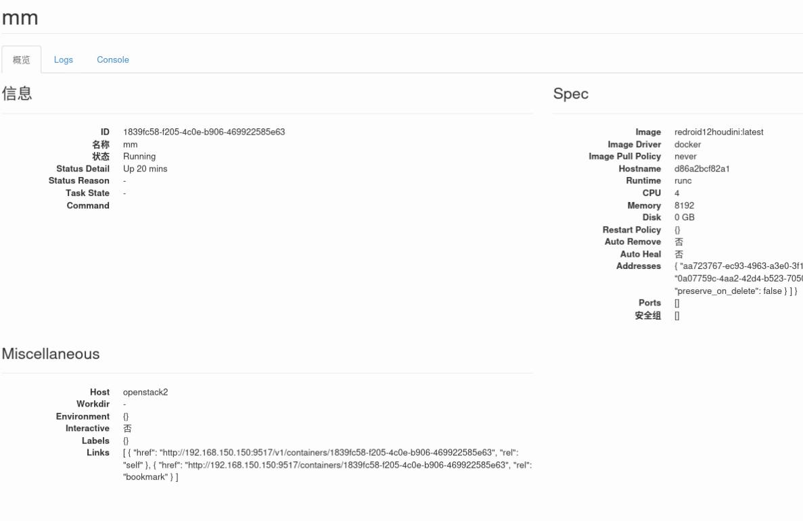
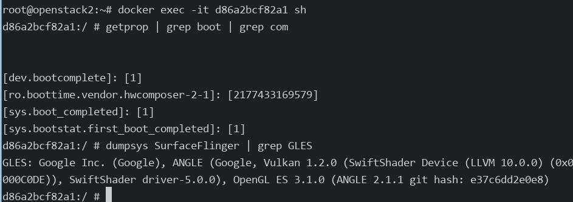
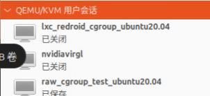
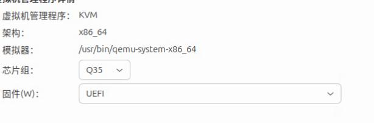
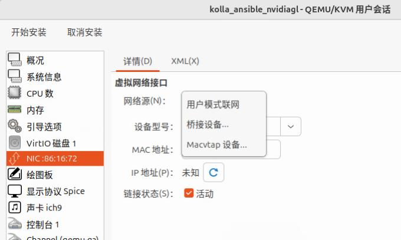
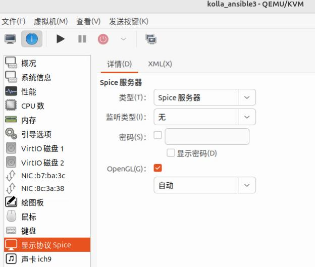
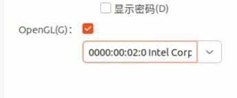
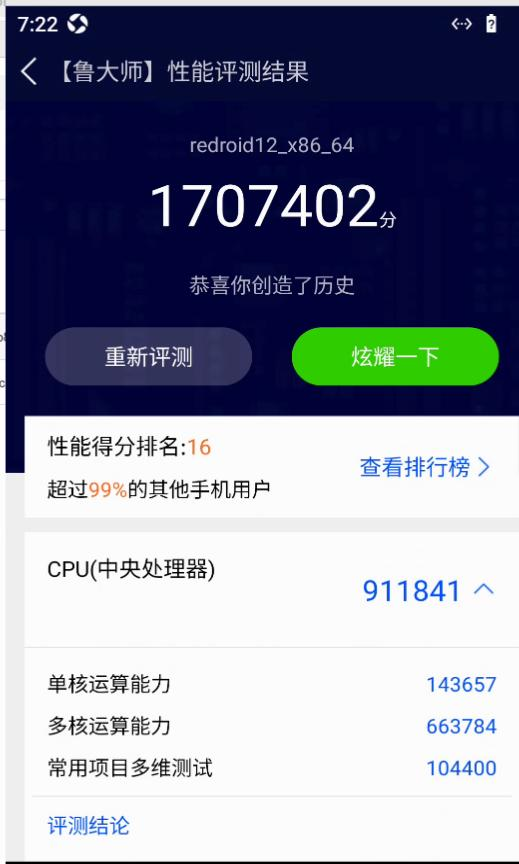
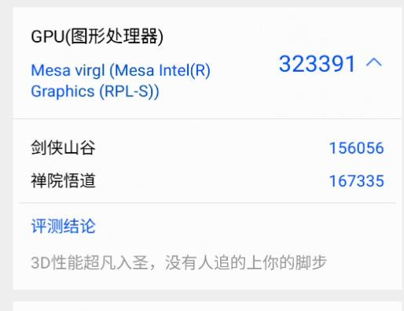

# 20250710
### 1. zun privileged
`policy.json` is fetched from `https://opendev.org/openstack/zun/src/commit/83d525c42541774cc07cf31f551551af34370993/etc/zun/policy.json`, added `"container:create:privileged": "rule:admin_or_user",`.      

```
{
    "context_is_admin":  "role:admin",
    "admin_or_owner":  "is_admin:True or project_id:%(project_id)s",
    "default": "rule:admin_or_owner",
    "admin_api": "rule:context_is_admin",
    "admin_or_user": "is_admin:True or user_id:%(user_id)s",

    "container:create": "rule:default",
+++    "container:create:privileged": "rule:admin_or_user",
    "container:delete": "rule:admin_or_user",
    "container:get": "rule:default",
    "container:get_all": "rule:default",
    "container:update": "rule:admin_or_user",
    "container:start": "rule:admin_or_user",
    "container:stop": "rule:admin_or_user",
    "container:reboot": "rule:admin_or_user",
    "container:pause": "rule:admin_or_user",
    "container:unpause": "rule:admin_or_user",
    "container:logs": "rule:admin_or_user",
    "container:execute": "rule:admin_or_user",
    "container:execute_resize": "rule:admin_or_user",
    "container:kill": "rule:admin_or_user",
    "container:update": "rule:admin_or_user",
    "container:rename": "rule:admin_or_user",
    "container:attach": "rule:admin_or_user",
    "container:resize": "rule:admin_or_user",
    "container:top": "rule:admin_or_user",
    "container:get_archive": "rule:admin_or_user",
    "container:put_archive": "rule:admin_or_user",
    "container:stats": "rule:admin_or_user",
    "container:commit": "rule:admin_or_user",
    "image:pull": "rule:default",
    "image:get_all": "rule:default",
    "image:search": "rule:default",


    "zun-service:delete": "rule:admin_api",
    "zun-service:disable": "rule:admin_api",
    "zun-service:enable": "rule:admin_api",
    "zun-service:get_all": "rule:admin_api"
}
```
Controller node:     

```
# docker ps | grep zun
02e8cb126ffa   quay.nju.edu.cn/openstack.kolla/zun-wsproxy:2024.1-ubuntu-jammy                 "dumb-init --single-…"   3 hours ago   Up 27 minutes (healthy)             zun_wsproxy
12c14cefb9bb   quay.nju.edu.cn/openstack.kolla/zun-api:2024.1-ubuntu-jammy                     "dumb-init --single-…"   3 hours ago   Up 28 minutes (healthy)             zun_api
# docker cp policy.json zun_api:/etc/zun/
# docker cp policy.json zun_wsproxy:/etc/zun/
#  ls /etc/kolla/ | grep zun
zun-api
zun-wsproxy
# vim /etc/kolla/zun-api/zun.conf
# vim /etc/kolla/zun-wsproxy/zun.conf
Added:    
[oslo_policy]
policy_file = /etc/zun/policy.json
# docker restart zun_api && docker restart zun_wxproxy
```
Compute node:     

```
# docker ps | grep zun
804fa4b38e9b   quay.nju.edu.cn/openstack.kolla/zun-cni-daemon:2024.1-ubuntu-jammy              "dumb-init --single-…"   3 hours ago   Up 27 minutes (healthy)             zun_cni_daemon
9a43a16a3c98   quay.nju.edu.cn/openstack.kolla/zun-compute:2024.1-ubuntu-jammy                 "dumb-init --single-…"   3 hours ago   Up 27 minutes (healthy)             zun_compute
# docker cp policy.json zun_cni_daemon:/etc/zun/
# docker cp policy.json zun_compute:/etc/zun/
# ls /etc/kolla/ | grep zun
zun-cni-daemon
zun-compute
# vim /etc/kolla/zun-cni-daemon/zun.conf
# vim /etc/kolla/zun-wcompute/zun.conf
Added:    
[oslo_policy]
policy_file = /etc/zun/policy.json
# docker restart zun_compute && docker restart zun_cni_daemon
```

Create privileged docker instance:     

```
# openstack network list
+--------------------------------------+---------+--------------------------------------+
| ID                                   | Name    | Subnets                              |
+--------------------------------------+---------+--------------------------------------+
| aa723767-ec93-4963-a3e0-3f1e6b028b1c | int-net | 6cac1cc1-644e-467c-9232-bafe1f035e54 |
| c58aec55-4e70-47e9-8222-89aed074217b | ext-net | 9506046d-ad61-441a-a63b-66b57d6e8143 |
+--------------------------------------+---------+--------------------------------------+
# openstack appcontainer run --privileged --name mm --image-pull-policy=never --net network=aa723767-ec93-4963-a3e0-3f1e6b028b1c --cpu 4 --memory 8192  xxxxx
```



aosp instance:    



Specify the host and init parameters:     

```
openstack appcontainer run --privileged --name mmk --image-pull-policy=never --net network=1cd5bde1-6151-4ea6-9429-b74f7b467f99 --cpu 4 --memory 8192 --host openstack3 redroid12houdini:latest androidboot.redroid_width=1080     androidboot.redroid_height=1920     androidboot.redroid_dpi=480
```

### 2. change machine id
via:      

```
sudo rm -f /etc/machine-id
sudo dbus-uuidgen --ensure=/etc/machine-id
sudo rm /var/lib/dbus/machine-id
sudo dbus-uuidgen --ensure
sudo reboot
```
### 3. virgl kolla node
Specify user session:    







So it won't be attached to virbr1(192.168.150.2/24) network.   

Changed to:    



or :     



Won't use nvidia card.   

```
test@openstack3:~$ sudo dmesg | grep -i virgl
[    1.280751] [drm] features: +virgl +edid -resource_blob -host_visible
```  

houdini workable:       

```
# openstack appcontainer run --privileged --name mmk --image-pull-policy=never --net network=1cd5bde1-6151-4ea6-9429-b74f7b467f99 --cpu 4 --memory 8192 --host openstack3 redroidhoudini12:latest androidboot.redroid_width=1080     androidboot.redroid_height=1920     androidboot.redroid_dpi=480 androidboot.redroid_gpu_mode=host androidboot.redroid_gpu_node=/dev/dri/renderD128  androidboot.redroid_fps=120
# openstack appcontainer list
+--------------------------------------+---------------+-------------------------+----------+--------------------+-----------------+-------+
| uuid                                 | name          | image                   | status   | task_state         | addresses       | ports |
+--------------------------------------+---------------+-------------------------+----------+--------------------+-----------------+-------+
| a54f636e-0113-42b8-88b8-433f2ed0b386 | mmk           | redroidhoudini12:latest | Deleting | container_deleting | 192.168.150.150 | []    |
| ffeaa2d0-1d07-4c1c-8746-5bf14e1fbf6a | redroid120fps | redroidhoudini12:latest | Running  | None               | 192.168.150.127 | []    |
+--------------------------------------+---------------+-------------------------+----------+--------------------+-----------------+-------+
```





