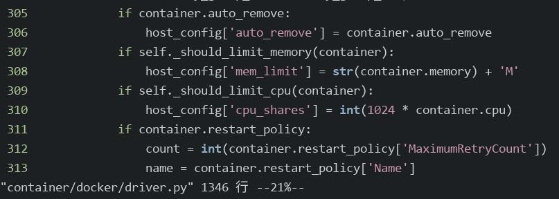
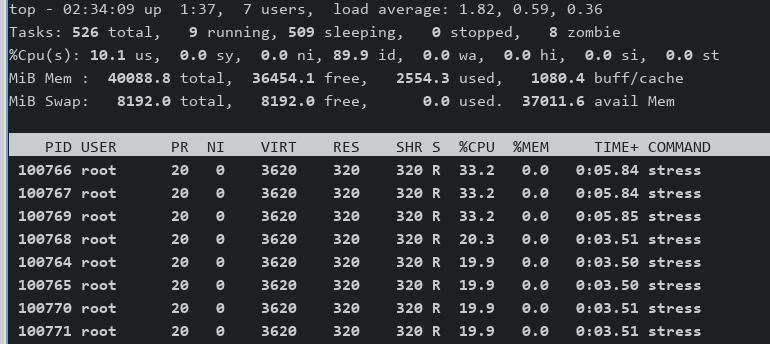
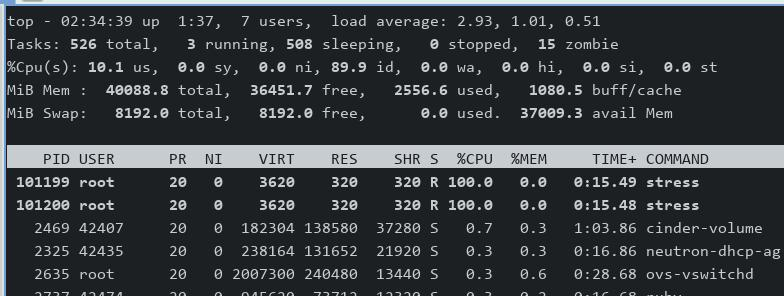
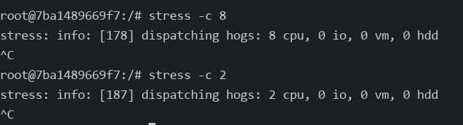

# 20250711
### 1. zun cpu limitation
Create a docker instance via zun:     

```
openstack appcontainer run --privileged --name ubuntustress --net network=1cd5bde1-6151-4ea6-9429-b74f7b467f99 --cpu 1 --memory 1024 --host openstack3 ubuntu:latest sleep 36000
```
On host(`openstack3`), inspect the docker instance:      

```
# docker inspect 7ba1489669f7
......
            "CpuShares": 1024,
            "Memory": 1073741824,
            "NanoCpus": 0,
            "CgroupParent": "",
......
```
Line 309-310 means `--cpu 1` --> 1024(CpuShares):   



`stress -c 8` in docker instance will result `8*100%` in top.     

Solution(manually binding cpu core):      

```
$ sudo docker info --format '{{.CgroupDriver}}'
systemd
$ sudo su
# cd /sys/fs/cgroup/system.slice
# echo "0-1" > docker-7ba1489669f71014023acc44afff8f6a1f60830b9c18398e2150c4e80a6c3e42.scope/cpuset.cpus
```
Stress 8:    



Stress 2:   



run stress command:    



Possible modification, update the client for sending more parametes to zun:      

`https://github.com/openstack/python-zunclient`

### 2. kolla(Queen)
centos7, use source related.   
