# 20250714
### 1. centos7 virgl redroid
Create a vm using import disk:     


Q35/bios:    


Change IP:    

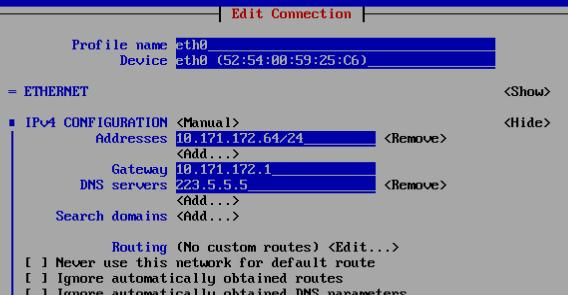

change hostname to `nvidiaredroidcentos`.    

Login the vm, then install kernel:      

```
# scp -r dash@192.168.1.8:/media/sda/iso/houdini12/centos .
# ls centos/
kernel-5.10.26-2.x86_64.rpm  kernel-headers-5.10.26-2.x86_64.rpm
# yum install ./kernel-5.10.26-2.x86_64.rpm  ./kernel-headers-5.10.26-2.x86_64.rpm 
# grub2-mkconfig -o /boot/grub2/grub.cfg
# shutdown -h now
```
Change setting to virgl:      

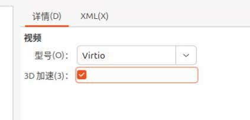

Using nvidia card:   

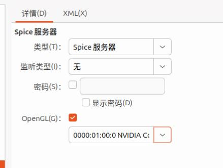

```
# dmesg | grep -i virgl
[    1.861350] [drm] features: +virgl +edid
# ls /dev/dri/
card0  renderD128
```
Install docker-ce, then import docker image:     

```
# curl -fsSL https://get.docker.com -o get-docker.sh
# sudo DOWNLOAD_URL=https://mirrors.ustc.edu.cn/docker-ce sh get-docker.sh
# vim /etc/yum.repos.d/docker-ce.repo 
# gpgcheck=1 --> gpgcheck=0
# sudo DOWNLOAD_URL=https://mirrors.ustc.edu.cn/docker-ce sh get-docker.sh
# systemctl enable docker --now
# docker load<redroidhoudini12intel.tar
```
Run redroid instance:      

```
# docker run -itd --privileged  -p 5555:5555 --name redroid12  redroidhoudini12:latest androidboot.redroid_width=1080     androidboot.redroid_height=1920     androidboot.redroid_dpi=480 androidboot.redroid_gpu_mode=host androidboot.redroid_gpu_node=/dev/dri/renderD128  androidboot.redroid_fps=120
# docker exec -it redroid12 sh
8a5eabf67563:/ # getprop | grep boot | grep com                                              
[dev.bootcomplete]: [1]
[ro.boottime.vendor.hwcomposer-2-1]: [299011048305]
[sys.boot_completed]: [1]
[sys.bootstat.first_boot_completed]: [1]
redroid_x86_64:/ # dumpsys SurfaceFlinger | grep GLES                                                                                                                                        
GLES: Mesa, virgl (NVIDIA GeForce RTX 4070/PCIe/SSE2), OpenGL ES 3.2 Mesa 24.0.8 (git-441f064c1c)
```
Issue(Ludashi download issue):     


### 2. (centos7) OpenStack queens + zun + redroid12
#### 2.1 Base image
AIM: 5.10 as the default kernel, docker-ce installed and configured.  

```
cp centos7_base.qcow2 centos7_510_docker_base.qcow2
```
Install kernel as above steps.    
Install docker as above steps.   

load the redroid12 images then docker pull nginx/ubuntu.    

docker configuration.   

```
[root@queenbase ~]# cat /etc/systemd/system/docker.service.d/kolla.conf 
[Service]
MountFlags=shared
[Service]
ExecStart=
# ExecStart commandline copied from 'docker-ce' package. Same on CentOS/Debian/Ubuntu systems.
ExecStart=/usr/bin/dockerd -H fd:// --containerd=/run/containerd/containerd.sock -H tcp://0.0.0.0:2375
```
undefine the vm, get the qcow2 file.    

#### 2.2 Create vms
queens1:   

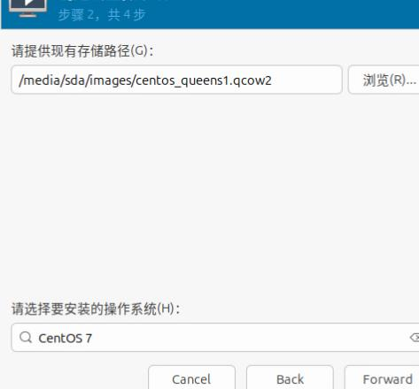

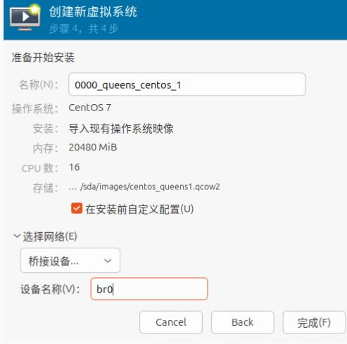

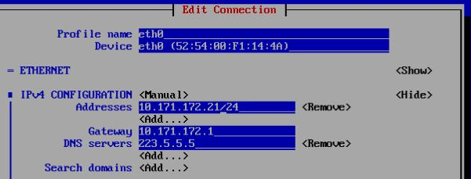

queens2:    

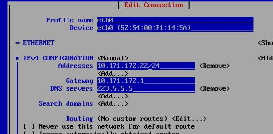

queen3:   

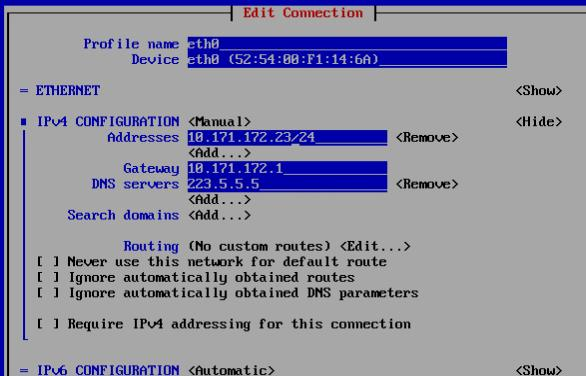

#### 2.3. deployment
Each node install pip:     

```
yum install python-devel libffi-devel gcc openssl-devel libselinux-python lvm2 -y
curl https://bootstrap.pypa.io/pip/2.7/get-pip.py -o get-pip.py
[root@queen1 ~]# python2.7 get-pip.py
[root@queen1 ~]# which pip
/usr/bin/pip
[root@queen1 ~]# pip --version
pip 20.3.4 from /usr/lib/python2.7/site-packages/pip (python 2.7)
```
Each node install ansible:     

```
pip install -U ansible==2.7.0
pip install docker
```
Each node add following items to `/etc/hosts`:      

```
10.171.172.21	queen1
10.171.172.22	queen2
10.171.172.23	queen3
```
password-less login:      

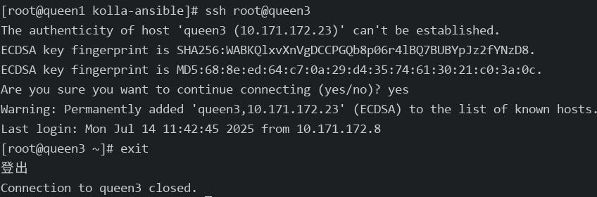

queen1 node:     

```
git clone https://github.com/openstack/kolla-ansible
cd kolla-ansible
git checkout tags/queens-eol -b queen
pip install pbr
pip install .
mkdir -p /etc/kolla
cp etc/kolla/* /etc/kolla/
cp ansible/inventory/multinode /etc/kolla/
```
Edit multinode like following:     

```
[control]
queen1

[network]
queen1
queen2
queen3

[external-compute]
queen1
queen2
queen3

[monitoring]
queen1

[storage]
queen1
queen2
queen3
```
globals.yml modifications:     

```
kolla_base_distro: "centos"
kolla_install_type: "source"
openstack_release: "queens"
docker_namespace: "kolla"
network_interface: "eth0"
neutron_external_interface: "eth1"
neutron_plugin_agent: "openvswitch"
enable_cinder: "yes"
enable_cinder_backend_lvm: "yes"
enable_haproxy: "yes"
enable_horizon: "yes"
enable_horizon_zun: "{{ enable_zun | bool }}"
enable_kuryr: "yes"
enable_zun: "yes"
fernet_token_expiry: 86400
nova_compute_virt_type: "kvm"
cinder_volume_group: "cinder-volumes"
```
generate the password:     

```
kolla-genpwd
```
load docker images:     

```
docker load<centoscontroller.tar
# for queen2/3
docker load<node.tar
```

Modifications for kolla-ansible:     

```
mkdir /root/origin
cd /usr/share/kolla-ansible/
# backup
cp ./ansible/roles/prechecks/tasks/service_checks.yml /root/origin/
cp ./ansible/roles/prechecks/tasks/package_checks.yml /root/origin/
cp ./ansible/roles/prechecks/tasks/user_checks.yml /root/origin/
cp ./ansible/roles/keystone/tasks/precheck.yml /root/origin/keystone_precheck.yml
cp ./ansible/roles/cinder/tasks/precheck.yml /root/origin/cinder_precheck.yml
# modification
cp /root/modifications/service_checks.yml ./ansible/roles/prechecks/tasks/service_checks.yml
cp /root/modifications/package_checks.yml ./ansible/roles/prechecks/tasks/package_checks.yml
cp /root/modifications/user_checks.yml ./ansible/roles/prechecks/tasks/user_checks.yml
cp /root/modifications/keystone_precheck.yml ./ansible/roles/keystone/tasks/precheck.yml
cp /root/modifications/cinder_precheck.yml ./ansible/roles/cinder/tasks/precheck.yml
```
deploy openstack:     

```
cd /etc/kolla/
kolla-ansible -i ./multinode prechecks -vv
kolla-ansible -i ./multinode deploy -vv 
kolla-ansible -i ./multinode post-deploy -vv
```
Install openstack client:      

```
#  cat /etc/yum.repos.d/CentOS-OpenStack-train.repo
    # CentOS-OpenStack-train.repo
    #
    # Please see http://wiki.centos.org/SpecialInterestGroup/Cloud for more
    # information
    
    [centos-openstack-train]
    name=CentOS-7 - OpenStack train
    baseurl=https://dl.rockylinux.org/vault/centos/7/cloud/$basearch/openstack-train/
    gpgcheck=0
    enabled=1
    gpgkey=file:///etc/pki/rpm-gpg/RPM-GPG-KEY-CentOS-SIG-Cloud
    exclude=sip,PyQt4
# yum install python2-openstackclient
# pip install python-zunclient
```
#### 2.4 OpenStack Admin
Visit `10.171.172.24`(admin, password is listed as following):      

```
cat /etc/kolla/passwords.yml | grep -i keystone_admin
keystone_admin_password: 5zGzqMear5ZVltRtRpETFiggoXiz0fmY7TZ1e7iV
```
horizon with zun ui supportd:     

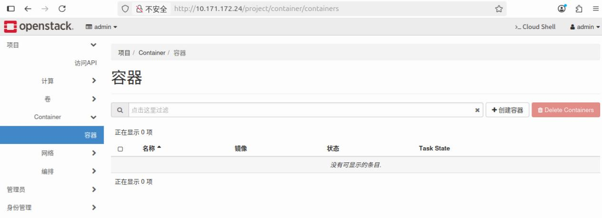

Create network(int/ext):       

```
openstack router create Ext-Router
openstack network create --internal --provider-network-type vxlan int-net
openstack subnet create int-net-sub --network int-net --subnet-range 177.77.77.0/24 --gateway 177.77.77.1 --dns-nameserver 114.114.114.114
openstack router add subnet Ext-Router int-net-sub
openstack network create --provider-physical-network physnet1 --provider-network-type flat  --external ext-net
openstack subnet create ext-net-sub --network ext-net --subnet-range 10.171.172.24/24 --allocation-pool start=10.171.172.160,end=10.171.172.220 --gateway 10.171.172.1 --dns-nameserver 114.114.114.114 --dhcp
openstack router set Ext-Router --external-gateway ext-net
```
Network topology:    

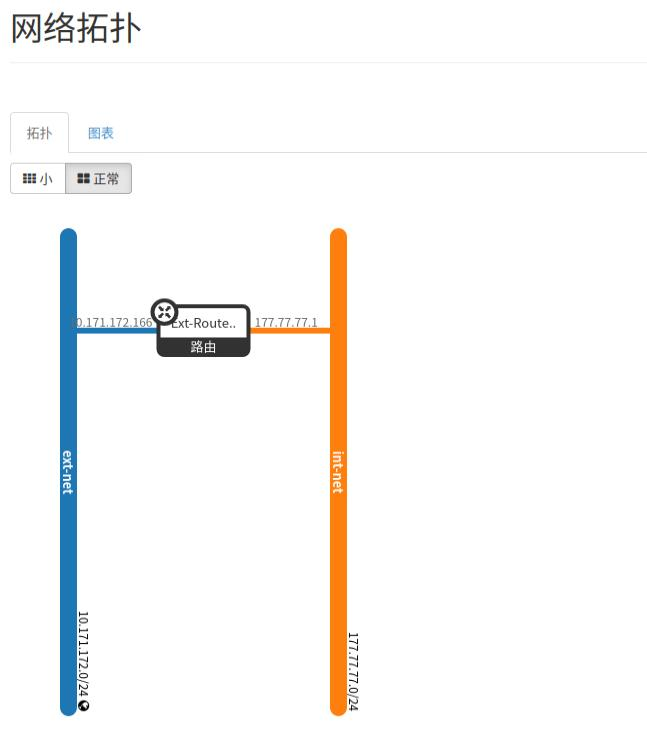

#### 2.5 zun instance
Get the network infos:      

```
# openstack network list
+--------------------------------------+---------+--------------------------------------+
| ID                                   | Name    | Subnets                              |
+--------------------------------------+---------+--------------------------------------+
| 5678d45a-4903-4f17-9266-bded57efba34 | int-net | efc9b0f3-2f5b-4102-b856-44169b518b4e |
| d27c46dc-4dde-4c04-af16-1104f0270e61 | ext-net | e63d1f7f-ded0-4fe3-a6fb-736ff7c3ec30 |
+--------------------------------------+---------+--------------------------------------+
```
Create the int zun instance:      

```
# openstack appcontainer run --name ubuntuint --net network=5678d45a-4903-4f17-9266-bded57efba34  --cpu 1 --memory 1024  ubuntu:latest sleep 3600
```
Create the int zun instance and specify its running node:      

```
# openstack appcontainer run --name ubuntuintHostQueen3 --net network=5678d45a-4903-4f17-9266-bded57efba34  --cpu 1 --memory 1024 --host queen3  ubuntu:latest sleep 3600
```
Examine the instance:     

```
[root@queen3 ~]# docker ps
CONTAINER ID   IMAGE                                                  COMMAND                   CREATED              STATUS              PORTS     NAMES
a0f3d7caa4b8   ubuntu:latest                                          "sleep 3600"              About a minute ago   Up About a minute             zun-a7d168ad-2322-4cf8-a5a1-5beb933e91f4
[root@queen3 ~]# docker exec -it a0f3d7caa4b8 bash
root@queen3:/#  apt update -y && apt install -y net-tools
root@queen3:/#  ifconfig
```

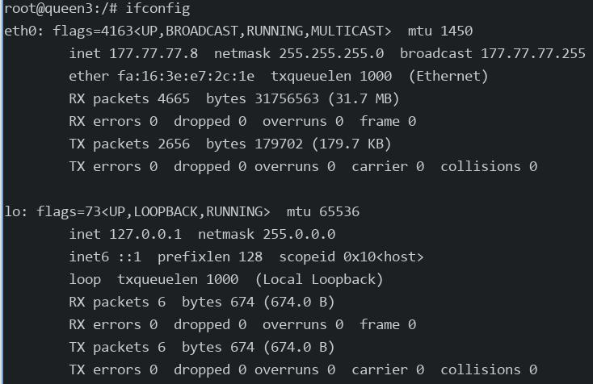

instance stop:     

```
[root@queen1 kolla]# openstack appcontainer list
+--------------------------------------+---------------------+---------------+---------+------------+-------------+-------+
| uuid                                 | name                | image         | status  | task_state | addresses   | ports |
+--------------------------------------+---------------------+---------------+---------+------------+-------------+-------+
| db03c512-7553-4e22-b41d-5dc925608b5c | ubuntuint           | ubuntu:latest | Running | None       | 177.77.77.4 | []    |
| a7d168ad-2322-4cf8-a5a1-5beb933e91f4 | ubuntuintHostQueen3 | ubuntu:latest | Running | None       | 177.77.77.8 | []    |
+--------------------------------------+---------------------+---------------+---------+------------+-------------+-------+
[root@queen1 kolla]# openstack appcontainer delete ubuntuint
Delete for container ubuntuint failed: Cannot delete container db03c512-7553-4e22-b41d-5dc925608b5c in Running state (HTTP 409) (Request-ID: req-efc9ca30-6732-4f07-8161-0a7344e88bc4)
[root@queen1 kolla]# openstack appcontainer stop ubuntuint
Request to stop container ubuntuint has been accepted.
[root@queen1 kolla]# openstack appcontainer list
+--------------------------------------+---------------------+---------------+---------+--------------------+-------------+-------+
| uuid                                 | name                | image         | status  | task_state         | addresses   | ports |
+--------------------------------------+---------------------+---------------+---------+--------------------+-------------+-------+
| db03c512-7553-4e22-b41d-5dc925608b5c | ubuntuint           | ubuntu:latest | Running | container_stopping | 177.77.77.4 | []    |
| a7d168ad-2322-4cf8-a5a1-5beb933e91f4 | ubuntuintHostQueen3 | ubuntu:latest | Running | None               | 177.77.77.8 | []    |
+--------------------------------------+---------------------+---------------+---------+--------------------+-------------+-------+
```
delete instance:      

```
[root@queen1 kolla]# openstack appcontainer delete ubuntuint
Request to delete container ubuntuint has been accepted.
[root@queen1 kolla]# openstack appcontainer list
+--------------------------------------+---------------------+---------------+---------+------------+-------------+-------+
| uuid                                 | name                | image         | status  | task_state | addresses   | ports |
+--------------------------------------+---------------------+---------------+---------+------------+-------------+-------+
| a7d168ad-2322-4cf8-a5a1-5beb933e91f4 | ubuntuintHostQueen3 | ubuntu:latest | Running | None       | 177.77.77.8 | []    |
+--------------------------------------+---------------------+---------------+---------+------------+-------------+-------+
```

external instance test with issue(first container will cause the VIP not accessable, thus the second one will failed):      

```
# openstack appcontainer run --name ubuntuext --net network=d27c46dc-4dde-4c04-af16-1104f0270e61 --cpu 1 --memory 1024  ubuntu:latest sleep 3600
# openstack appcontainer run --name ubuntuextHostQueen3 --net network=d27c46dc-4dde-4c04-af16-1104f0270e61 --cpu 1 --memory 1024  ubuntu:latest sleep 3600
Failed to discover available identity versions when contacting http://10.171.172.24:35357/v3. Attempting to parse version from URL.
Unable to establish connection to http://10.171.172.24:35357/v3/auth/tokens: HTTPConnectionPool(host='10.171.172.24', port=35357): Max retries exceeded with url: /v3/auth/tokens (Caused by NewConnectionError('<urllib3.connection.HTTPConnection object at 0x7f83e4df4190>: Failed to establish a new connection: [Errno 113] \xe6\xb2\xa1\xe6\x9c\x89\xe5\x88\xb0\xe4\xb8\xbb\xe6\x9c\xba\xe7\x9a\x84\xe8\xb7\xaf\xe7\x94\xb1',))
```
#### 2.6 floating ip allocation
Create an zun instance:    

```
[root@queen1 kolla]# openstack appcontainer list
+--------------------------------------+---------------------+---------------+---------+------------+--------------+-------+
| uuid                                 | name                | image         | status  | task_state | addresses    | ports |
+--------------------------------------+---------------------+---------------+---------+------------+--------------+-------+
| 9edef92d-39cf-4020-bfa2-f2f2fd65d7bd | ubuntuintHostQueen3 | ubuntu:latest | Running | None       | 177.77.77.23 | []    |
+--------------------------------------+---------------------+---------------+---------+------------+--------------+-------+
```
Allocating a floating IP :     

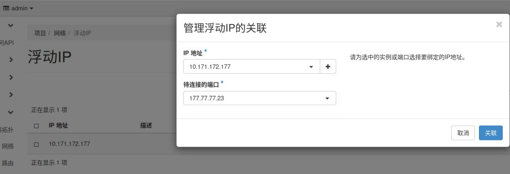

Recreate the security group:     

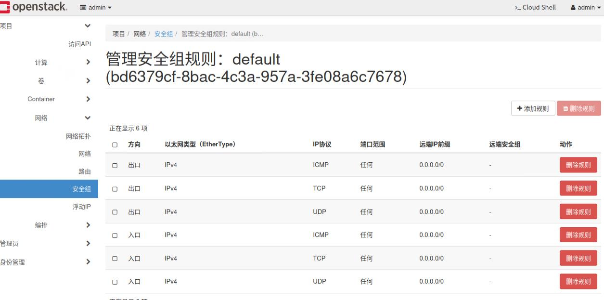

In docker instance:     

```
root@queen3:/# apt update -y && apt install -y net-tools iputils-ping
root@queen3:/# ping -c2 223.5.5.5
PING 223.5.5.5 (223.5.5.5) 56(84) bytes of data.
64 bytes from 223.5.5.5: icmp_seq=1 ttl=111 time=12.0 ms
64 bytes from 223.5.5.5: icmp_seq=2 ttl=111 time=8.64 ms

--- 223.5.5.5 ping statistics ---
2 packets transmitted, 2 received, 0% packet loss, time 1001ms
rtt min/avg/max/mdev = 8.644/10.306/11.968/1.662 ms
root@queen3:/# cat /etc/issue
Ubuntu 24.04.2 LTS \n \l
```
Ping from outside world(same ethernet):    

```
root@i9workstation:~# ping -c2 10.171.172.177
PING 10.171.172.177 (10.171.172.177) 56(84) bytes of data.
64 bytes from 10.171.172.177: icmp_seq=1 ttl=63 time=2.44 ms
64 bytes from 10.171.172.177: icmp_seq=2 ttl=63 time=1.40 ms

--- 10.171.172.177 ping statistics ---
2 packets transmitted, 2 received, 0% packet loss, time 1001ms
rtt min/avg/max/mdev = 1.396/1.919/2.442/0.523 
```
#### 2.7 zun privileged mode
Create privileged container instance:        

```
# openstack appcontainer run  --name ubuntuint  --net network=5678d45a-4903-4f17-9266-bded57efba34 --privileged --cpu 1 --memory 1024 ubuntu:latest sleep 3600
Additional properties are not allowed (u'privileged' was unexpected)

Failed validating 'additionalProperties' in schema:
    {'additionalProperties': False,
     'properties': {'auto_remove': {'type': ['boolean', 'null']},
                    'command': {'type': ['string', 'null']},
                    'cpu': {'minLength': 1,
```
Reason(Queen version):     

```
(zun-compute)[root@queen1 /]# ls /zun-base-source/
zun-1.0.1
(zun-api)[root@queen1 /]# ls /zun-base-source/
zun-1.0.1
```
Release note(`https://fossies.org/linux/zun/ChangeLog`):     

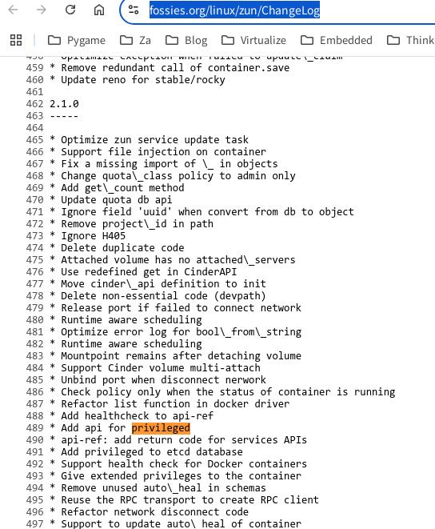

Rocky version:      

```
[root@queen1 ~]# docker run -it kolla/centos-source-zun-api:rocky /bin/bash
()[root@46e8671fcd28 /]# ls zun-base-source/
zun-2.1.0
```
So we need to backport the `--privileged code` into zun-1.0.1....    

### 3. systemd stop timeout
Issue:      

```
A stop job is running for Session c2 of user ... (1min 30s)
```
Changed:     

```
# vim /etc/systemd/system.conf
# cat /etc/systemd/system.conf |grep -i timeoutstop
DefaultTimeoutStopSec=20s
# systemctl daemon-reload
```
