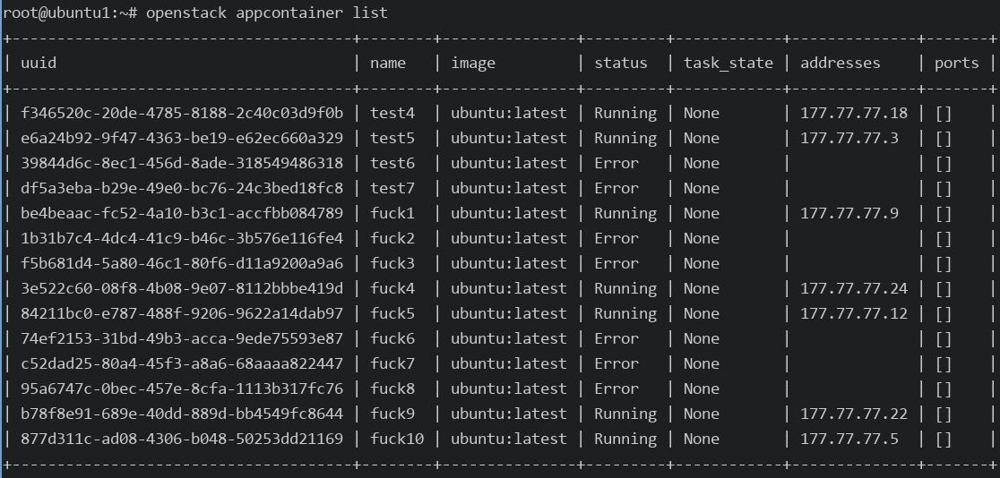

# 20250715
### 1. zun Replacement(Ubuntu1804)
Replace the docker image tag:     

```
# backup origin one
docker tag kolla/ubuntu-source-zun-api:queens kolla/ubuntu-source-zun-api:queensback
docker tag kolla/ubuntu-source-zun-compute:queens kolla/ubuntu-source-zun-compute:queensback
# remove origin on
docker rmi kolla/ubuntu-source-zun-api:queens
docker rmi kolla/ubuntu-source-zun-compute:queens
# rocky->queens
docker tag kolla/ubuntu-source-zun-compute:rocky kolla/ubuntu-source-zun-compute:queens
docker tag kolla/ubuntu-source-zun-api:rocky kolla/ubuntu-source-zun-api:queens
```
Stop/Delete the running zun related services:      

```
docker stop zun_compute && docker rm zun_compute && docker stop zun_api && docker rm zun_api
```
Re-deploy:     

```
# cd /etc/kolla
# kolla-ansible -i ./multinode deploy
```
After deployment, when create:     

```
# openstack appcontainer show xxxx
| status_reason     | Docker internal error: 500 Server Error: Internal Server Error ("IpamDriver.RequestPool: Another pool with same cidr exist. ipam and network options not used to pass pool name").                                              |
```
some node will be not available, maybe I should try another fresh installation.   

### 2. zun deployment(ubuntu1804 with rocky image)
IP addr is listed:     

```
10.171.172.31   ubuntu1
10.171.172.32   ubuntu2
10.171.172.33   ubuntu3
```
(each node) configure the hosts:      

```
# cat /etc/hosts
10.171.172.31	ubuntu1
10.171.172.32	ubuntu2
10.171.172.33	ubuntu3
```

(each node) Install pip:     

```
# rm -f /etc/resolv.conf && echo "nameserver 223.5.5.5">/etc/resolv.conf && apt update -y
# apt install -y python-pip
```
(controller) virtualenv:      

```
pip install virtualenv
mkdir ~/kolla && virtualenv ~/kolla/virtualenv && source ~/kolla/virtualenv/bin/activate
apt-get install -y python-dev libffi-dev gcc libssl-dev python-selinux python-setuptools build-essential
```
(controller) kolla preparation:      

```
cd ~
git clone https://github.com/openstack/kolla-ansible
cd kolla-ansible/ && git checkout tags/queens-eol -b queen
pip install -r requirements.txt
pip install .
# which kolla-ansible
# result should be  /root/kolla/virtualenv/bin/kolla-ansible

mkdir -p /etc/kolla
cp etc/kolla/* /etc/kolla/
```
(controller) Create globals.xml, content listed as following:     

```
kolla_base_distro: "ubuntu"
kolla_install_type: "source"
openstack_release: "queens"
kolla_internal_vip_address: "10.171.172.34"
docker_namespace: "kolla"
network_interface: "eth0"
neutron_external_interface: "eth1"
neutron_plugin_agent: "openvswitch"
enable_cinder: "yes"
enable_cinder_backend_lvm: "yes"
enable_haproxy: "yes"
enable_horizon: "yes"
enable_horizon_zun: "{{ enable_zun | bool }}"
enable_kuryr: "yes"
enable_zun: "yes"
fernet_token_expiry: 86400
cinder_volume_group: "cinder-volumes"
nova_compute_virt_type: "kvm"
ironic_dnsmasq_dhcp_range:
tempest_image_id:
tempest_flavor_ref_id:
tempest_public_network_id:
tempest_floating_network_name:
```
(controller node)multinode should be like:      

```
[control]
ubuntu1

[network]
ubuntu1
ubuntu2
ubuntu3

[inner-compute]

[external-compute]
ubuntu1
ubuntu2
ubuntu3

[compute:children]
inner-compute
external-compute

[monitoring]
ubuntu1

[storage]
ubuntu1
ubuntu2
ubuntu3

# ls /etc/kolla/
globals.yml  multinode  passwords.yml

```
(controller node)Fill in password:     

```
kolla-genpwd 
```
(controller node) kolla source code changes:      

```
# vim /root/kolla/virtualenv/share/kolla-ansible/ansible/roles/baremetal/templates/docker_apt_repo.j2
  # main docker repo
  #deb {{ docker_apt_url }}/repo {{ ansible_distribution | lower }}-{{ ansible_distribution_release | lower }} main
# vim /root/kolla/./virtualenv/share/kolla-ansible/ansible/roles/baremetal/tasks/install.yml
  # comment line 67-89
# vim /root/kolla/./virtualenv/share/kolla-ansible/ansible/roles/baremetal/tasks/post-install.yml
# comment line 19-24
# vim /root/kolla/./virtualenv/share/kolla-ansible/ansible/roles/baremetal/tasks/pre-install.yml
  # comment line 93-114
#  vim /root/kolla/./virtualenv/share/kolla-ansible/ansible/roles/baremetal/defaults/main.yml
  debian_pkg_install:
  # - "{{ 'docker-ce' if ansible_architecture == 'aarch64' else 'docker-engine=1.12.*' }}"
   - git
#  vim /root/kolla/./virtualenv/share/kolla-ansible/ansible/roles/neutron/tasks/precheck.yml
 34   #failed_when: result.stdout.find('MountFlags=1048576') == -1
 35   failed_when: result.stdout.find('MountFlags=shared') == -1

```
(all node) configure docker repo, and install docker:     

```
# curl -fsSL https://get.docker.com -o get-docker.sh
# sh get-docker.sh
# curl -fsSL https://download.docker.com/linux/ubuntu/gpg | sudo gpg --dearmor -o /usr/share/keyrings/docker-archive-keyring.gpg
# cat /etc/apt/sources.list.d/docker.list
deb [arch=amd64 signed-by=/usr/share/keyrings/docker-archive-keyring.gpg] https://download.docker.com/linux/ubuntu bionic stable
# apt update -y && apt install -y docker-ce
```

(controller node)bootstrap servers:       

```
apt install -y ansible
kolla-ansible  -i ./multinode bootstrap-servers
```
(all node) configure docker options:     

```
root@ubuntu3:~# cat /etc/systemd/system/docker.service.d/kolla.conf
[Service]
MountFlags=shared
ExecStart=
ExecStart=/usr/bin/dockerd -H fd:// --containerd=/run/containerd/containerd.sock -H tcp://10.171.172.33:2375 --cluster-store=etcd://10.xxx.xxx.xxx:2379
root@ubuntu3:~# systemctl daemon-reload && systemctl restart docker && reboot
```
(all node) after reboot, load images:      

```
docker load<computer.tar
docker load<controller.tar
```
(all nodes) install pip docker:      

```
pip install docker
pip install --upgrade pip
 pip install  netaddr oslo_config
```
(controller node) continue deploy:      

```
source ~/kolla/virtualenv/bin/activate
kolla-ansible -i ./multinode prechecks
kolla-ansible -i ./multinode deploy
kolla-ansible -i ./multinode post-deploy
```
(all node), add aosp related:      

```
# crontab -e
@reboot modprobe binder_linux devices="binder,hwbinder,vndbinder" ; modprobe ashmem_linux
```
(all node), privileged zun instance:       

```
vim /etc/kolla/zun-compute/zun.conf 
vim /etc/kolla/zun-api/zun.conf 
docker cp policy.json zun_compute:/etc/zun/
docker cp policy.json zun_api:/etc/zun/
```
(controller node)Create network:     

```
source /etc/kolla/admin-openrc.sh 
apt install -y python-openstackclient && pip install python-zunclient
```
bug fix for zun:      

```
docker exec -it --user root zun_compute bash 
docker exec -it --user root zun_api bash 
sed -i 's|^exec_dirs.*|exec_dirs=/var/lib/kolla/venv/bin,/sbin,/usr/sbin,/bin,/usr/bin,/usr/local/bin,/usr/local/sbin|g' /etc/zun/rootwrap.conf
mkdir -p /var/lib/docker
chmod 777 -R /var/lib/docker
```
Even with kuryr replacement(`rocky->queens`), still got error:       

```
| status_reason     | Docker internal error: 500 Server Error: Internal Server Error ("IpamDriver.RequestPool: Another pool with same cidr exist. ipam and network options not used to pass pool name").                                          |

```
### 2. destroy and re-deploy
Destroy the running kolla ansible via:       

```
kolla-ansible -i ./multinode destroy --include-images --include-dev --yes-i-really-really-mean-it
```

with bridged network:     



Created via:      

```
for i in {1..10}; do openstack appcontainer run --name fuck$i  --net network=634b42dd-8475-4eb5-abcc-6cd7a327062d --image-pull-policy=never --cpu 1 --memory 1024 --privileged  ubuntu:latest sleep 3600; done
```
### 3. queens network issue(zun)
Create via:      

```
for i in {1..10}; do openstack appcontainer run --name lucky$i --net network=9d746dac-e1e7-4fe4-9011-6d8dd0433413 --image-pull-policy=never --cpu 1 --memory 1024 ubuntu:latest sleep 3600; done
```
Result:      

```
 openstack appcontainer list
+--------------------------------------+---------+---------------+---------+------------+--------------+-------+
| uuid                                 | name    | image         | status  | task_state | addresses    | ports |
+--------------------------------------+---------+---------------+---------+------------+--------------+-------+
| 4dd9593a-47e8-4724-9bb9-2001ccb6b349 | lucky1  | ubuntu:latest | Running | None       | 177.77.77.4  | []    |
| 205340f6-a9c2-4a5c-83a6-f259c42f32c4 | lucky2  | ubuntu:latest | Running | None       | 177.77.77.5  | []    |
| 372e44c0-c91d-444d-967d-58127947625a | lucky3  | ubuntu:latest | Running | None       | 177.77.77.6  | []    |
| b0fe8607-67d5-4738-8714-ac086110ab27 | lucky4  | ubuntu:latest | Running | None       | 177.77.77.23 | []    |
| b22b459f-32f9-422a-8ee5-f56380b2d36b | lucky5  | ubuntu:latest | Error   | None       | 177.77.77.28 | []    |
| ed5a170c-ed04-492a-ab46-31f72785cca8 | lucky6  | ubuntu:latest | Running | None       | 177.77.77.20 | []    |
| e1742617-fd6d-46ca-9a8c-56cbd5f196c8 | lucky7  | ubuntu:latest | Running | None       | 177.77.77.10 | []    |
| 9971e09c-a282-411b-82c6-8ccbd6123d99 | lucky8  | ubuntu:latest | Running | None       | 177.77.77.3  | []    |
| 63108364-53a6-4b4e-9ad8-b13a2e8fb5dc | lucky9  | ubuntu:latest | Error   | None       | 177.77.77.7  | []    |
| 16fc196d-5e44-4c00-8134-197e0727bfc1 | lucky10 | ubuntu:latest | Error   | None       | 177.77.77.19 | []    |
+--------------------------------------+---------+---------------+---------+------------+--------------+-------+
```
error message:      

```
root@ubuntu1:~# openstack appcontainer show lucky10 | grep status
| status            | Error                                                                                                                                                                                                                                                                                                                  |
| status_detail     | Exited(128)  ago (error)                                                                                                                                                                                                                                                                                               |
| status_reason     | Docker internal error: 500 Server Error: Internal Server Error ("failed to create endpoint zun-16fc196d-5e44-4c00-8134-197e0727bfc1 on network 9d746dac-e1e7-4fe4-9011-6d8dd0433413: remote: Neutron net associated with identifier 4a9c320154e5a85d15e44b08d968514b7c0e9a3ef5b32fcf971c9583e6e8174f doesn't exist."). |
root@ubuntu1:~# openstack appcontainer show lucky5 | grep status
| status            | Error                                                                                                                                                                                                                                                                                                                  |
| status_detail     | Exited(128)  ago (error)                                                                                                                                                                                                                                                                                               |
| status_reason     | Docker internal error: 500 Server Error: Internal Server Error ("failed to create endpoint zun-b22b459f-32f9-422a-8ee5-f56380b2d36b on network 9d746dac-e1e7-4fe4-9011-6d8dd0433413: remote: Neutron net associated with identifier 4a9c320154e5a85d15e44b08d968514b7c0e9a3ef5b32fcf971c9583e6e8174f doesn't exist."). |
root@ubuntu1:~# openstack appcontainer show lucky9 | grep status
| status            | Error                                                                                                                                                                                                                                                                                                                  |
| status_detail     | Exited(128)  ago (error)                                                                                                                                                                                                                                                                                               |
| status_reason     | Docker internal error: 500 Server Error: Internal Server Error ("failed to create endpoint zun-63108364-53a6-4b4e-9ad8-b13a2e8fb5dc on network 9d746dac-e1e7-4fe4-9011-6d8dd0433413: remote: Neutron net associated with identifier 4a9c320154e5a85d15e44b08d968514b7c0e9a3ef5b32fcf971c9583e6e8174f doesn't exist."). |

```

network will change id as:    

```
root@ubuntu1:~# openstack network list
+--------------------------------------+------------------------------------------------------------------+--------------------------------------+
| ID                                   | Name                                                             | Subnets                              |
+--------------------------------------+------------------------------------------------------------------+--------------------------------------+
| 0d1be4f2-7bf7-4aa1-bc8e-80e011203873 | ext-net                                                          | f12d5f1c-b67d-42e3-a98b-c8d7d047ecce |
| 9d746dac-e1e7-4fe4-9011-6d8dd0433413 | c83c42ab80b1ebcfeac8900959a376844fb26f18b26c98f004dca5276766b4f3 | 1ef1bf11-461c-4142-95af-e4b3f58795a5 |
+--------------------------------------+------------------------------------------------------------------+--------------------------------------+
```
