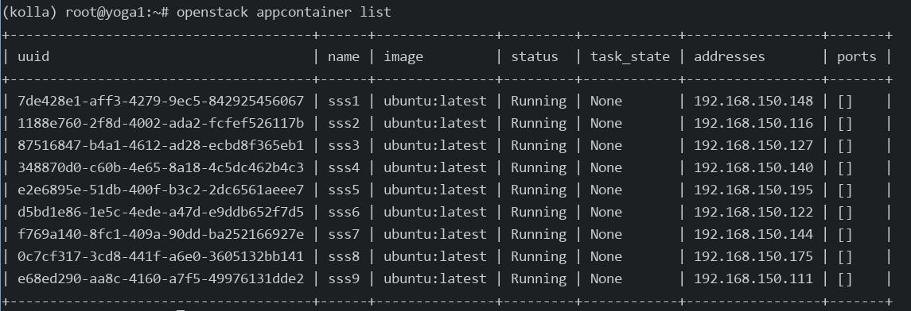
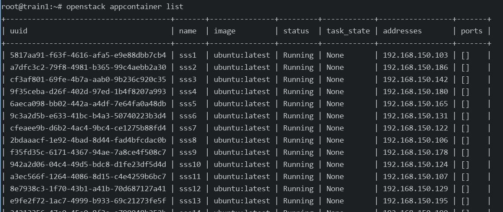

# 20250716
### 1. ubuntu2204 yoga verification
environment info:      

```
# cat /etc/hosts
....
192.168.150.11  yoga1
192.168.150.12  yoga2
192.168.150.13  yoga3
```
(control node):     

```
rm -f /etc/resolv.conf && echo "nameserver 223.5.5.5">/etc/resolv.conf && apt update -y
ufw disable
apt remove apparmor --purge
apt install -y git python3-dev libffi-dev build-essential libssl-dev
apt install python3-venv python3-pip -y
apt install -y dnscrypt-proxy
echo "nameserver 127.0.2.1">/etc/resolv.conf
chattr +i /etc/resolv.conf
pvcreate /dev/vdb
vgcreate cinder-volumes /dev/vdb
reboot
python3 -m venv .venv/kolla
source ~/.venv/kolla/bin/activate
pip3 install -U pip
pip3 install 'ansible-core>=2.11,<2.12'
git clone https://github.com/openstack/kolla-ansible.git
cd kolla-ansible
git checkout tags/yoga-eol -b yoga
pip install -r requirements.txt 
pip install .
mkdir -p /etc/kolla
cp etc/kolla/* /etc/kolla/
```

The globals.yml is listed as:      

```
# grep -v '^#' /etc/kolla/globals.yml  | grep -v "^$"
---
kolla_base_distro: "ubuntu"
kolla_install_type: "source"
openstack_release: "yoga"
kolla_internal_vip_address: "192.168.150.14"
docker_configure_for_zun: "yes"
containerd_configure_for_zun: "yes"
network_interface: "eth0"
neutron_external_interface: "eth1"
neutron_plugin_agent: "linuxbridge"
enable_openstack_core: "yes"
enable_haproxy: "yes"
enable_cinder: "yes"
enable_cinder_backend_lvm: "yes"
enable_horizon_zun: "{{ enable_zun | bool }}"
enable_kuryr: "yes"
enable_zun: "yes"
fernet_token_expiry: 86400
cinder_volume_group: "cinder-volumes"
nova_compute_virt_type: "kvm"

```
Edit the `/etc/kolla/multinode` file for definition of deployment.    

Install all of the nodes python deps:     

```
# pip3 freeze>requirements.txt
comment all of the ansible items
scp to other 2 nodes
```
Install pip deps:     

```
(kolla) [root@yoga1 ~]# deactivate 
# pip3 install -r /tmp/requirements.txt
root@yoga2:/home/test# pip3 install -r /home/test/requirements.txt 
root@yoga3:/home/test# pip3 install -r /home/test/requirements.txt 
```
copy ssh identifier files to `yoga1-3`,     

```
kolla-ansible bootstrap-servers -i ./multinode
kolla-ansible prechecks -i ./multinode -e prechecks_enable_host_ntp_checks=false
```

Prepare deps(using 2023.1 for downloading, then replace):     

```
# kolla-ansible install-deps
Failed with: 
error: pathspec 'unmaintained/yoga' did not match any file(s) known to git
ERROR! Failed to switch a cloned Git repo `https://opendev.org/openstack/ansible-collection-kolla` to the requested revision `unmaintained/yoga`.
# cat ~/.venv/kolla/share/kolla-ansible/requirements.yml
---
collections:
  - name: https://opendev.org/openstack/ansible-collection-kolla
    type: git
    version: unmaintained/2023.1
    #version: unmaintained/yoga
### install 2023.1
# kolla-ansible install-deps
Installing 'openstack.kolla:1.0.0' to '/root/.ansible/collections/ansible_collections/openstack/kolla'
Created collection for openstack.kolla:1.0.0 at /root/.ansible/collections/ansible_collections/openstack/kolla
openstack.kolla:1.0.0 was installed successfully
###  Fetch the yoga-eol deps
# git clone https://opendev.org/openstack/ansible-collection-kolla
#   cd ansible-collection-kolla/
#  git checkout tags/yoga-eol -b yoga
# cd /root/.ansible/collections/ansible_collections/openstack/kolla/
# rm -rf roles/*
#  cp -ar /root/ansible-collection-kolla/roles/* roles/
# ls roles/
baremetal  docker_sdk  kolla_user 
```
(all node):     

```
# pip3 install 'pyopenssl>=23.2.0'

```
Begin install:     

```
# cd /etc/kolla/
# pip install 'ansible>=4,<6'
# pip install 'pyopenssl>=23.2.0'
```
Source code changes:     

```
# vim /root/.ansible/collections/ansible_collections/openstack/kolla/roles/baremetal/defaults/main.yml
docker_apt_package: "docker-ce=5:20.10.24~3-0~ubuntu-jammy"
```
deploy:     

```
cd /etc/kolla
kolla-ansible -i ./multinode bootstrap-servers
kolla-ansible prechecks -i ./multinode -e prechecks_enable_host_ntp_checks=false
```
(all nodes), add registry:    

```
# vim /etc/docker/daemon.json , add following:   
      "registry-mirrors": [ "https://docker.nju.edu.cn/",
             "https://hub.uuuadc.top",
        "https://docker.anyhub.us.kg",
        "https://dockerhub.jobcher.com",
        "https://dockerhub.icu",
        "https://docker.ckyl.me",
        "https://docker.awsl9527.cn", "https://docker.mirrors.ustc.edu.cn", "https://docker.1ms.run", "https://docker.xuanyuan.me"
      ]
# systemctl daemon-reload && systemctl restart docke
```

load images, then pull/deploy/post-deploy
```
cd /etc/kolla
kolla-ansible -i ./multinode pull
kolla-ansible -i ./multinode deploy && kolla-ansible -i ./multinode post-deploy
apt install -y python3-openstackclient
pip3 install python-zunclient
reboot
```
After reboot, create network, test the zun.    

Change some items:     

```
neutron_plugin_agent: "openvswitch"
enable_etcd: "yes"
```

Test:    

```
for i in {1..5}; do openstack appcontainer run --name sss$i --net network=24f240b1-319d-40fc-acf5-bf970027737f --image-pull-policy=never --cpu 1 --memory 1024 --host yoga3 ubuntu:latest sleep 3600; done
for i in {1..3}; do openstack appcontainer run --name ttt$i --net network=24f240b1-319d-40fc-acf5-bf970027737f --image-pull-policy=never --cpu 1 --memory 1024 --host yoga1 ubuntu:latest sleep 3600; done
```

Test ext net:     

```
 for i in {1..3}; do openstack appcontainer run --name sss$i --net network=9c5c9066-c2dd-4beb-8407-3652fe0036a0 --image-pull-policy=never --cpu 1 --memory 1024 --host yoga3 ubuntu:latest sleep 3600; done
 for i in {4..6}; do openstack appcontainer run --name sss$i --net network=9c5c9066-c2dd-4beb-8407-3652fe0036a0 --image-pull-policy=never --cpu 1 --memory 1024 --host yoga2 ubuntu:latest sleep 3600; done
 for i in {7..9}; do openstack appcontainer run --name sss$i --net network=9c5c9066-c2dd-4beb-8407-3652fe0036a0 --image-pull-policy=never --cpu 1 --memory 1024 --host yoga1 ubuntu:latest sleep 3600; done

```


### 2. docker-ce downgrade
docker-ce downgrade:   

```
apt remove  docker-ce docker-ce-cli docker-ce-rootless-extras
apt autoremove
apt install docker-ce=5:20.10.24~3-0~ubuntu-jammy
```

### 3. openstack(train) deployment
Install ubuntu200406 vm.   

```
# /etc/hosts
192.168.150.21	train1
192.168.150.22	train2
192.168.150.23	train3
```

configuration:    

```
# cat /etc/kolla/globals.yml | grep -v '^#' | grep -v '^$'
---
kolla_base_distro: "ubuntu"
kolla_install_type: "source"
openstack_release: "train"
kolla_internal_vip_address: "192.168.150.24"
docker_configure_for_zun: "yes"
neutron_external_interface: "eth1"
neutron_plugin_agent: "openvswitch"
enable_openstack_core: "yes"
enable_haproxy: "yes"
enable_cinder: "yes"
enable_cinder_backend_lvm: "yes"
enable_etcd: "yes"
enable_horizon_zun: "{{ enable_zun | bool }}"
enable_kuryr: "yes"
enable_zun: "yes"
fernet_token_expiry: 86400
cinder_volume_group: "cinder-volumes"
nova_compute_virt_type: "kvm"
``` 
(all nodes):      

```
ls /usr/lib/python3/dist-packages/OpenSSL
 mv /usr/lib/python3/dist-packages/OpenSSL /root/
 sudo pip3 install pyopenssl
 sudo pip3 install pyopenssl --upgrade
```
Change baremetal related:      

```
# vim /root/.venv/kolla/share/kolla-ansible/ansible/roles/baremetal/defaults/main.yml
 10 docker_apt_package: "docker-ce=5:20.10.24~3-0~ubuntu-focal"
```
Remove:     

```
apt remove docker-buildx-plugin docker-ce docker-ce-cli docker-ce-rootless-extras docker-compose-plugin
apt autoremove
cd /etc/kolla
 kolla-ansible bootstrap-servers -i ./multinode
```
Solved issue:      

```
failed: [train3] (item={'key': 'cron', 'value': {'container_name': 'cron', 'group': 'all', 'enabled': True, 'image': 'kolla/ubuntu-source-cron:train', 'environment': {'DUMMY_ENVIRONMENT': 'kolla_useless_env'}, 'volumes': ['/etc/kolla/cron/:/var/lib/kolla/config_files/:ro', '/etc/localtime:/etc/localtime:ro', '/etc/timezone:/etc/timezone:ro', 'kolla_logs:/var/log/kolla/'], 'dimensions': {}}}) => {"ansible_loop_var": "item", "changed": true, "item": {"key": "cron", "value": {"container_name": "cron", "dimensions": {}, "enabled": true, "environment": {"DUMMY_ENVIRONMENT": "kolla_useless_env"}, "group": "all", "image": "kolla/ubuntu-source-cron:train", "volumes": ["/etc/kolla/cron/:/var/lib/kolla/config_files/:ro", "/etc/localtime:/etc/localtime:ro", "/etc/timezone:/etc/timezone:ro", "kolla_logs:/var/log/kolla/"]}}, "msg": "'Traceback (most recent call last):\\n  File \"/usr/local/lib/python3.8/dist-packages/requests/adapters.py\", line 633, in send\\n    conn = self.get_connection_with_tls_context(\\n  File \"/usr/local/lib/python3.8/dist-packages/requests/adapters.py\", line 489, in get_connection_with_tls_context\\n    conn = self.poolmanager.connection_from_host(\\n  File \"/usr/local/lib/python3.8/dist-packages/urllib3/poolmanager.py\", line 303, in connection_from_host\\n    return self.connection_from_context(request_context)\\n  File \"/usr/local/lib/python3.8/dist-packages/urllib3/poolmanager.py\", line 325, in connection_from_context\\n    raise URLSchemeUnknown(scheme)\\nurllib3.exceptions.URLSchemeUnknown: Not supported URL scheme http+docker\\n\\nDuring handling of the above exception, another exception occurred:\\n\\nTraceback (most recent call last):\\n  File \"/usr/local/lib/python3.8/dist-packages/docker/api/client.py\", line 214, in _retrieve_server_version\\n    return self.version(api_version=False)[\"ApiVersion\"]\\n  File \"/usr/local/lib/python3.8/dist-packages/docker/api/daemon.py\", line 181, in version\\n    return self._result(self._get(url), json=True)\\n  File \"/usr/local/lib/python3.8/dist-packages/docker/utils/decorators.py\", line 46, in inner\\n    return f(self, *args, **kwargs)\\n  File \"/usr/local/lib/python3.8/dist-packages/docker/api/client.py\", line 237, in _get\\n    return self.get(url, **self._set_request_timeout(kwargs))\\n  File \"/usr/local/lib/python3.8/dist-packages/requests/sessions.py\", line 602, in get\\n    return self.request(\"GET\", url, **kwargs)\\n  File \"/usr/local/lib/python3.8/dist-packages/requests/sessions.py\", line 589, in request\\n    resp = self.send(prep, **send_kwargs)\\n  File \"/usr/local/lib/python3.8/dist-packages/requests/sessions.py\", line 703, in send\\n    r = adapter.send(request, **kwargs)\\n  File \"/usr/local/lib/python3.8/dist-packages/requests/adapters.py\", line 637, in send\\n    raise InvalidURL(e, request=request)\\nrequests.exceptions.InvalidURL: Not supported URL scheme http+docker\\n\\nDuring handling of the above exception, another exception occurred:\\n\\nTraceback (most recent call last):\\n  File \"/tmp/ansible_kolla_docker_payload_t4b_6om5/ansible_kolla_docker_payload.zip/ansible/modules/kolla_docker.py\", line 1023, in main\\n  File \"/tmp/ansible_kolla_docker_payload_t4b_6om5/ansible_kolla_docker_payload.zip/ansible/modules/kolla_docker.py\", line 265, in __init__\\n  File \"/usr/local/lib/python3.8/dist-packages/docker/api/client.py\", line 197, in __init__\\n    self._version = self._retrieve_server_version()\\n  File \"/usr/local/lib/python3.8/dist-packages/docker/api/client.py\", line 221, in _retrieve_server_version\\n    raise DockerException(\\ndocker.errors.DockerException: Error while fetching server API version: Not supported URL scheme http+docker\\n'"}

allnodes:    

pip install 'requests==2.25.0'

kolla-ansible prechecks -i ./multinode -e prechecks_enable_host_ntp_checks=false
```
Pull images:     

```
kolla-ansible pull -i ./multinode 
kolla-ansible deploy -i ./multinode 
# hang on 
```

Solved via:    

```
TASK [haproxy : Waiting for virtual IP to appear]
Here is how I fixed it:
1. Because, another service in the network may use the same Virtual Router ID, It is 51 by default. So, change the default "keepalived_virtual_router_id" to another value (free and in the range of 0-255)
$ sudo vi /etc/kolla/globals.yml
...
keepalived_virtual_router_id: "251"
```
post deploy:    

```
kolla-ansible post-deploy -i ./multinode 
apt install python3-openstackclient
pip3 install python-zunclient
```
Create network, then create instance:      

```
for i in {1..30}; do openstack appcontainer run --name sss$i --net network=783e5e92-e7df-4906-a5ce-15a26b4ac28a --image-pull-policy=never --cpu 1 --memory 512  ubuntu:latest sleep 3600; done
```



