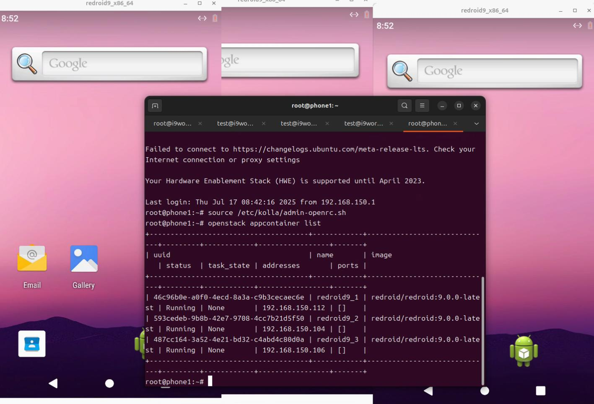
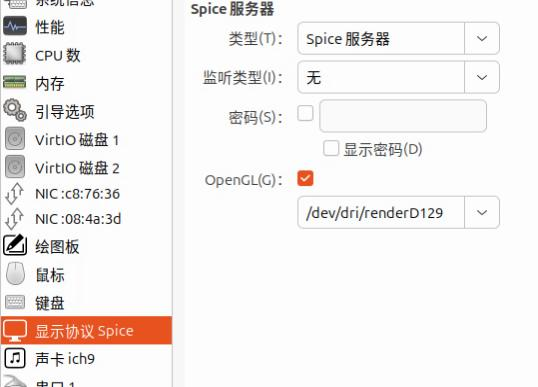
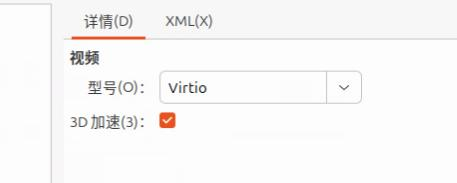

# 20250717
### 1. centos7 queens kuryr config
Pull the image(for deploy etcd):      

```
docker pull kolla/centos-source-etcd:queens
```
Downgrade docker-ce:      

```
# docker version
Client: Docker Engine - Community
 Version:           26.1.4
 API version:       1.45
 Go version:        go1.21.11
 Git commit:        5650f9b
 Built:             Wed Jun  5 11:32:04 2024
 OS/Arch:           linux/amd64
 Context:           default

Server: Docker Engine - Community
 Engine:
  Version:          26.1.4
......
# yum remove docker-ce docker-ce-cli docker-ce-rootless-extras docker-buildx-plugin docker-compose-plugin
# yum install docker-ce-20.10.24-3.el7 docker-ce-cli-20.10.24-3.el7
# systemctl restart docker
# docker version
# docker version
Client: Docker Engine - Community
 Version:           20.10.24
 API version:       1.41
 Go version:        go1.19.7
 Git commit:        297e128
 Built:             Tue Apr  4 18:22:57 2023
 OS/Arch:           linux/amd64
 Context:           default
 Experimental:      true

Server: Docker Engine - Community
 Engine:
  Version:          20.10.24
  API version:      1.41 (minimum version 1.12)
.....
```

Backup docker images:      

```
docker save -o queencentosimages.tar ubuntu:latess-source-zun-compute:queens kolla/centos-source-zun-compute:rocky kolla/centos-source-zun-api:queens kolla/centos-source-zun-api:rocky kolla/centos-source-nova-compute:queens kolla/centos-source-horizon:queens kolla/centos-source-glance-api:queens kolla/centos-source-heat-engine:queens kolla/centos-source-heat-api:queens kolla/centos-source-heat-api-cfn:queens kolla/centos-source-glance-registry:queens kolla/centos-source-nova-ssh:queens kolla/centos-source-nova-api:queens kolla/centos-source-zun-api:queensback kolla/centos-source-zun-compute:queensback kolla/centos-source-nova-novncproxy:queens kolla/centos-source-nova-scheduler:queens kolla/centos-source-nova-placement-api:queens kolla/centos-source-cinder-volume:queens kolla/centos-source-cinder-backup:queens kolla/centos-source-nova-consoleauth:queens kolla/centos-source-nova-conductor:queens kolla/centos-source-cinder-api:queens kolla/centos-source-kuryr-libnetwork:queens kolla/centos-source-neutron-server:queens kolla/centos-source-cinder-scheduler:queens kolla/centos-source-neutron-l3-agent:queens kolla/centos-source-neutron-openvswitch-agent:queens kolla/centos-source-neutron-metadata-agent:queens kolla/centos-source-neutron-dhcp-agent:queens kolla/centos-source-keystone:queens kolla/centos-binary-cinder-volume:queens kolla/centos-binary-cinder-backup:queens kolla/centos-binary-nova-compute:queens kolla/centos-binary-cinder-api:queens kolla/centos-binary-cinder-scheduler:queens kolla/centos-binary-heat-engine:queens kolla/centos-binary-heat-api:queens kolla/centos-binary-heat-api-cfn:queens kolla/centos-binary-glance-api:queens kolla/centos-binary-glance-registry:queens kolla/centos-binary-horizon:queens kolla/centos-binary-nova-api:queens kolla/centos-binary-nova-placement-api:queens kolla/centos-binary-nova-ssh:queens kolla/centos-binary-nova-conductor:queens kolla/centos-binary-nova-consoleauth:queens kolla/centos-binary-nova-novncproxy:queens kolla/centos-binary-neutron-l3-agent:queens kolla/centos-binary-nova-scheduler:queens kolla/centos-binary-keystone:queens kolla/centos-binary-neutron-server:queens kolla/centos-binary-neutron-dhcp-agent:queens kolla/centos-binary-neutron-openvswitch-agent:queens kolla/centos-binary-neutron-metadata-agent:queens kolla/centos-binary-nova-libvirt:queens kolla/centos-binary-kolla-toolbox:queens kolla/centos-binary-openvswitch-db-server:queens kolla/centos-binary-openvswitch-vswitchd:queens kolla/centos-binary-tgtd:queens kolla/centos-binary-cron:queens kolla/centos-binary-mariadb:queens kolla/centos-binary-fluentd:queens kolla/centos-binary-rabbitmq:queens kolla/centos-binary-memcached:queens kolla/centos-binary-iscsid:queens kolla/centos-source-nova-libvirt:queens kolla/centos-source-kolla-toolbox:queens kolla/centos-source-rabbitmq:queens kolla/centos-source-openvswitch-vswitchd:queens kolla/centos-source-openvswitch-db-server:queens kolla/centos-source-memcached:queens kolla/centos-source-iscsid:queens kolla/centos-source-cron:queens kolla/centos-source-mariadb:queens kolla/centos-source-tgtd:queens kolla/centos-source-haproxy:queens kolla/centos-source-keepalived:queens kolla/centos-source-fluentd:queens kolla/centos-source-etcd:queens
```
destroy the installed cluster and re-deploy(should run twice):      

```
kolla-ansible -i ./multinode destroy --include-images --include-dev --yes-i-really-really-mean-it
kolla-ansible -i ./multinode destroy --include-images --include-dev --yes-i-really-really-mean-it
```
Enable etcd then deploy/post-deploy.    

```
docker load<queencentosimages.tar
kolla-ansible -i ./multinode deploy && kolla-ansible -i ./multinode post-deploy
```
Issue(external network failed):      

```
 name              | sss3                                                                                                                                                                                                                        |
| restart_policy    | None                                                                                                                                                                                                                        |
| ports             | None                                                                                                                                                                                                                        |
| command           | [u'sleep', u'3600']                                                                                                                                                                                                         |
| runtime           | None                                                                                                                                                                                                                        |
| cpu               | 1.0                                                                                                                                                                                                                         |
| interactive       | False                                                                                                                                                                                                                       |
+-------------------+-----------------------------------------------------------------------------------------------------------------------------------------------------------------------------------------------------------------------------+
Unable to establish connection to http://10.171.172.24:9517/v1/containers?run=true: ('Connection aborted.', error(110, '\xe8\xbf\x9e\xe6\x8e\xa5\xe8\xb6\x85\xe6\x97\xb6'))
Failed to discover available identity versions when contacting http://10.171.172.24:35357/v3. Attempting to parse version from URL.
Unable to establish connection to http://10.171.172.24:35357/v3/auth/tokens: HTTPConnectionPool(host='10.171.172.24', port=35357): Max retries exceeded with url: /v3/auth/tokens (Caused by NewConnectionError('<urllib3.connection.HTTPConnection object at 0x7fd06a35b0d0>: Failed to establish a new connection: [Errno 113] \xe6\xb2\xa1\xe6\x9c\x89\xe5\x88\xb0\xe4\xb8\xbb\xe6\x9c\xba\xe7\x9a\x84\xe8\xb7\xaf\xe7\x94\xb1',))
Failed to discover available identity versions when contacting http://10.171.172.24:35357/v3. Attempting to parse version from URL.

```
### 2. ubuntu1804 queens deployment(with zunFROMrocky)
Disk layout:       

```
 qemu-img create -f qcow2 -b /var/lib/libvirt/images/ubuntu180406.qcow2 -F qcow2 /media/sda/images/ubuntu180406_queens_zunFROMrocky1.qcow2
 qemu-img create -f qcow2 -b /var/lib/libvirt/images/ubuntu180406.qcow2 -F qcow2 /media/sdb/images/ubuntu180406_queens_zunFROMrocky2.qcow2
 qemu-img create -f qcow2 -b /var/lib/libvirt/images/ubuntu180406.qcow2 -F qcow2 /media/sdc/images/ubuntu180406_queens_zunFROMrocky3.qcow2
 qemu-img create -f qcow2 /media/sda/images/ubuntu180406_queens_zunFROMrockylvm.qcow2 100G
 qemu-img create -f qcow2 /media/sdb/images/ubuntu180406_queens_zunFROMrockylvm.qcow2 100G
 qemu-img create -f qcow2 /media/sdc/images/ubuntu180406_queens_zunFROMrockylvm.qcow2 100G
```
vm ips:     

```
phone1 192.168.150.31
phone2 192.168.150.32
phone3 192.168.150.33
```
Controller setup is the same as `20250715`,    

globals.yml is listed as following:      

```
kolla_base_distro: "ubuntu"
kolla_install_type: "source"
openstack_release: "queens"
kolla_internal_vip_address: "192.168.150.34"
docker_namespace: "kolla"
network_interface: "eth0"
neutron_external_interface: "eth1"
neutron_plugin_agent: "openvswitch"
enable_cinder: "yes"
enable_cinder_backend_lvm: "yes"
enable_haproxy: "yes"
enable_horizon: "yes"
enable_horizon_zun: "{{ enable_zun | bool }}"
enable_kuryr: "yes"
enable_zun: "yes"
fernet_token_expiry: 86400
cinder_volume_group: "cinder-volumes"
nova_compute_virt_type: "kvm"
enable_etcd: "yes"
keepalived_virtual_router_id: "251"
```
globals.yml should be adjusted to `phone1-phone3`, the content is the same as `20250715`:     
```
# ls /etc/kolla/
globals.yml  multinode  passwords.yml
```
Install docker adjustment:      

```
apt install -y docker-ce=5:20.10.24~3-0~ubuntu-bionic
```

adjust `kolla source code changes` in `20250715`:     

```
comment line 77-99
vim ./share/kolla-ansible/ansible/roles/baremetal/tasks/post-install.yml
```
 adjust all nodes's docker options:      

```
$ /etc/systemd/system/docker.service.d/kolla.conf
...
ExecStart=/usr/bin/dockerd -H fd:// --containerd=/run/containerd/containerd.sock  -H tcp://0.0.0.0:2375 --cluster-store=etcd://192.168.150.31:2379
```
load image:    

```
scp root@10.171.172.31:~/1804zunphoneimages.tar .
docker load<1804zunphoneimages.tar
docker rmi kolla/ubuntu-source-zun-api:queens && docker rmi kolla/ubuntu-source-zun-compute:queens && docker tag kolla/ubuntu-source-zun-compute:rocky kolla/ubuntu-source-zun-compute:queens && docker tag kolla/ubuntu-source-zun-api:rocky kolla/ubuntu-source-zun-api:queens
```
allnode:    

```
pvcreate /dev/vdb
vgcreate cinder-volumes /dev/vdb
then: 
precheck
```

deploy/post-deploy/apply zun patch, then create network :      

```
apt install -y python3-openstackclient && pip3 install python-zunclient
```
Test:      

```
for i in {1..18}; do openstack appcontainer run --name inner$i --net network=3c1d9781-bfb4-4371-b6fe-9d609cce6151 --image-pull-policy=never --cpu 1 --memory 512 ubuntu:latest sleep 3600; done
 for i in {1..18}; do openstack appcontainer run --name ext$i --net network=a6a90663-3aed-40a0-9817-89eaed5aef70 --image-pull-policy=never --cpu 1 --memory 512 ubuntu:latest sleep 3600; done
```
Test redroid:     

```
 openstack appcontainer run --name testredroid --net network=a6a90663-3aed-40a0-9817-89eaed5aef70 --image-pull-policy ifnotpresent --cpu 4 --memory 8192 --privileged  redroid/redroid:9.0.0-latest androidboot.redroid_width=1080     androidboot.redroid_height=1920     androidboot.redroid_dpi=480 androidboot.redroid_gpu_mode=guest
```
Use houdini12:     

```
for i in {1..3}; do openstack appcontainer run --name redroid12_$i --image-pull-policy=ifnotpresent --net network=a6a90663-3aed-40a0-9817-89eaed5aef70  --cpu 4 --memory 8192 --privileged 192.168.1.7:5000/redroidhoudini12:latest androidboot.redroid_width=1080     androidboot.redroid_height=1920     androidboot.redroid_dpi=480 androidboot.redroid_gpu_mode=guest; done
```
REsult:     

```
root@phone1:~# openstack appcontainer list
+--------------------------------------+-------------+------------------------------------------+---------+------------+-----------------+-------+
| uuid                                 | name        | image                                    | status  | task_state | addresses       | ports |
+--------------------------------------+-------------+------------------------------------------+---------+------------+-----------------+-------+
| 4103300a-9768-41dd-b930-b7549587c710 | redroid12_1 | 192.168.1.7:5000/redroidhoudini12:latest | Running | None       | 192.168.150.120 | []    |
| f198a224-6dc1-4f6c-aadf-46852aa90a2a | redroid12_2 | 192.168.1.7:5000/redroidhoudini12:latest | Running | None       | 192.168.150.104 | []    |
| ae000c1d-8c9f-4813-b41a-0283f251c6b1 | redroid12_3 | 192.168.1.7:5000/redroidhoudini12:latest | Running | None       | 192.168.150.107 | []    |
+--------------------------------------+-------------+------------------------------------------+---------+------------+-----------------+-------+

```

Change image validation options(image won't verification, line 44, from True to False):      

```
$ cat api.py
 43     cfg.BoolOpt('enable_image_validation',
 44                 default=False,
 45                 help="Enable image validation.")                                                                                                                                          
 46 ]
$ docker cp api.py zun_api:/var/lib/kolla/venv/lib/python2.7/site-packages/zun/conf/api.py
$ docker exec -it zun_api bash
# rm -f /var/lib/kolla/venv/lib/python2.7/site-packages/zun/conf/api.pyc
```

redroid 9 result:    



virgl :    





```
Host machine:   

root@i9workstation:~# ls -l -h /dev/dri/by-path/
总计 0
lrwxrwxrwx 1 root root  8  7月 17 07:36 pci-0000:00:02.0-card -> ../card2
lrwxrwxrwx 1 root root 13  7月 17 07:36 pci-0000:00:02.0-render -> ../renderD129
lrwxrwxrwx 1 root root  8  7月 17 07:36 pci-0000:01:00.0-card -> ../card0
lrwxrwxrwx 1 root root 13  7月 17 07:36 pci-0000:01:00.0-render -> ../renderD128
lrwxrwxrwx 1 root root  8  7月 17 07:36 pci-0000:09:00.0-card -> ../card1
root@i9workstation:~# lspci | grep -i vga
00:02.0 VGA compatible controller: Intel Corporation Raptor Lake-S GT1 [UHD Graphics 770] (rev 04)

root@phone1:~# dmesg | grep -i virgl
[    1.910583] [drm] virgl 3d acceleration enabled
```
Could not ping from outside, both inner/ext.   
### 3. home(redroid12 on ubuntu1804QueensZunRocky)
Create instance via:     

```
modprobe binder_linux devices="binder,hwbinder,vndbinder" ; modprobe ashmem_linux
for i in {1..3}; do openstack appcontainer run --name redroid12_$i --image-pull-policy=ifnotpresent --net network=835b8f8a-6181-402b-8e28-321bf71f1874  --cpu 4 --memory 8192 --privileged  redroidhoudini12:latest androidboot.redroid_width=1080     androidboot.redroid_height=1920     androidboot.redroid_dpi=480 androidboot.redroid_gpu_mode=guest; done
openstack appcontainer list
+--------------------------------------+-------------+-------------------------+---------+------------+-----------------+-------+
| uuid                                 | name        | image                   | status  | task_state | addresses       | ports |
+--------------------------------------+-------------+-------------------------+---------+------------+-----------------+-------+
| 5fdd8bde-6328-4f69-8f23-541df39657b2 | redroid12_1 | redroidhoudini12:latest | Running | None       | 192.168.150.161 | []    |
| d2054504-6465-42ab-a82c-436aebeacb25 | redroid12_2 | redroidhoudini12:latest | Running | None       | 192.168.150.168 | []    |
| 5d551da7-6fe5-411c-a98c-ec470fb0b7c1 | redroid12_3 | redroidhoudini12:latest | Running | None       | 192.168.150.177 | []    |
+--------------------------------------+-------------+-------------------------+---------+------------+-----------------+----
```
Each node has one:     

```
root@ubuntu1:~# docker ps | grep redroid
47db92adfcf8   redroidhoudini12:latest                                "/init qemu=1 androi…"   4 minutes ago       Up 4 minutes              zun-5fdd8bde-6328-4f69-8f23-541df39657b2

root@ubuntu2:~# docker ps | grep redroid
288843e8ca31   redroidhoudini12:latest                                "/init qemu=1 androi…"   3 minutes ago       Up 3 minutes              zun-5d551da7-6fe5-411c-a98c-ec470fb0b7c1

root@ubuntu3:~# docker ps | grep redroid
a1d4ee8bb3a6   redroidhoudini12:latest                                "/init qemu=1 androi…"   3 minutes ago       Up 3 minutes              zun-d2054504-6465-42ab-a82c-436aebeacb25
```
adb connect and adb shell:     

```
dash@archwayland:~$ adb connect 192.168.150.161
* daemon not running; starting now at tcp:5037
* daemon started successfully
connected to 192.168.150.161:5555
dash@archwayland:~$ adb connect 192.168.150.168
connected to 192.168.150.168:5555
dash@archwayland:~$ adb connect 192.168.150.177
connected to 192.168.150.177:5555
dash@archwayland:~$ adb devices
List of devices attached
192.168.150.161:5555	device
192.168.150.168:5555	device
192.168.150.177:5555	device

dash@archwayland:~$ adb -s 192.168.150.161:5555 shell
redroid_x86_64:/ $ getprop | grep boot | grep com                                                                                                                                           
[dev.bootcomplete]: [1]
[ro.boottime.vendor.hwcomposer-2-1]: [2969097311287]
[sys.boot_completed]: [1]
[sys.bootstat.first_boot_completed]: [1]
redroid_x86_64:/ $ dumpsys SurfaceFlinger |grep GLES
GLES: Google Inc. (Google), ANGLE (Google, Vulkan 1.2.0 (SwiftShader Device (LLVM 10.0.0) (0x0000C0DE)), SwiftShader driver-5.0.0), OpenGL ES 3.1.0 (ANGLE 2.1.1 git hash: e37c6dd2e0e8)

```
