# 20250721
### 1. CentOS queens zun deployment
3 nodes with replaced docker images(`rocky->queens`):      

```
[root@queen1 kolla]# docker images | grep zun | grep rocky
kolla/centos-source-zun-compute                   rocky           384975e8ebb3   5 years ago     1.07GB
kolla/centos-source-zun-api                       rocky           4293ca2bb6b1   5 years ago     1.04GB
[root@queen1 kolla]# docker images | grep kuryr | grep rocky
kolla/centos-source-kuryr-libnetwork              rocky           1eb87543a31b   5 years ago     953MB
```
When create ext nework , failed  with :       

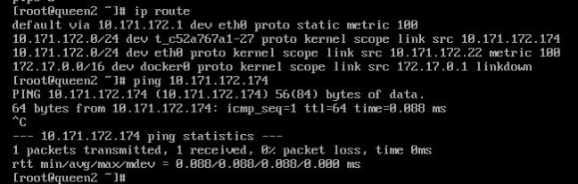

issue:     

```
Unable to establish connection to http://10.171.172.24:9517/v1/containers?run=true: ('Connection aborted.', error(110, '\xe8\xbf\x9e\xe6\x8e\xa5\xe8\xb6\x85\xe6\x97\xb6'))
Failed to discover available identity versions when contacting http://10.171.172.24:35357/v3. Attempting to parse version from URL.
Unable to establish connection to http://10.171.172.24:35357/v3/auth/tokens: HTTPConnectionPool(host='10.171.172.24', port=35357): Max retries exceeded with url: /v3/auth/tokens (Caused by NewConnectionError('<urllib3.connection.HTTPConnection object at 0x7f60a3d8c0d0>: Failed to establish a new connection: [Errno 113] \xe6\xb2\xa1\xe6\x9c\x89\xe5\x88\xb0\xe4\xb8\xbb\xe6\x9c\xba\xe7\x9a\x84\xe8\xb7\xaf\xe7\x94\xb1',))
Failed to discover available identity versions when contacting http://10.171.172.24:35357/v3. Attempting to parse version from URL.
Unable to establish connection to http://10.171.172.24:35357/v3/auth/tokens: HTTPConnectionPool(host='10.171.172.24', port=35357): Max retries exceeded with url: /v3/auth/tokens (Caused by NewConnectionError('<urllib3.connection.HTTPConnection object at 0x7f529babd0d0>: Failed to establish a new connection: [Errno 113] \xe6\xb2\xa1\xe6\x9c\x89\xe5\x88\xb0\xe4\xb8\xbb\xe6\x9c\xba\xe7\x9a\x84\xe8\xb7\xaf\xe7\x94\xb1',))

```
### 2. CentOS queens zun deployment(linuxbridge mode)
The same issue as above./     
### 3. dadfailed issue
issue:      

```
2: eth0: <BROADCAST,MULTICAST,UP,LOWER_UP> mtu 1500 qdisc pfifo_fast state UP group default qlen 1000
    link/ether 52:54:00:f1:14:6a brd ff:ff:ff:ff:ff:ff
    inet 10.171.172.23/24 brd 10.171.172.255 scope global noprefixroute eth0
       valid_lft forever preferred_lft forever
    inet6 fe80::43ae:554e:9564:d787/64 scope link tentative noprefixroute dadfailed 
       valid_lft forever preferred_lft forever
    inet6 fe80::f07e:e9f6:352b:994c/64 scope link noprefixroute 
       valid_lft forever preferred_lft forever

```

solved via:     
```
[root@queen3 ~]# cat /etc/machine-id 
334e69d6bacf423a8b821ba7a3cdd9a4
[root@queen3 ~]# sudo chmod ugo+w /etc/machine-id
[root@queen3 ~]# sudo cat /dev/null > /etc/machine-id
[root@queen3 ~]# sudo systemd-machine-id-setup
Initializing machine ID from KVM UUID.
[root@queen3 ~]# sudo chmod ugo-w /etc/machine-id
[root@queen3 ~]# cat /etc/machine-id 
ec8dd68a129e4eeab9b31bbf9e5701a5
```
### 4. enable virsh console
Via:     

```
sudo systemctl enable serial-getty@ttyS0.service --now
```
Then `virsh console vmname` you could get a console login.    

### 5. redeploy queens(ubuntu)
Use docker images then retag:       

```
docker load<1804zunphoneimages.tar && docker load<etcd.tar && docker load<rocky.tar
docker rmi kolla/ubuntu-source-zun-api:queens kolla/ubuntu-source-zun-api:queensback kolla/ubuntu-source-zun-compute:queens kolla/ubuntu-source-zun-compute:queensback && docker tag kolla/ubuntu-source-zun-compute:rocky kolla/ubuntu-source-zun-compute:queens && docker tag kolla/ubuntu-source-zun-api:rocky kolla/ubuntu-source-zun-api:queens && docker rmi kolla/ubuntu-source-kuryr-libnetwork:queens && docker tag kolla/ubuntu-source-kuryr-libnetwork:rocky kolla/ubuntu-source-kuryr-libnetwork:queens
```

### 6. OS verification environment
Create a new network:     

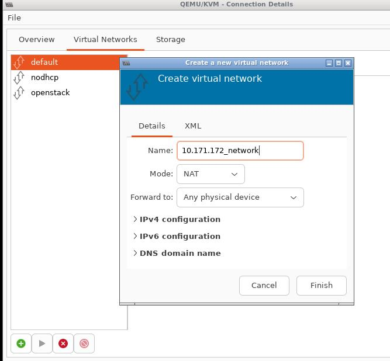

Disable dhcppv4:     

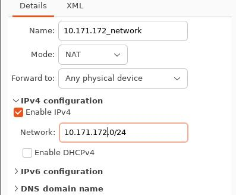

Create vm via import existing disk image:     


Select `ubuntu1804_mixed_deploy_10.171.172.41.qcow2`:    

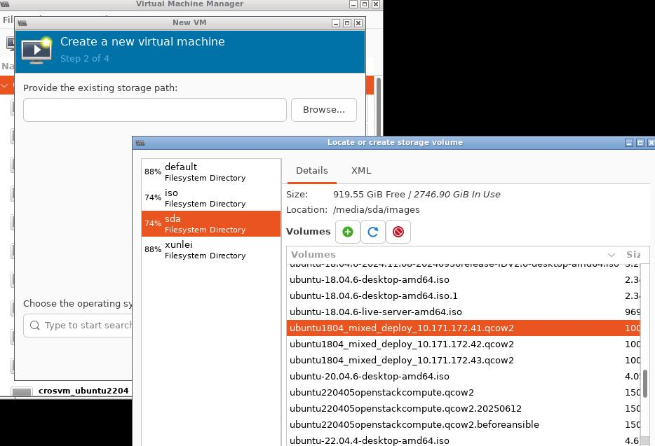

Select `Ubuntu 18.04 LTS` for installing options:    

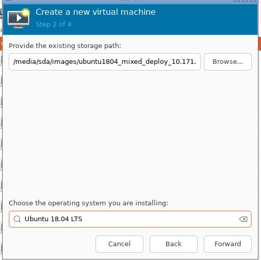

specify memory/cpu:     

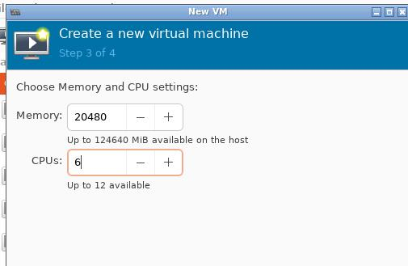

Specify the vm name:     

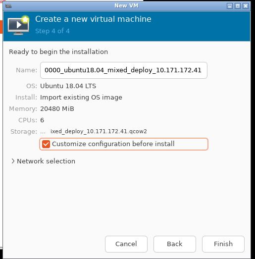

Add 41vdb.qcow2 for the second vm disk:     

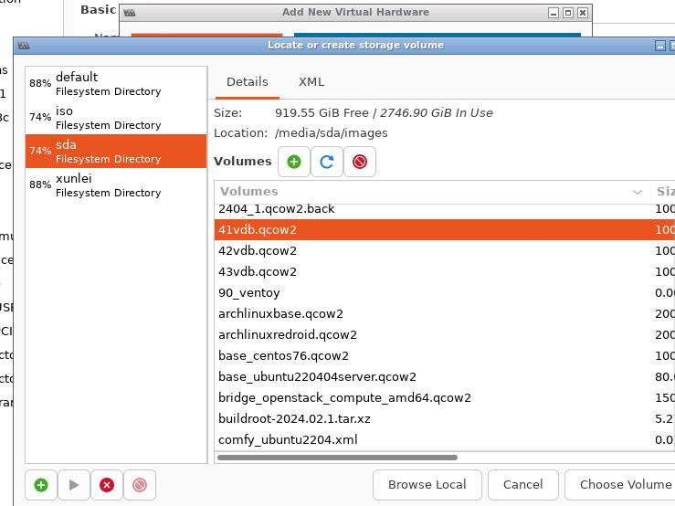

Select `10.171.172_network` for the network source:     

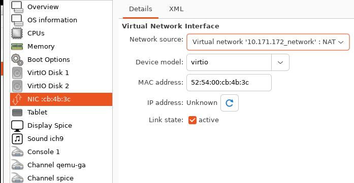

Add the second network which also uses the same network:    

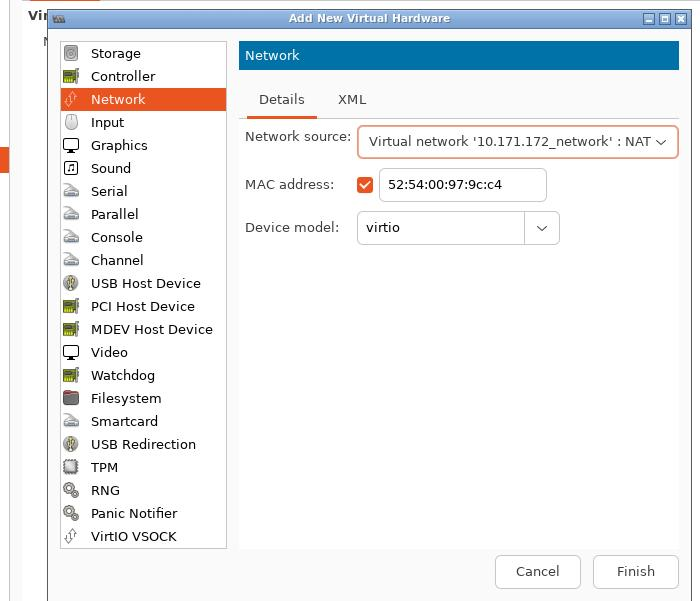

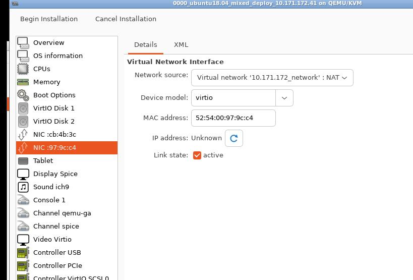

click `Beging installation` for starting the created vm:    

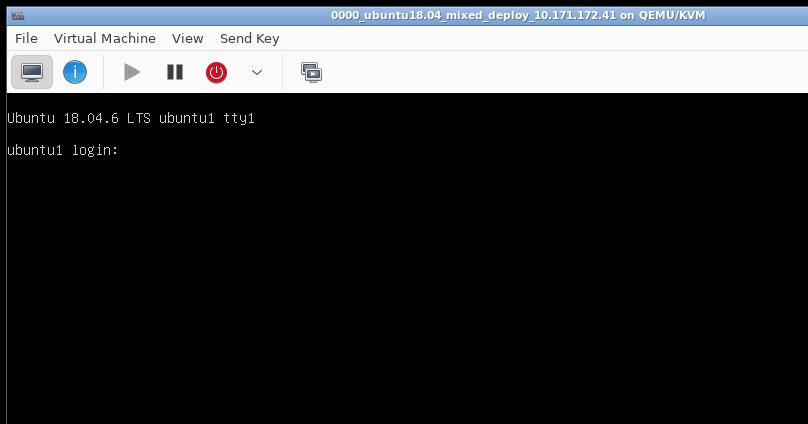

Imported another 2 vms, 3-nodes cluster listed as:     

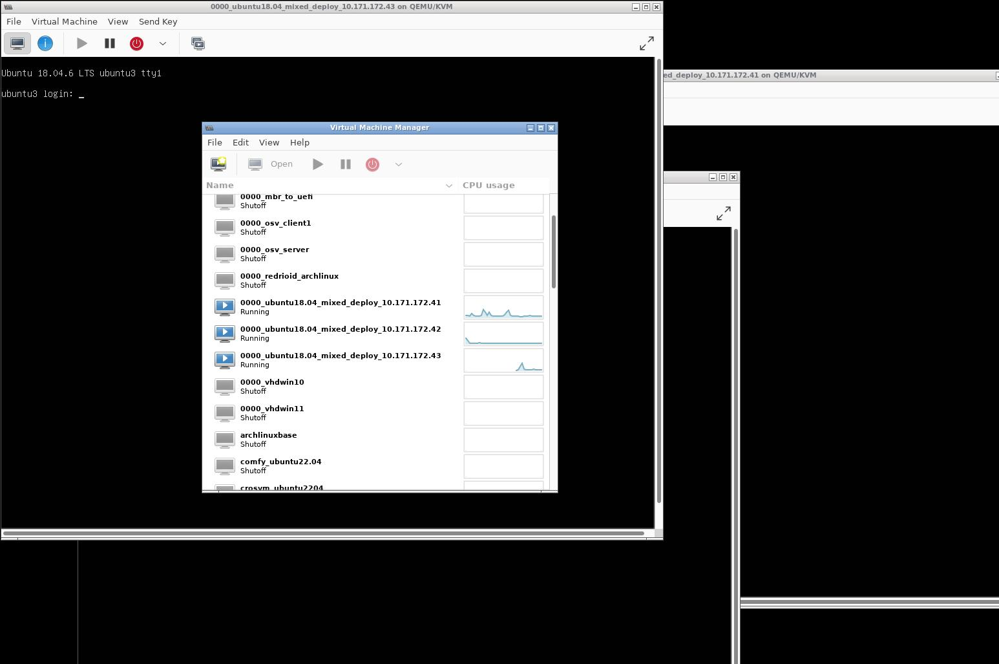

Examine the environment:      

```
ssh root@10.171.172.41

......

root@ubuntu1:~# source /etc/kolla/admin-openrc.sh 
root@ubuntu1:~# openstack appcontainer list
+--------------------------------------+------------+------------------------------+---------+---------------------+----------------+-------+
| uuid                                 | name       | image                        | status  | task_state          | addresses      | ports |
+--------------------------------------+------------+------------------------------+---------+---------------------+----------------+-------+
| f99294a3-e747-4001-a639-506354970756 | redroid9_1 | redroid/redroid:9.0.0-latest | Running | None                | 10.171.172.171 | []    |
| 70139649-9b5d-4190-b721-ffdc67c48db2 | redroid9_2 | redroid/redroid:9.0.0-latest | Stopped | container_rebooting | 10.171.172.178 | []    |
| 39474c90-8ca0-4ca7-8a21-09ab9ab859f0 | redroid9_3 | redroid/redroid:9.0.0-latest | Running | None                | 10.171.172.168 | []    |
+--------------------------------------+------------+------------------------------+---------+---------------------+----------------+-------+

```
Fetch the horizon password:      

```
root@ubuntu1:~# cat /etc/kolla/passwords.yml | grep -i keystone_admin
keystone_admin_password: hO3wJGfQZzig1t2eUZsSKwAbnUTprpel27FO2hx4
```
login with admin and `keystone_admin_password`:     

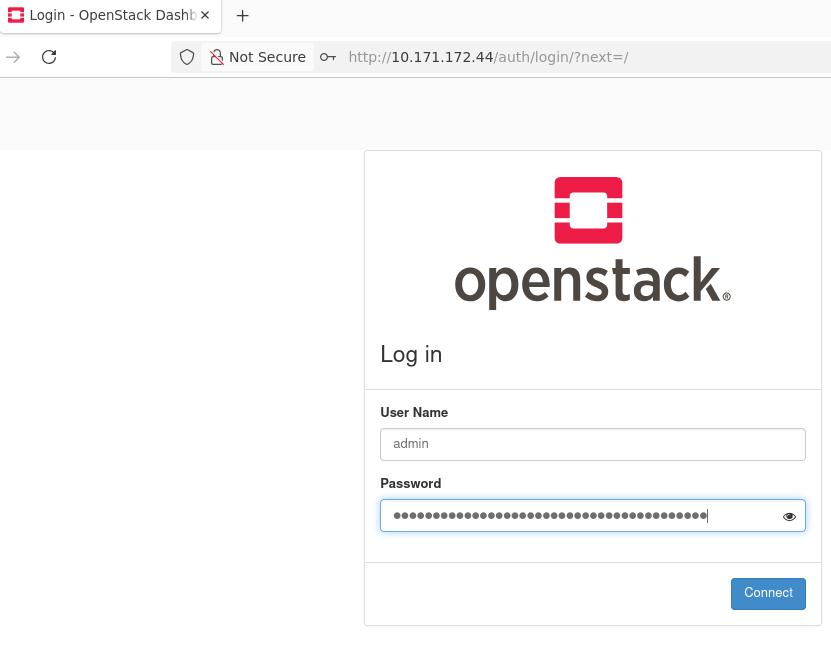


bug-fix for disable image validation:       

```
$  docker cp zun_api:/var/lib/kolla/venv/lib/python2.7/site-packages/zun/conf/api.py .
$ cat api.py
 43     cfg.BoolOpt('enable_image_validation',
 44                 default=False,
 45                 help="Enable image validation.")                                                                                                                                          
 46 ]
$ docker cp api.py zun_api:/var/lib/kolla/venv/lib/python2.7/site-packages/zun/conf/api.py
$ docker exec -it zun_api bash
# rm -f /var/lib/kolla/venv/lib/python2.7/site-packages/zun/conf/api.pyc
# exit
$ docker restart zun_api
```

Start the container:     

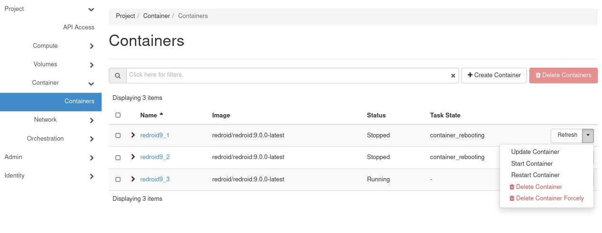


```
# openstack appcontainer show redroid9_1 | grep status_reason
| status_reason     | Docker internal error: 500 Server Error: Internal Server Error ("IpamDriver.RequestAddress: Requested ip address {'subnet_id': u'9171905d-523a-4374-bddd-d3699a59f65b', 'ip_address': u'10.171.172.171'} already belongs to a bound Neutron port: a3f3373d-3a61-4a13-95b3-958a9945a0e0"). 
```

Stop and recreate again:     

```
for i in {1..3}; do openstack appcontainer stop redroid9_$i; done
for i in {1..3}; do openstack appcontainer delete redroid9_$i; done
```
Create the appcontainer instance via:     

```
# openstack appcontainer run --name redroid9_ubuntu1 --image-pull-policy=ifnotpresent --net network=15723fae-abdd-4a22-8c11-73607fbda740 --cpu 4 --memory 8192 --privileged --host ubuntu1 redroid/redroid:9.0.0-latest androidboot.redroid_width=1080     androidboot.redroid_height=1920     androidboot.redroid_dpi=480 androidboot.redroid_gpu_mode=guest androidboot.redroid_fps=120
Internal Server Error (HTTP 500) (Request-ID: req-21a92c7c-e33d-46de-b2c6-45b823789a7e)

```
After apply the above image validation bugfix, create:       

```
openstack appcontainer run --name redroid9_ubuntu1 --image-pull-policy=ifnotpresent --net network=15723fae-abdd-4a22-8c11-73607fbda740 --cpu 4 --memory 8192 --privileged --host ubuntu1 redroid/redroid:9.0.0-latest androidboot.redroid_width=1080     androidboot.redroid_height=1920     androidboot.redroid_dpi=480 androidboot.redroid_gpu_mode=guest androidboot.redroid_fps=120
openstack appcontainer run --name redroid9_ubuntu3 --image-pull-policy=ifnotpresent --net network=15723fae-abdd-4a22-8c11-73607fbda740 --cpu 4 --memory 8192 --privileged --host ubuntu3 redroid/redroid:9.0.0-latest androidboot.redroid_width=1080     androidboot.redroid_height=1920     androidboot.redroid_dpi=480 androidboot.redroid_gpu_mode=guest androidboot.redroid_fps=120
openstack appcontainer run --name redroid9_ubuntu3 --image-pull-policy=ifnotpresent --net network=15723fae-abdd-4a22-8c11-73607fbda740 --cpu 4 --memory 8192 --privileged --host ubuntu3 redroid/redroid:9.0.0-latest androidboot.redroid_width=1080     androidboot.redroid_height=1920     androidboot.redroid_dpi=480 androidboot.redroid_gpu_mode=guest androidboot.redroid_fps=120
```
Examine the result:      

```
# openstack appcontainer list
+--------------------------------------+------------------+------------------------------+---------+------------+----------------+-------+
| uuid                                 | name             | image                        | status  | task_state | addresses      | ports |
+--------------------------------------+------------------+------------------------------+---------+------------+----------------+-------+
| 599aea74-f487-4545-b366-6b38c7b15431 | redroid9_ubuntu1 | redroid/redroid:9.0.0-latest | Running | None       | 10.171.172.181 | []    |
| 882f5554-2eb9-48d9-a880-8ec861aa8a6d | redroid9_ubuntu2 | redroid/redroid:9.0.0-latest | Running | None       | 10.171.172.172 | []    |
| 3f4d8f74-69b4-4d3f-9a69-5b94add17c85 | redroid9_ubuntu3 | redroid/redroid:9.0.0-latest | Running | None       | 10.171.172.180 | []    |
+--------------------------------------+------------------+------------------------------+---------+------------+----------------+-------+
root@ubuntu1:~# docker ps | grep zun | grep 599aea74
77fa40f90722   redroid/redroid:9.0.0-latest                           "/init qemu=1 androi…"   3 minutes ago   Up 3 minutes              zun-599aea74-f487-4545-b366-6b38c7b15431
```
Login to ubuntu2, verify the instance:      

```
root@ubuntu2:~# docker ps | grep zun | grep 882f
791b49035b5f   redroid/redroid:9.0.0-latest                           "/init qemu=1 androi…"   3 minutes ago   Up 3 minutes              zun-882f5554-2eb9-48d9-a880-8ec861aa8a6d
root@ubuntu2:~# docker exec -it 791b49035b5f sh
ubuntu2:/ # getprop | grep boot | grep com                                                                                                                                                                                                                  
[dev.bootcomplete]: [1]
[ro.boottime.vendor.hwcomposer-2-1]: [1381625505509]
[sys.boot_completed]: [1]
[sys.logbootcomplete]: [1]
```

Login to ubuntu3 , verify the instance:      

```
root@ubuntu3:~# docker ps | grep zun | grep redroid
1b9998f0726b   redroid/redroid:9.0.0-latest                           "/init qemu=1 androi…"   4 minutes ago   Up 4 minutes              zun-3f4d8f74-69b4-4d3f-9a69-5b94add17c85
root@ubuntu3:~# docker exec -it zun-3f4d8f74-69b4-4d3f-9a69-5b94add17c85 sh
ubuntu3:/ # getprop |grep boot | grep com                                                                                                                                                                                                                   
[dev.bootcomplete]: [1]
[ro.boottime.vendor.hwcomposer-2-1]: [1309493725053]
[sys.boot_completed]: [1]
[sys.logbootcomplete]: [1]
```
Stop and delete instance:    

```
 for i in {1..3}; do openstack appcontainer stop redroid9_ubuntu$i; done
 for i in {1..3}; do openstack appcontainer delete redroid9_ubuntu$i; done
```

