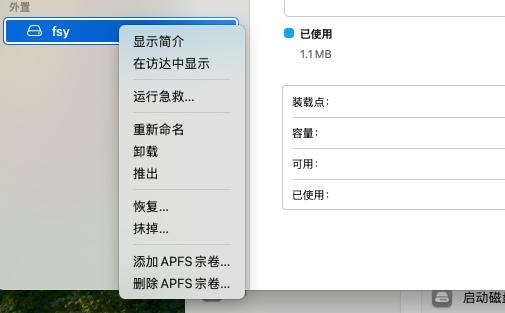

# 20250729
### 1. macos partition
Wipe:    



### 2. macos virt-manager
Add a bridge interface:     


Use qemu for installation of debian:       

```
sudo /opt/homebrew/bin/qemu-system-aarch64  -M virt,highmem=on,gic-version=3 \
  -cpu cortex-a72 \
-smp 8 -m 12800M -accel hvf \
  -bios /opt/homebrew/share/qemu/edk2-aarch64-code.fd \
  -device virtio-scsi-device \
  -device scsi-hd,drive=hd0 \
  -drive if=none,id=hd0,format=qcow2,file=/Volumes/fsy/images/debian.qcow2 \
  -device scsi-cd,drive=cd0 \
  -drive if=none,id=cd0,format=raw,media=cdrom,readonly=on,file=/Volumes/fsy/images/debian-12.9.0-arm64-DVD-1.iso \
  -netdev vmnet-bridged,id=net0,ifname=en0 \
  -device virtio-net-pci,netdev=net0,mac=42:5c:38:00:09:f3 \
  -nographic \
  -monitor none \
  -serial stdio
```
After installation, change iso from debian to virtio.     

openstack node configuration:        

```
sudo /opt/homebrew/bin/qemu-system-aarch64  -M virt,highmem=on,gic-version=3 \
  -cpu cortex-a72 \
-smp 10 -m 12800M -accel hvf \
  -bios /opt/homebrew/share/qemu/edk2-aarch64-code.fd \
  -device virtio-scsi-device \
  -device scsi-hd,drive=hd0 \
  -drive if=none,id=hd0,format=qcow2,file=/Volumes/fsy/images/debian.qcow2 \
  -device scsi-hd,drive=hd1 \
  -drive if=none,id=hd1,format=qcow2,file=/Volumes/fsy/images/debianvdb.qcow2 \
  -device scsi-cd,drive=cd0 \
  -drive if=none,id=cd0,format=raw,media=cdrom,readonly=on,file=/Volumes/fsy/images/virtio-win-0.1.266.iso \
  -netdev vmnet-bridged,id=net0,ifname=en0 \
  -device virtio-net-pci,netdev=net0,mac=42:5c:38:00:09:f3 \
  -netdev vmnet-bridged,id=net1,ifname=en0 \
  -device virtio-net-pci,netdev=net1,mac=42:5c:38:00:09:33 \
  -nographic \
  -monitor none \
  -serial stdio
```

