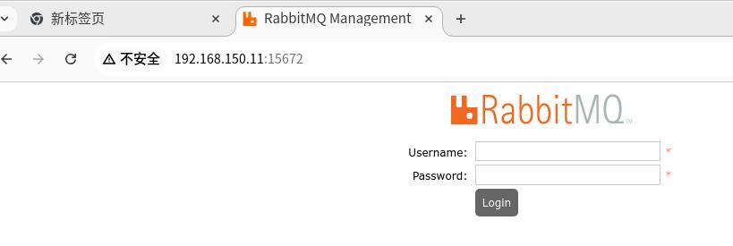
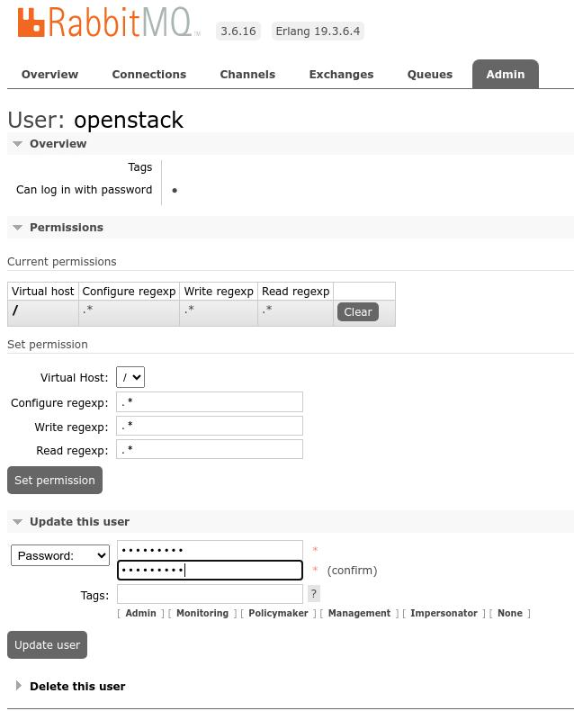
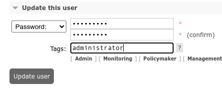

# 20250811
### 1. stein work tips(CentOS7)
Step:     

```
192.168.150.11  controller
192.168.150.12  compute1
192.168.150.13  compute2
```
All nodes:      

```
systemctl disable firewalld
SELINUX should be disabled
echo "PS1='[\[\e[31m\]\u\[\e[m\]@\[\e[36m\]\H\[\e[33m\] \W\[\e[m\]]\[\e[35m\]\\$ \[\e[m\]'" >>/etc/bashrc
source /etc/bashrc
sed -i.bak   -e 's|^mirrorlist=|#mirrorlist=|g'   -e 's|^#baseurl=http://mirror.centos.org/centos|baseurl=https://mirrors.ustc.edu.cn/centos-vault/centos|g'   /etc/yum.repos.d/CentOS-Base.repo && yum makecache
yum install -y vim net-tools wget lrzsz tree screen lsof tcpdump nmap mlocate

cat >>/etc/hosts<<EOF

# controller
192.168.150.11    controller

# compute
192.168.150.12    compute1
192.168.150.13    compute2
EOF
```
(Controller)passwordless ssh login:    

```
ssh-keygen 
ssh-copy-id root@controller
ssh-copy-id root@compute1
ssh-copy-id root@compute2
```

(Controller) Change repo:       

```
yum install -y centos-release-openstack-stein
yum makecache
cd /etc/yum.repos.d

vim CentOS-OpenStack-stein.repo
baseurl=https://mirrors.ustc.edu.cn/centos-vault/7.9.2009/cloud/x86_64/openstack-stein/
vim CentOS-Ceph-Nautilus.repo
baseurl=https://mirrors.ustc.edu.cn/centos-vault/7.9.2009/storage/x86_64/ceph-nautilus/
vim CentOS-NFS-Ganesha-28.repo
baseurl=https://mirrors.ustc.edu.cn/centos-vault/7.9.2009/storage/x86_64/nfs-ganesha-28/
vim CentOS-QEMU-EV.repo
baseurl=https://mirrors.ustc.edu.cn/centos-vault/7.9.2009/virt/x86_64/kvm-common/

yum makecache
yum install -y python-openstackclient 
```
(Compute1/2):       

```
yum install -y centos-release-openstack-stein
(Controller): scp CentOS-OpenStack-stein.repo CentOS-Ceph-Nautilus.repo CentOS-NFS-Ganesha-28.repo CentOS-QEMU-EV.repo root@compute1(2):/etc/yum.repos.d/
```

(Controller):      

```
yum install -y mariadb mariadb-server MySQL-python
vim /etc/my.cnf.d/mariadb-server.cnf (Added following lines under mysqld module):
default-storage-engine = innodb
innodb_file_per_table = on
collation-server = utf8_general_ci
init-connect = 'SET NAMES utf8'
character-set-server = utf8
systemctl enable mariadb.service --now
mysql_secure_installation
(Only set the password to yiersansi)

yum install -y memcached python-memcached
sed -i 's/127.0.0.1/0.0.0.0/' /etc/sysconfig/memcached 
systemctl enable memcached.service --now
# test
printf "set foo 0 0 3\r\nbar\r\n"|nc controller 11211  
printf "get foo\r\n"|nc controller 11211 

yum install -y rabbitmq-server
systemctl enable rabbitmq-server.service --now
rabbitmqctl add_user openstack openstack
rabbitmqctl set_permissions openstack ".*" ".*" ".*" 
rabbitmq-plugins list 
rabbitmq-plugins enable rabbitmq_management  

```
geust/guest for login:    







(Controller), Install/config keystone:      

```
mysql -uroot -p
create database keystone;
grant all privileges on keystone.* to keystone_user@controller identified by 'keystone_pass';
flush privileges;
quit;
```

### 2. GPT-SoVITS On Ubuntu22.04
Upgrade cuda to 12.8:      

```
wget https://developer.download.nvidia.com/compute/cuda/repos/ubuntu2204/x86_64/cuda-keyring_1.1-1_all.deb
sudo dpkg -i cuda-keyring_1.1-1_all.deb
sudo apt-get update
sudo apt-get -y install cuda-toolkit-12-8
sudo apt-get install -y cuda-drivers
export PATH=/usr/local/cuda-12.8/bin${PATH:+:${PATH}}
sudo reboot
```

Docker:     

```
git clone https://github.com/RVC-Boss/GPT-SoVITS.git
sudo vim /etc/docker/daemon.json
           "runtimes": {
        "nvidia": {
            "path": "nvidia-container-runtime",
            "runtimeArgs": []
        }
sudo systemctl daemon-reload && sudo systemctl restart docker
```
Change to docker-ce, then:      

```
cd ~/Code/GPT-SoVITS
sudo docker-compose run --service-ports GPT-SoVITS-CU12
```
Enter the docker instance and execute:      

```
$ sudo docker exec -it 9956431bddd0 bash
l(base) root@9956431bddd0:/workspace/GPT-SoVITS# ls *.py
api.py  api_v2.py  config.py  webui.py
(base) root@9956431bddd0:/workspace/GPT-SoVITS# python webui.py
(base) root@9956431bddd0:/workspace/GPT-SoVITS# python api_v2.py 
```

