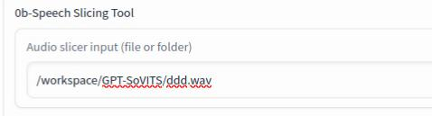
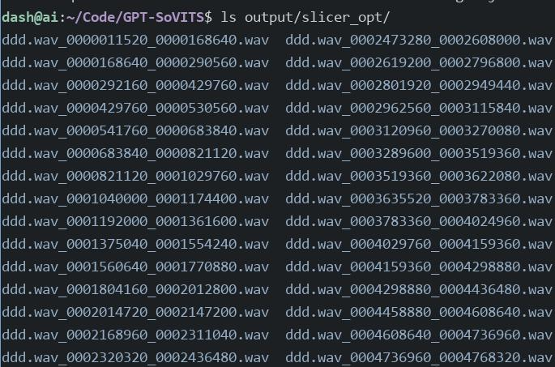
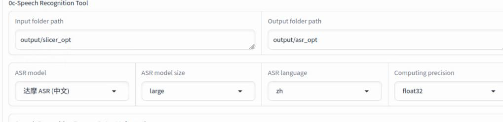
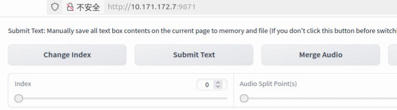
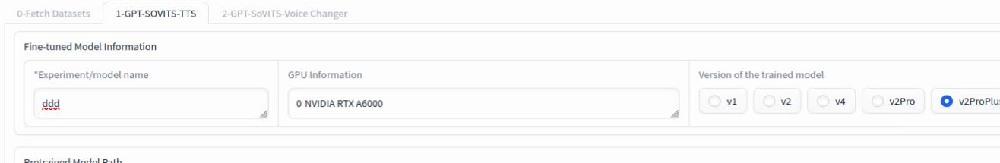
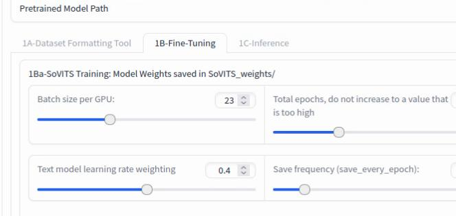
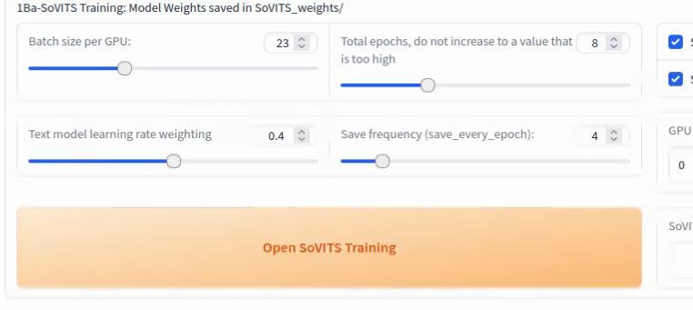
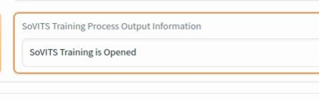
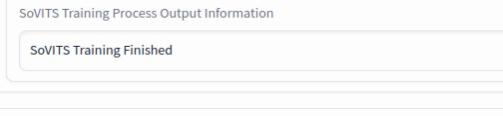

# 20250813
### 1. GPT-SoVITS working tips
Speech Slicing:     



`output/slicer_opt` foler content:    



```
sudo apt install sox
$ for file in *.wav; do echo "$file: $(soxi -D "$file") seconds"; done
ddd.wav_0000011520_0000168640.wav: 4.910000 seconds
ddd.wav_0000168640_0000290560.wav: 3.810000 seconds
ddd.wav_0000292160_0000429760.wav: 4.300000 seconds
ddd.wav_0000429760_0000530560.wav: 3.150000 seconds
ddd.wav_0000541760_0000683840.wav: 4.440000 seconds
ddd.wav_0000683840_0000821120.wav: 4.290000 seconds
...
```
Click `Open Speech Recognition`,    



Click `Open Audio Labeling WebUI`, fix some words. Port is 9871:       



After fix, `Close Audio Labeling WebUI`.    

Fine-Tuned Model Information:    




Status:    


Finish:     


Click `1B-Fine-Tuning`:     



Click `Open SoVITS Traning`:     







Result:      

```
dash@ai:~/Code/GPT-SoVITS$ ls SoVITS_weights_v2ProPlus/ddd* -l -h
-rw-r--r-- 1 root root 165M  8月 13 15:31 SoVITS_weights_v2ProPlus/ddd_e4_s20.pth
-rw-r--r-- 1 root root 165M  8月 13 15:32 SoVITS_weights_v2ProPlus/ddd_e8_s40.pth
```
`Open GPT Traning`:    


Result:      

```
dash@ai:~/Code/GPT-SoVITS$ ls GPT_weights_v2ProPlus/ddd-e* -l -h
-rw-r--r-- 1 root root 149M  8月 13 15:33 GPT_weights_v2ProPlus/ddd-e10.ckpt
-rw-r--r-- 1 root root 149M  8月 13 15:33 GPT_weights_v2ProPlus/ddd-e15.ckpt
-rw-r--r-- 1 root root 149M  8月 13 15:33 GPT_weights_v2ProPlus/ddd-e5.ckpt
```

### 2. extract wav  

55:51->58:20,    
Extrace via:    
```
ffmpeg -i kink.mp4 -vn -acodec pcm_s16le -ar 44100 -ac 2 -ss 00:55:51 -to 00:58:20 xxxa.wav
```
concat wav files:    

```
ffmpeg -f concat -i list.txt -c copy output3.wav
$  cat ~/list.txt                
file 'output1.wav'
file 'output2.wav'

```
