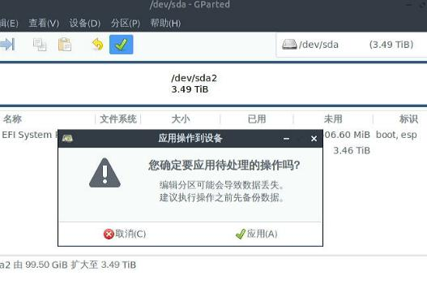

# 20250818
### 1. idv(rtx passthrough)
#### 1.1 bios configuration
Disable `Internal Graphics`(If present):     


Boot from CD(or external usb disk):     


Save and exit, reboot to installation.    

#### 1.2 System Installation/Configuration
Choose `Install Ubuntu`:     


Nvidia card won't work(ubuntu18.04 didn't have the device driver).    

Use internal graphical card for installation:     


Manually install deriver under installed system:      

```
# ./NVIDIA-Linux-x86_64-580.76.05.run  
# reboot
root@idvgen12:~# lspci -vvnn -s 01:00.0 | grep 'Kernel driver in'
	Kernel driver in use: nvidia
root@idvgen12:~# lspci | grep -i vga
01:00.0 VGA compatible controller: NVIDIA Corporation Device 2786 (rev a1)
09:00.0 VGA compatible controller: ASPEED Technology, Inc. ASPEED Graphics Family (rev 52)
```
Change default grub configuration:     

```
# vim /etc/default/grub
GRUB_CMDLINE_LINUX_DEFAULT="quiet splash iommu=pt kvm.ignore_msrs=1 intel_iommu=on intel_iommu=pt video=efifb:off,vesafb:off initcall_blacklist=sysfb_init modprobe.blacklist=ast"
# update-grub2 && reboot
```
####  1.3 vfio hooks debugging
adjust for making it workable for nvidia card:      

```
root@idvgen12:~# cat /bin/detectgpu.sh | grep -i nvidia
vgaid=`lspci | grep -i vga | grep -i nvidia | awk {'print $1'}`
reserveid=`lspci | grep -i vga | grep -i nvidia | awk -F ':' {'print $1'}`

/bin/vfio-startup.sh and /bin/vfio-teardown.sh remains the same.    
```
#### 1.4 vm preparation
vm disk preparation:      

```
root@idvgen12:~# mv /home/test/little_win10.qcow2 /var/lib/libvirt/images/
root@idvgen12:~# qemu-img create -f qcow2 -b /var/lib/libvirt/images/little_win10.qcow2 -F qcow2 /var/lib/libvirt/images/nvidia_win10.qcow2
```
Import disk and generate the vm:     


minimum configuration:      


Enable remote desktop:      


Adjust the processor for setting 12 cores:     


12=6core/2threads:     


Change to e1000 ethernet card for networking:    


`192.168.123.142` for connecting:     


#### 1.5 vm adjust.
Add nvidia card, keyboard, mouse:     


vfio hook:    

```
root@idvgen12:~# cat /etc/libvirt/hooks/qemu  | grep ^INSTANCE
INSTANCE="nvidia_win10"
# systemctl restart libvirtd
# virsh start nvidia_win10
```
kvm output:     


ssh forwarding to windows' remote desktop:      

```
root@idvgen12:/etc/apt/sources.list.d# ssh -L 0.0.0.0:13389:192.168.123.142:3389 test@192.168.1.101
```

Wait for windows update for updating the system:    


also using virtio iso for updating the system driver   

Add the python-qt5 scripts, but this script won't start, until:        

```
usermod -aG libvirt test
``` 
Also comment all of the `sudo` related items under `/opt/bgok_close.py`.    

### 2. redo nvidia-idv(256G ssd)


rescuezilla clone:    


### 3. rescuzilla
选择语言：    


点击`还原`:      


还原镜像所在位置:      


选择`nvidiaidv-2025-08-18xxxx`    


选择需要还原到的硬盘:     


保持默认:     


点击下一步，并选择确认后开始还原:      


还原过程, 并查看其进度:    


点击桌面的gparted, 扩充磁盘:     


切换到sda:     


扩充到100%:     


确认应用:      



点击关闭后，重启      


### 4. bios for silver


A6000 maybe need passthrough vbt files.    
