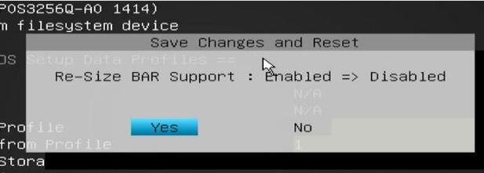

# 20250819
### 1. a6000 passthrough(continue)
Disable os probe in grub:      

```
# vim /etc/default/grub
GRUB_DISABLE_OS_PROBER=true
# update-grub2 && reboot
```


Solved via:     

```
cd /boot/grub
rm grubenv
grub-editenv grubenv create
grub-editenv grubenv set default=0
grub-editenv grubenv list
update-grub
```
Extrace the vbios and edit it with okteta, also the same as before.      


Change win10 images to ubuntu2004/uefi image, the same result.   

### 2. rtxa600 passthrough(ubuntu2404)
Not needed, for we have to adjust so much on ubuntu2404.    

### 3. z790 issue
z790 issue, close `Above 4GB MMIO BIOS assignment`:    


Close `Above 4G Decoding` and `Re-Size BAR Support`:     


Detailed changes:     




Then z790 will passthrough RTX A6000
