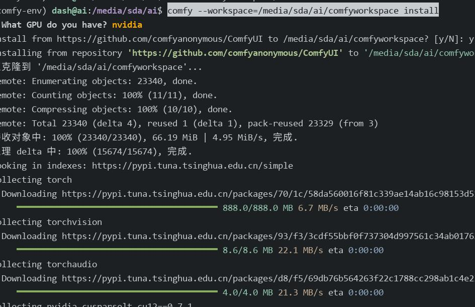
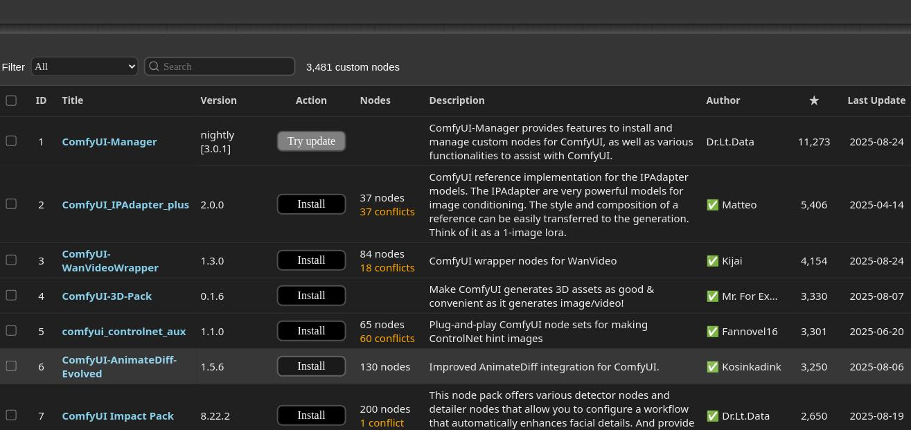
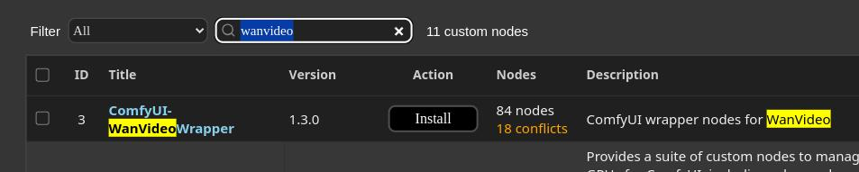
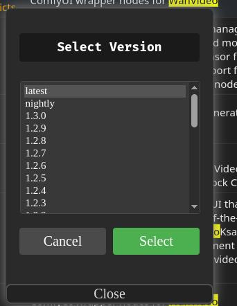
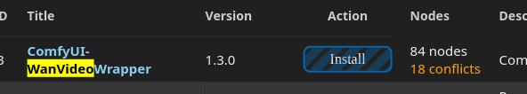
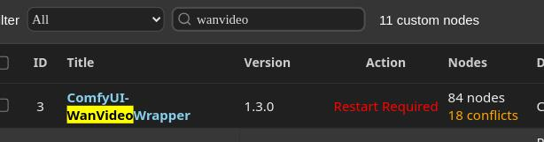

# 20250825
### 1. comfyui
Install steps(Using tsinghua repository):     

```
python3 -m venv comfy-env
source /media/sda/ai/comfy-env/bin/activate
pip install comfy-cli -i https://pypi.tuna.tsinghua.edu.cn/simple
pip config set global.index-url https://pypi.tuna.tsinghua.edu.cn/simple
rm -rf comfyworkspace/
comfy --workspace=/media/sda/ai/comfyworkspace install
```



```
comfy launch -- --listen 0.0.0.0 --port 18080 
```


```
official: 
1280x720, comfy ui, 48G 40min
1280x720, KJ, 48G 40min
```

Install kj:     

customization node manager:    







Changes to `Install` status:    



After installation:     



### 2. nfs buf-fix on arch
bug:    

```
nfs: mount program didn't pass remote address
```
Solved via install `nfs-utils` under archlinux

### 3. euler kernel for xxx
Steps:    

```
useradd -m mock
wget xxxxx.rpm
su - mock
rpm -ivh kernel-5.10.0-278.0.0.181.oe2203sp4.src.rpm
vim rpmbuild/SPECS/kernel.spec
comment OpenCSD
  129 BuildRequires: libtraceevent-devel > 1.2.1-4
->
  129 BuildRequires: libtraceevent-devel 

su root
yum-builddep kernel.spec

After building
yum install ./kernel-5.10.0-278.0.0.181.ctl3.aarch64.rpm
grubby --set-default /boot/vmlinuz-5.10.0-278.0.0.181.ctl3.aarch64

reboot
```
