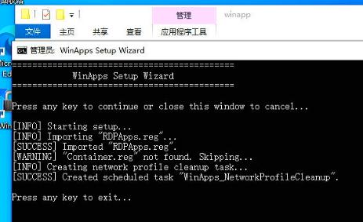

# 20250826
### 1. euler kernel build
Issue:     

```
*** ERROR - ABI BREAKAGE WAS DETECTED ***
```

Solved via
```
vim SPECS/kernel.spec
%define with_kabichk 0
%else
%define with_kabichk 0
%endif
```
Kernel source file:     

```
su - mock
rpm -ivh kernel-5.10.0-136.12.0.86.oe2203sp1.src.rpm
```
### 2. winapp



fixed ip address:     

```
root@test-P860:/var/lib/libvirt/images# virsh dumpxml RDPWindows| grep mac
    <type arch='x86_64' machine='pc-q35-8.2'>hvm</type>
      <mac address='52:54:00:0e:95:70'/>
root@test-P860:/var/lib/libvirt/images# virsh net-edit "default"

<dhcp>
  <range start="192.168.122.2" end="192.168.122.254"/>
  <host mac="df:87:4c:75:e5:fb" name="RDPWindows" ip="192.168.122.2"/>

Network default XML configuration edited.

root@test-P860:/var/lib/libvirt/images# virsh net-destroy "default"
Network default destroyed

root@test-P860:/var/lib/libvirt/images# virsh net-start "default"
Network default started

root@test-P860:/var/lib/libvirt/images# virsh start RDPWindows
Domain 'RDPWindows' started

```
### 3. kernel build in euler
issue:    

```
	asciidoc is needed by kernel-5.10.0-136.12.0.86.aarch64
	audit-libs-devel is needed by kernel-5.10.0-136.12.0.86.aarch64
	binutils-devel is needed by kernel-5.10.0-136.12.0.86.aarch64
	bison is needed by kernel-5.10.0-136.12.0.86.aarch64
	clang >= 10.0.0 is needed by kernel-5.10.0-136.12.0.86.aarch64
	dwarves is needed by kernel-5.10.0-136.12.0.86.aarch64
	elfutils-devel is needed by kernel-5.10.0-136.12.0.86.aarch64
	elfutils-libelf-devel is needed by kernel-5.10.0-136.12.0.86.aarch64
	flex is needed by kernel-5.10.0-136.12.0.86.aarch64
	gcc >= 3.4.2 is needed by kernel-5.10.0-136.12.0.86.aarch64
	gettext is needed by kernel-5.10.0-136.12.0.86.aarch64
	glibc-static is needed by kernel-5.10.0-136.12.0.86.aarch64
	gtk2-devel is needed by kernel-5.10.0-136.12.0.86.aarch64
	hmaccalc is needed by kernel-5.10.0-136.12.0.86.aarch64
	hostname is needed by kernel-5.10.0-136.12.0.86.aarch64
	java-1.8.0-openjdk is needed by kernel-5.10.0-136.12.0.86.aarch64
	java-1.8.0-openjdk-devel is needed by kernel-5.10.0-136.12.0.86.aarch64
	java-devel is needed by kernel-5.10.0-136.12.0.86.aarch64
	libbabeltrace-devel is needed by kernel-5.10.0-136.12.0.86.aarch64
	libcap-devel is needed by kernel-5.10.0-136.12.0.86.aarch64
	libcap-ng-devel is needed by kernel-5.10.0-136.12.0.86.aarch64
	libunwind-devel is needed by kernel-5.10.0-136.12.0.86.aarch64
	libzstd-devel is needed by kernel-5.10.0-136.12.0.86.aarch64
	llvm is needed by kernel-5.10.0-136.12.0.86.aarch64
	m4 is needed by kernel-5.10.0-136.12.0.86.aarch64
	module-init-tools is needed by kernel-5.10.0-136.12.0.86.aarch64
	ncurses-devel is needed by kernel-5.10.0-136.12.0.86.aarch64
	net-tools is needed by kernel-5.10.0-136.12.0.86.aarch64
	newt-devel is needed by kernel-5.10.0-136.12.0.86.aarch64
	numactl-devel is needed by kernel-5.10.0-136.12.0.86.aarch64
	openssl is needed by kernel-5.10.0-136.12.0.86.aarch64
	openssl-devel is needed by kernel-5.10.0-136.12.0.86.aarch64
	pciutils-devel is needed by kernel-5.10.0-136.12.0.86.aarch64
	perl is needed by kernel-5.10.0-136.12.0.86.aarch64
	perl(Carp) is needed by kernel-5.10.0-136.12.0.86.aarch64
	perl(ExtUtils::Embed) is needed by kernel-5.10.0-136.12.0.86.aarch64
	perl-devel is needed by kernel-5.10.0-136.12.0.86.aarch64
	perl-generators is needed by kernel-5.10.0-136.12.0.86.aarch64
	python3-devel is needed by kernel-5.10.0-136.12.0.86.aarch64
	python3-docutils is needed by kernel-5.10.0-136.12.0.86.aarch64
	rsync is needed by kernel-5.10.0-136.12.0.86.aarch64
	xmlto is needed by kernel-5.10.0-136.12.0.86.aarch64
	xz-devel is needed by kernel-5.10.0-136.12.0.86.aarch64
	zlib-devel is needed by kernel-5.10.0-136.12.0.86.aarch64

steps

    1   sed -E 's#https?://(repo|mirrors)\.openeuler\.org/#http://mirrors.ustc.edu.cn/openeuler/#g'          -i.bak          /etc/yum.repos.d/openEuler.repo
    2  yum makecache
    3  useradd -m mock
    4  cd /home/mock/
    5  ls
    6  cd rpmbuild/
    7  ls
    8  cd SPECS/
    9  ls
   10  yum-builddp kernel.spec
   11  yum install yum-utils
   12  yum search yum-builddp
   13  yum install yum-utils
   14  yum install make
   15  yum install yum-utils
   16  yum search yum-utils
   17  ls
   18  grep -E '^(Requires|BuildRequires):'  kernel.spec
   19  grep -E '^(Requires|BuildRequires):'  kernel.spec| awk '{print $2}' | sort -u > dependencies.txt
   20  cat dependencies.txt 
   21  dnf builddep kernel.spec 
   22  rpmbuild -ba kernel.spec 
   23  yum install rpmbuild
   24  yum install rpm-builder
   25  yum search rpm
   26  yum install rpm-build
   27  rpmbuild -ba kernel.spec 
   28  su - mock
   29  yum install sudo
   30  sudo -i su
   31  yum install util-linux
   32  su - mock
   33  ls

```
