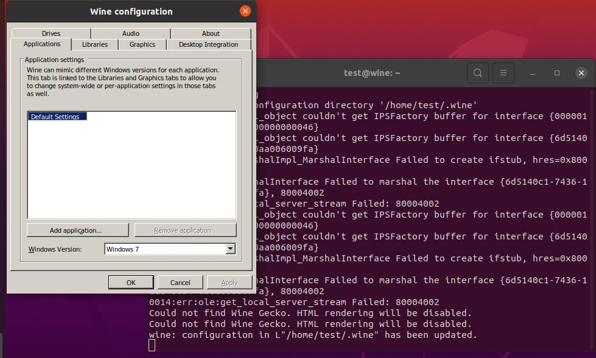
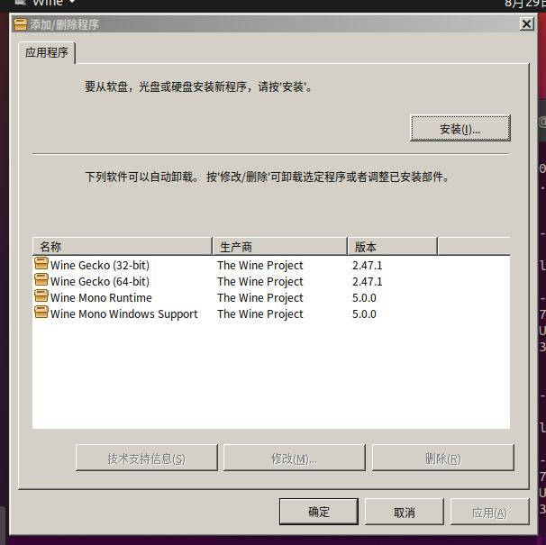

# 20250829
### 1. wine
Ubuntu20.04:      

```
dpkg --add-architecture i386 
sudo apt install wine64 wine32
sudo apt install -y fonts-wqy-microhei fonts-wqy-zenhei xfonts-wqy

$ wine --version
wine-5.0 (Ubuntu 5.0-3ubuntu1)
```
winecfg for calling.    



```
 wget http://dl.winehq.org/wine/wine-gecko/2.47.1/wine-gecko-2.47.1-x86.msi
 wget https://dl.winehq.org/wine/wine-mono/5.0.0/wine-mono-5.0.0-x86.msi
 wget https://dl.winehq.org/wine/wine-gecko/2.47.1/wine-gecko-2.47.1-x86_64.msi
 wine start /i wine-gecko-2.47.1-x86_64.msi 
 wine start /i wine-gecko-2.47.1-x86.msi 
 wine start /i wine-mono-5.0.0-x86.msi
```



### 2. phytium benchmark(20.04)
Result:      

```
 (aarch64)
8 cores @ 2500 MHz  |  31.2 GiB RAM
Number of Processes: 8  |  Test Iterations: 1  |  Test Duration: Medium
--------------------------------------------------------------------------------
CPU Mark:                          5655
  Integer Math                     31467 Million Operations/s
  Floating Point Math              28880 Million Operations/s
  Prime Numbers                    53.1 Million Primes/s
  Sorting                          19645 Thousand Strings/s
  Encryption                       1358 MB/s
  Compression                      37695 KB/s
  CPU Single Threaded              1252 Million Operations/s
  Physics                          644 Frames/s
  Extended Instructions (NEON)     5425 Million Matrices/s

Memory Mark:                       1633
  Database Operations              4793 Thousand Operations/s
  Memory Read Cached               9521 MB/s
  Memory Read Uncached             9129 MB/s
  Memory Write                     12665 MB/s
  Available RAM                    31098 Megabytes
  Memory Latency                   76 Nanoseconds
  Memory Threaded                  26549 MB/s
--------------------------------------------------------------------------------

```

