# 20250904
### 1. winserver 2022
Choose `Windows Server 2022 Standard Evalution(Desktop Ex..)`:    

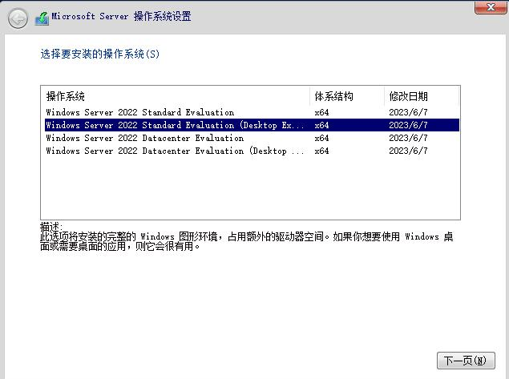

Added vfs to vm:    

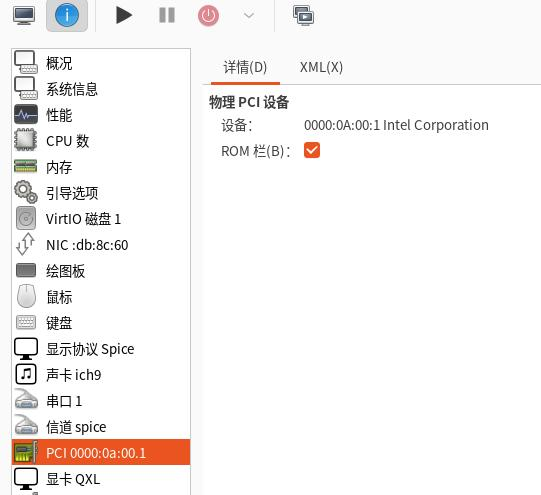

no device driver for vgpu:   

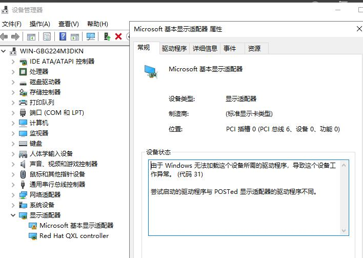


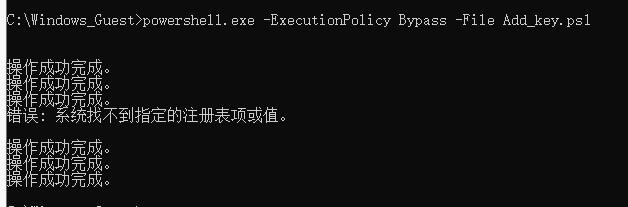


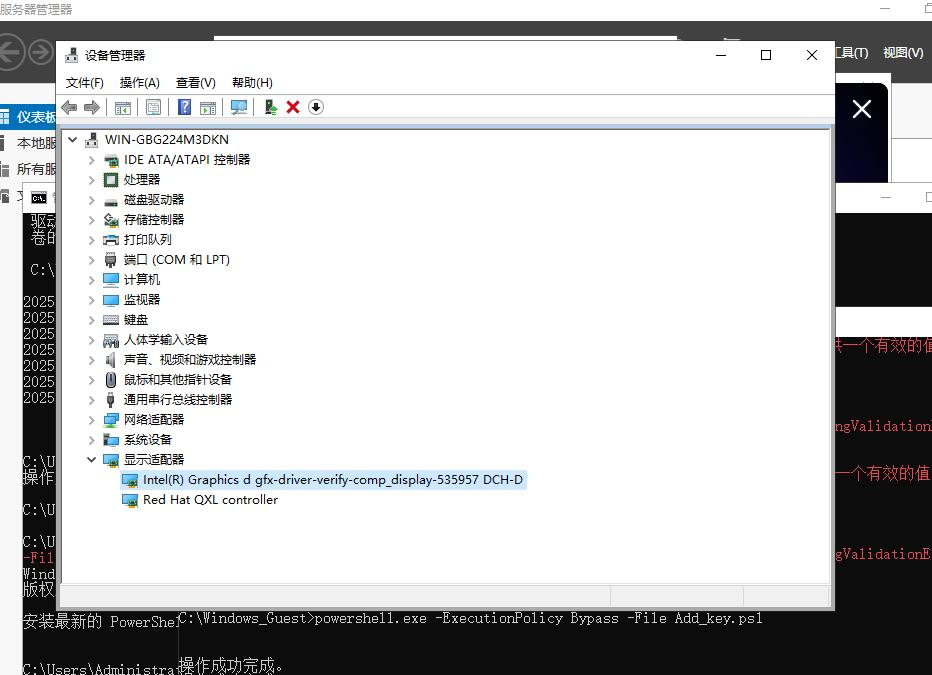

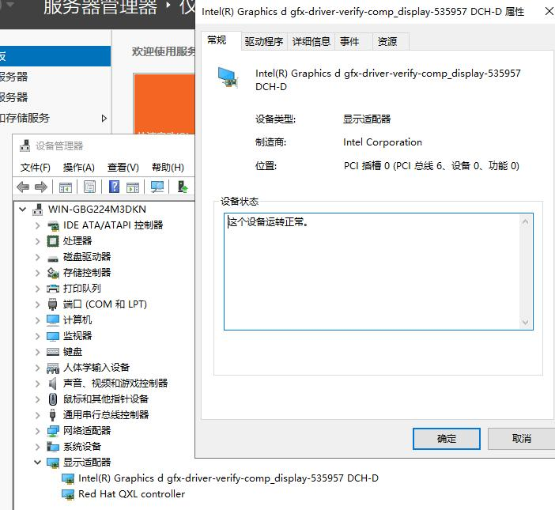

Open remote desktop:    


Using tigervnc server for setting windows vnc server.   

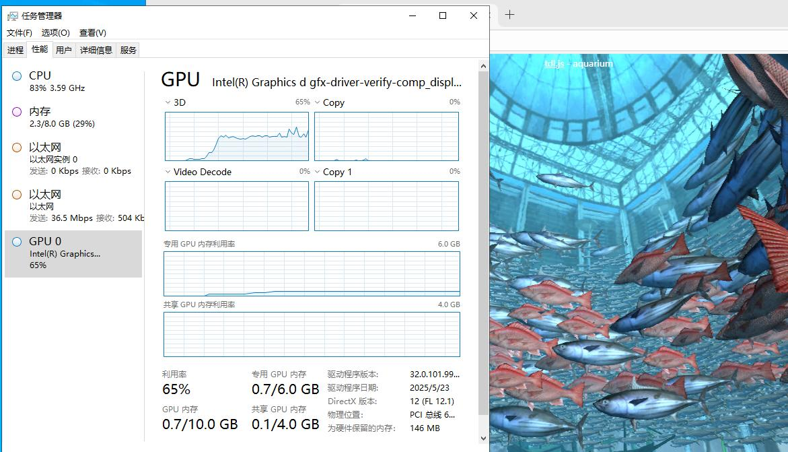

### 2. perf related
glmark2:     


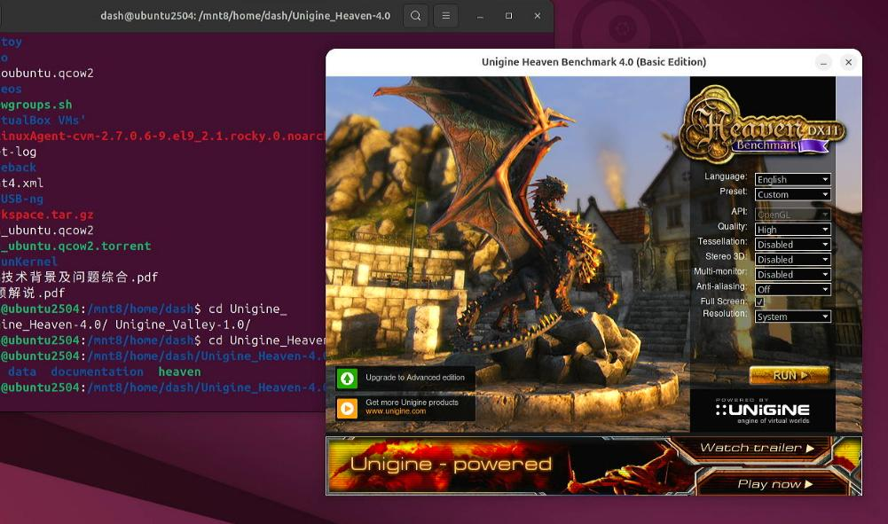

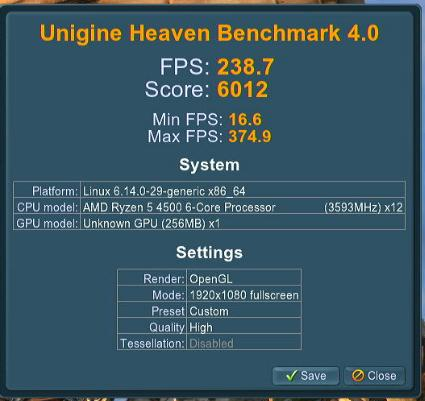

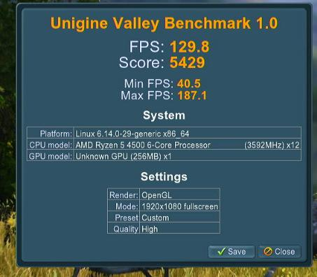

Upgrade to newest kernel:    

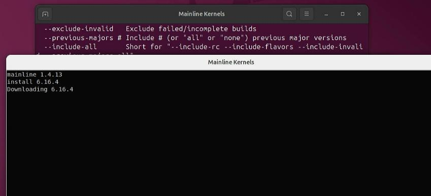

```
sudo add-apt-repository ppa:cappelikan/ppa
apt update -y
apt install -y mainline
```

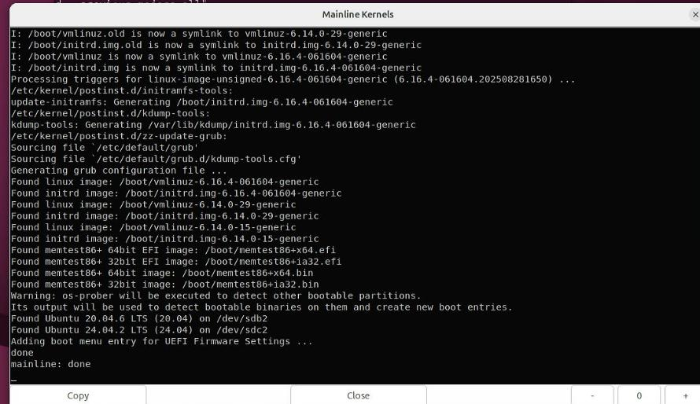

### 3. build kernel(25.04)

In docker:     

```
apt update
apt install -y vim
 apt install -y flex bison libssl-dev libelf-dev bc gcc automake autoconf libtool make rsync \
            patch wget dpkg-dev libdw-dev git debhelper kmod python-is-python3 gawk
cd /mnt/linux-6.16.4
git config --global --add safe.directory /mnt/linux-6.16.4
git init
git add .
git -c user.name="Your Name" -c user.email="your_email@example.com" commit -m "init commit"


cd /mnt/official
apt download linux-modules-6.14.0-24-generic
ar x linux-modules-6.14.0-24-generic_6.14.0-24_amd64.deb
tar -xvf data.tar.xz
cat ./boot/config-6.14.0-24-generic

cd /mnt/linux-6.16.4/
cp /mnt/official/boot/config-* .config
make menuconfig
## make changes to binder related

sed -i 's/^CONFIG_SYSTEM_TRUSTED_KEYS="debian\/canonical-certs.pem"/CONFIG_SYSTEM_TRUSTED_KEYS=""/' .config
sed -i 's/^CONFIG_SYSTEM_REVOCATION_KEYS="debian\/canonical-revoked-certs.pem"/CONFIG_SYSTEM_REVOCATION_KEYS=""/' .config
time make deb-pkg -j$(nproc)
```
Comparison of different configs generated deb:      

```
First time
-rw-r--r-- 1 root root 9.0M Sep  4 22:16 linux-headers-6.16.4-g5c503d1d0d25-dirty_6.16.4-g5c503d1d0d25-3_amd64.deb
-rw-r--r-- 1 root root  15M Sep  4 22:16 linux-image-6.16.4-g5c503d1d0d25-dirty_6.16.4-g5c503d1d0d25-3_amd64.deb
-rw-r--r-- 1 root root 1.5M Sep  4 22:16 linux-libc-dev_6.16.4-g5c503d1d0d25-3_amd64.deb

Second time(with official ubuntu config)

  LD [M]  net/qrtr/qrtr-smd.ko
  LD [M]  net/qrtr/qrtr-tun.ko
  LD [M]  net/qrtr/qrtr-mhi.ko
  LD [M]  virt/lib/irqbypass.ko
make[3]: *** [debian/rules:80: build-arch] Error 2
dpkg-buildpackage: error: make -f debian/rules binary subprocess returned exit status 2
make[2]: *** [scripts/Makefile.package:126: deb-pkg] Error 2
make[1]: *** [/mnt/linux-6.16.4/Makefile:1635: deb-pkg] Error 2
make: *** [Makefile:248: __sub-make] Error 2

```

