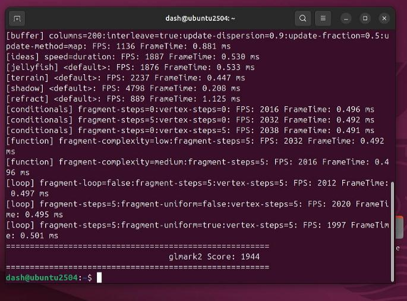

# 20250904
### 1. winserver 2022
Choose `Windows Server 2022 Standard Evalution(Desktop Ex..)`:    


Added vfs to vm:    


no device driver for vgpu:   


Open remote desktop:    


Using tigervnc server for setting windows vnc server.   


### 2. perf related
glmark2:     




Upgrade to newest kernel:    


```
sudo add-apt-repository ppa:cappelikan/ppa
apt update -y
apt install -y mainline
```


