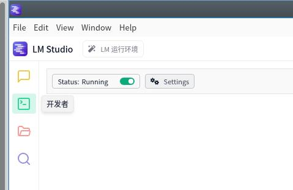
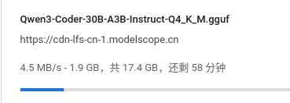
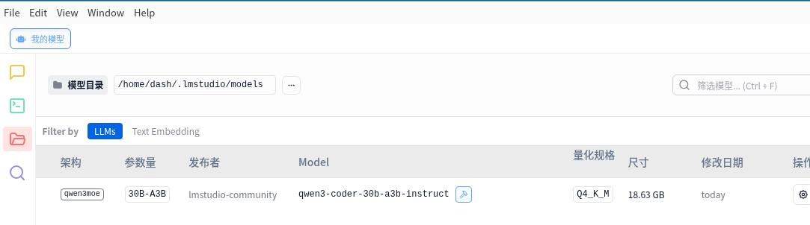
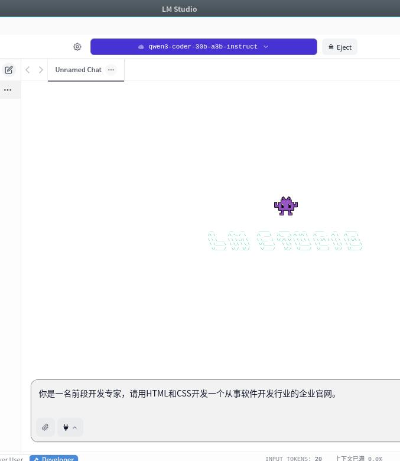
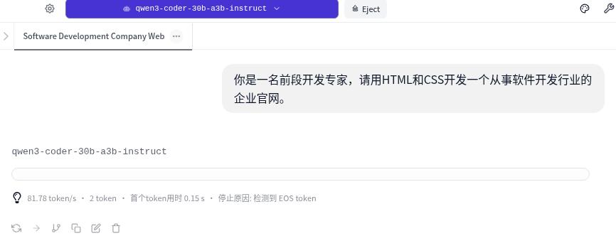
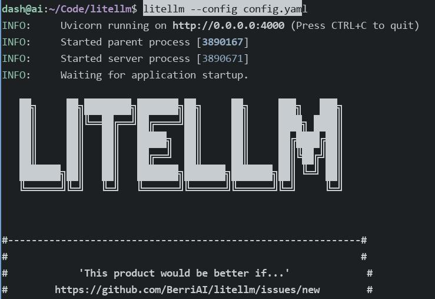

# 20250909
### 1. claude code
Ubuntu22.04, install steps as following:       

```
$ sudo apt install -y npm
$ sudo npm install -g @anthropic-ai/claude-code
npm WARN EBADENGINE Unsupported engine {
npm WARN EBADENGINE   package: '@anthropic-ai/claude-code@1.0.109',
npm WARN EBADENGINE   required: { node: '>=18.0.0' },
npm WARN EBADENGINE   current: { node: 'v12.22.9', npm: '8.5.1' }
npm WARN EBADENGINE }
# update nodejs
$ curl -fsSL https://deb.nodesource.com/setup_lts.x| sudo bash -
$ sudo apt install -y nodejs
# will fail
$ sudo apt remove libnode-dev
$ sudo apt install -y nodejs
$ sudo npm install -g @anthropic-ai/claude-code
$ claude --version
1.0.109 (Claude Code)
$ pip install 'litellm[proxy]'
``` 
LM Studio:     

```
chmod 777 LM_Studio*
./LM_Studio* --appimage-extract
cd squashfs-root
./lm-studio
```
Start the listening port 1234:    



Testing:    

```
dash@ai:~$ curl http://localhost:1234/v1/models
{
  "data": [
    {
      "id": "nomic-embed-text-v1.5",
      "object": "model",
      "owned_by": "organization_owner"
    }
  ],
  "object": "list"
```
Download the models from `modelscope.cn`:       




```
mv ~/Downloads/Qwen3-Coder-30B-A3B-Instruct-Q4_K_M.gguf ~/.lmstudio/models/lmstudio-community/Qwen3-Coder-30B-A3B-Instruct-GGUF
```







```
$ pwd
/home/dash/Code/litellm
$ cat config.yaml
model_list:
  - model_name: claude-3-5-haiku-20241022
    litellm_params:
      model: lm_studio/qwen/qwen3-coder-30b
      api_key: sk-dummy
      api_base: http://localhost:1234/v1
  
  - model_name: claude-3-5-sonnet-20241022
    litellm_params:
      model: lm_studio/qwen/qwen3-coder-30b
      api_key: sk-dummy
      api_base: http://localhost:1234/v1
  
  # 也支持原始模型名称
  - model_name: qwen3-coder-30b
    litellm_params:
      model: lm_studio/qwen/qwen3-coder-30b
      api_key: sk-dummy
      api_base: http://localhost:1234/v1
  
  - model_name: deepseek-r1
    litellm_params:
      model: lm_studio/deepseek-r1-distill-qwen-7b
      api_key: sk-dummy
      api_base: http://localhost:1234/v1
  
general_settings:
  master_key: sk-lmstudio-proxy-12345
$ litellm --config config.yaml

```


### 2. socket proxy
Host side:     

```
socat --experimental UNIX-LISTEN:/tmp/proxy.sock,fork  TCP:192.168.1.33:21080
chmod 777 /tmp/proxy.sock
```
Create 1 docker instance:     

```
$ sudo docker run --network none -v /tmp/proxy.sock:/tmp/proxy.sock -v /etc/resolv.conf:/etc/resolv.conf -it  ubuntuwithcurl:latest /bin/bash
In docker instance:    
root@5f50018c0076:/# socat TCP-LISTEN:1080,fork UNIX-CONNECT:/tmp/proxy.sock 

root@5f50018c0076:/# cat /etc/apt/apt.conf.d/proxy.conf
Acquire::http::Proxy "socks5h://127.0.0.1:1080";
Acquire::https::Proxy "socks5h://127.0.0.1:1080";

then: 
apt-get -y && apt upgrade -y
```

