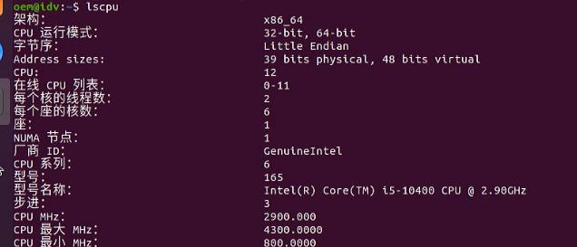
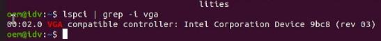
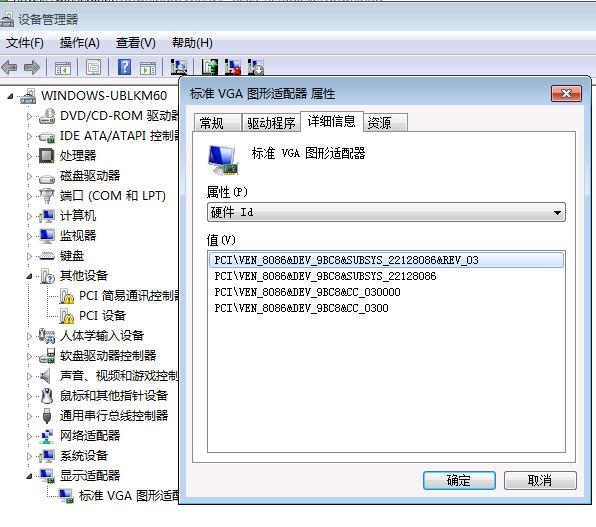
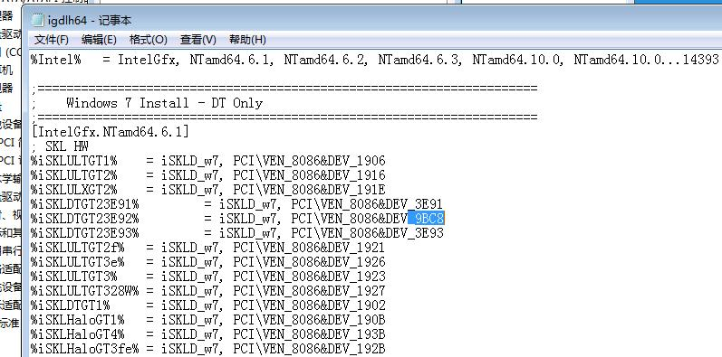
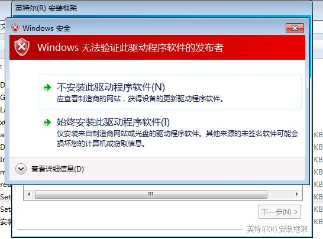
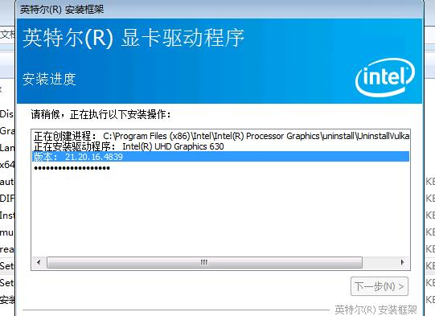
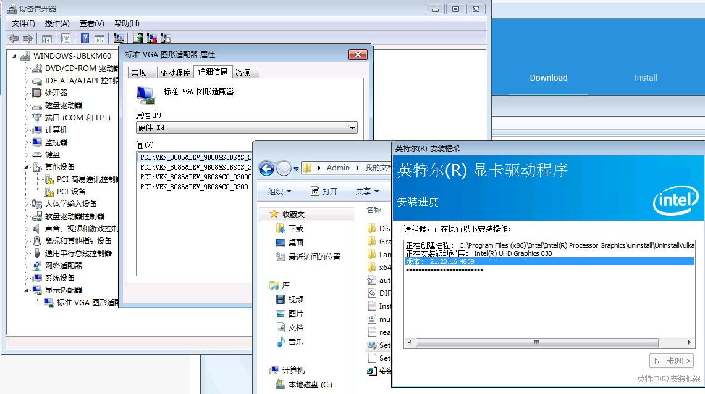
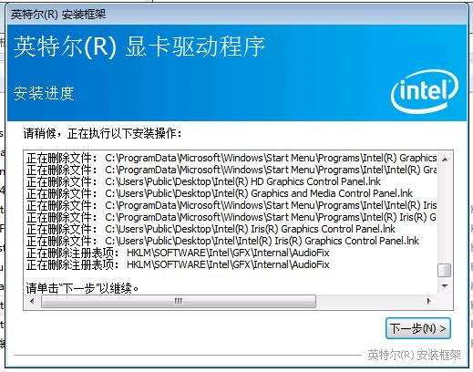
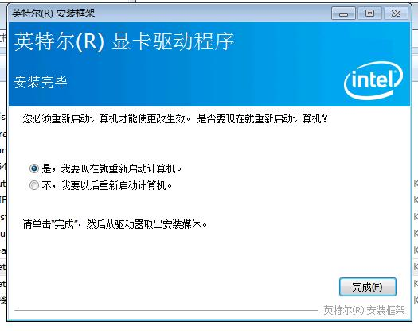

# 20250910
### 1. claude code(WritingQTapp)
Startup:     

```
export ANTHROPIC_BASE_URL="http://localhost:4000" && export ANTHROPIC_AUTH_TOKEN="sk-lmstudio-proxy-12345" && unset ANTHROPIC_API_KEY && claude --model claude-3-5-haiku-20241022
```

### 2. win7 on gen10 idv
Basic info:    





After installation, remote desktop open:    

















