# 20250911
### 1. win7 on gen10
Verification step:    

```
Install ubuntu 18.04
verify win10 vm
use the same configuration for installation of win7

```

### 2. gen 10 i9 win7(raw)
Use a rx550 gpu, for installation:      

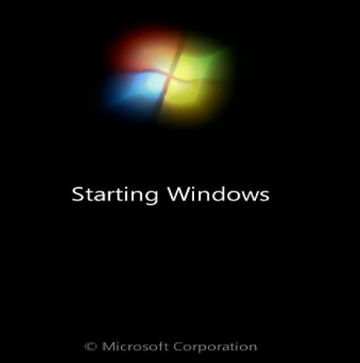

Close secure boot:    

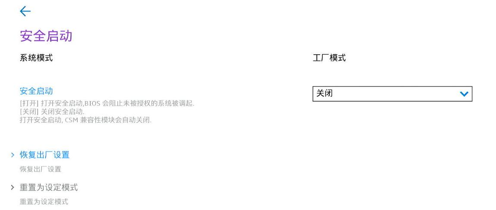

Get the bios mode:    

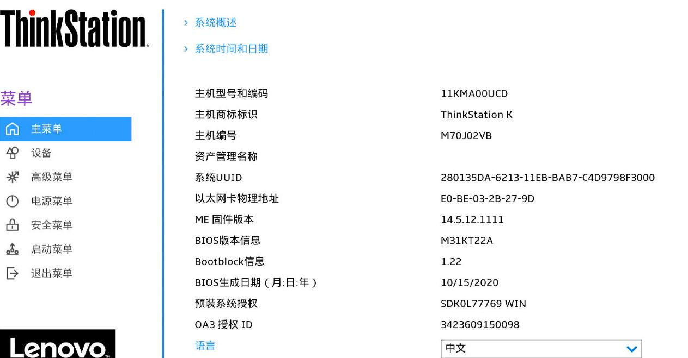

enable csm:     

```
BIOS版本M31K开头的激活代码 AmiSetupWriter.efi 0x802 0x1 （CSM改为允许）

如果M31K开头的BIOS，独显为RTX 16系列和20系列输入以下三条命令
AmiSetupWriter.efi 0x808 0x0 
AmiSetupWriter.efi 0x80b 0x2
AmiSetupWriter.efi 0x80c 0x2
```

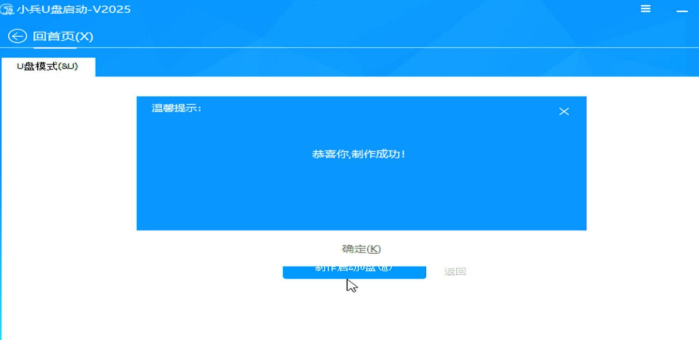

Create bios functionality disk:    

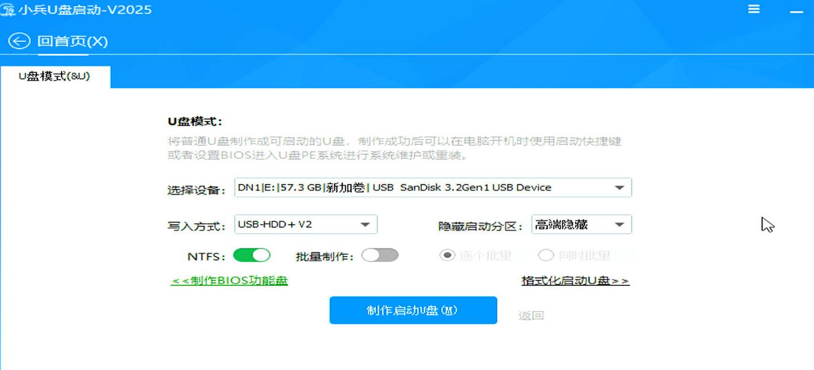

Boot to uefi mode:   
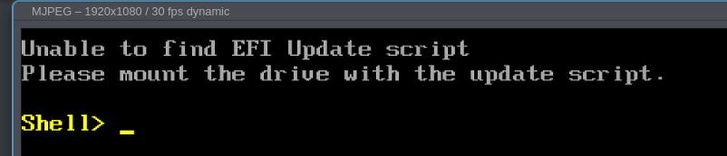

CSM enable:   

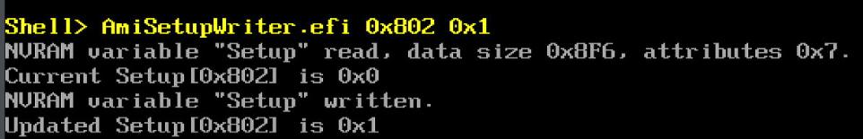

Graphical related:    

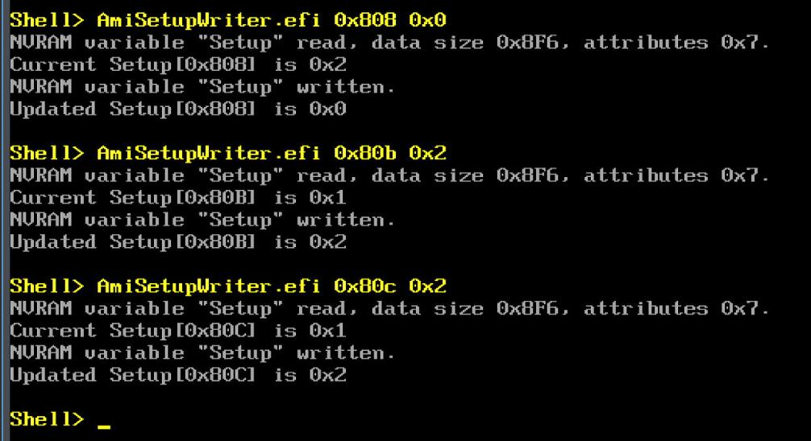

Ventoy for installing win7, could not start Ventoy.   


### 3. h3c idv(verification)
legacy items. black screen, but could be accessed via todesk.     

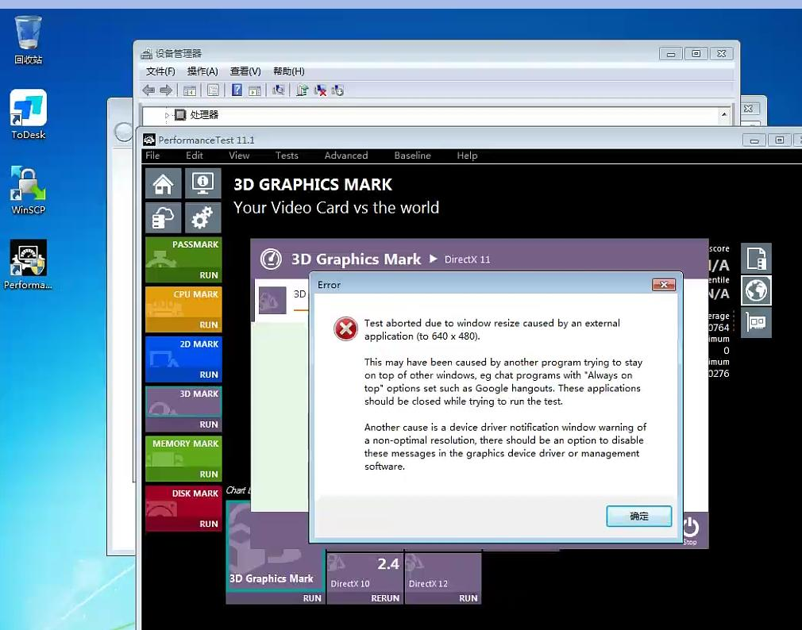

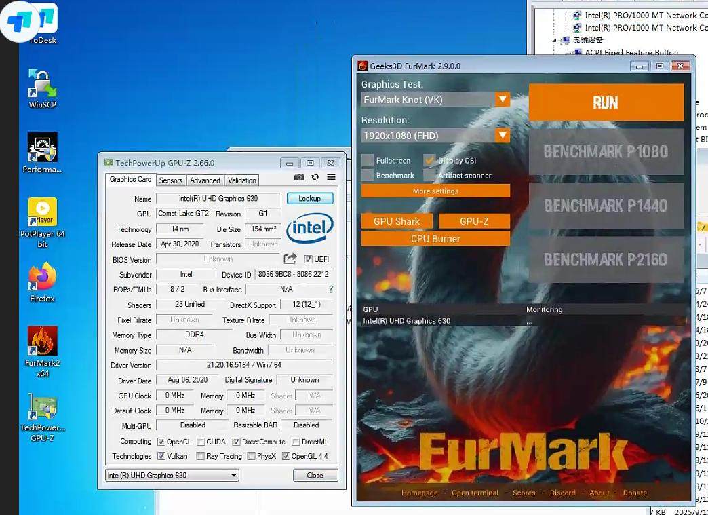

### 4. hardware installation
USB disk for installation :    

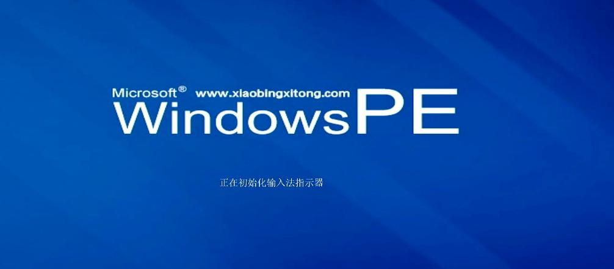


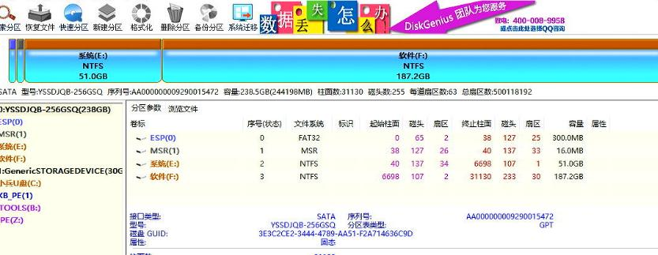

选择重装系统:     

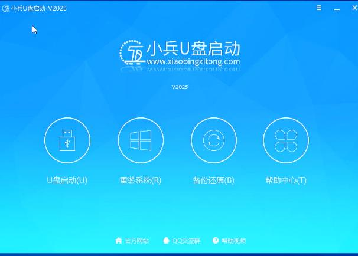

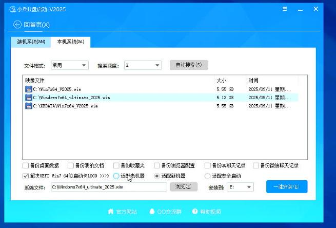

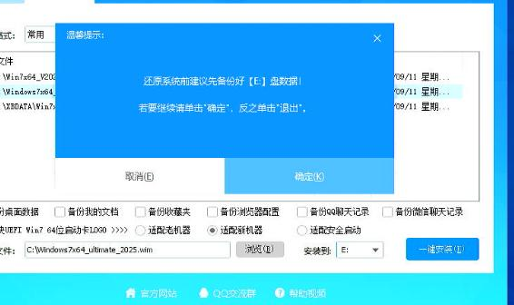

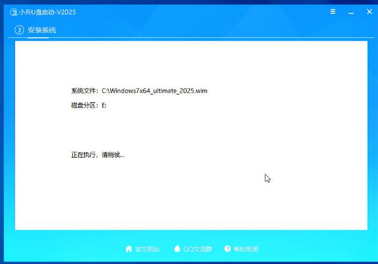

进度:     

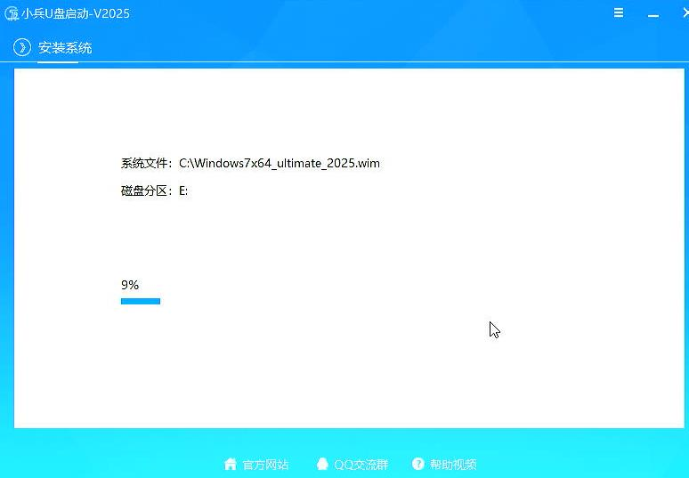

导入驱动:    

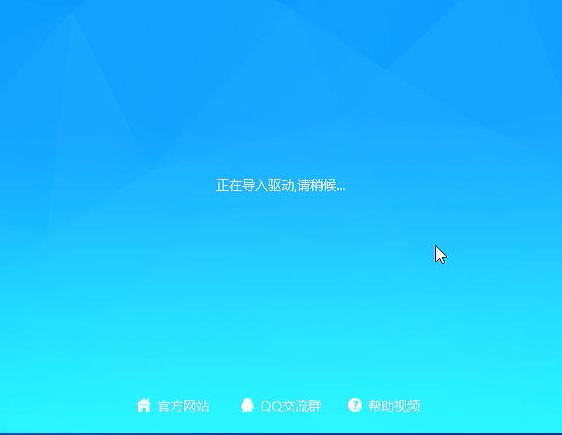

重启后：   

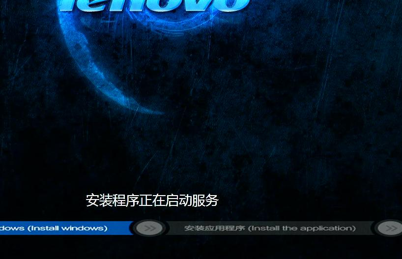

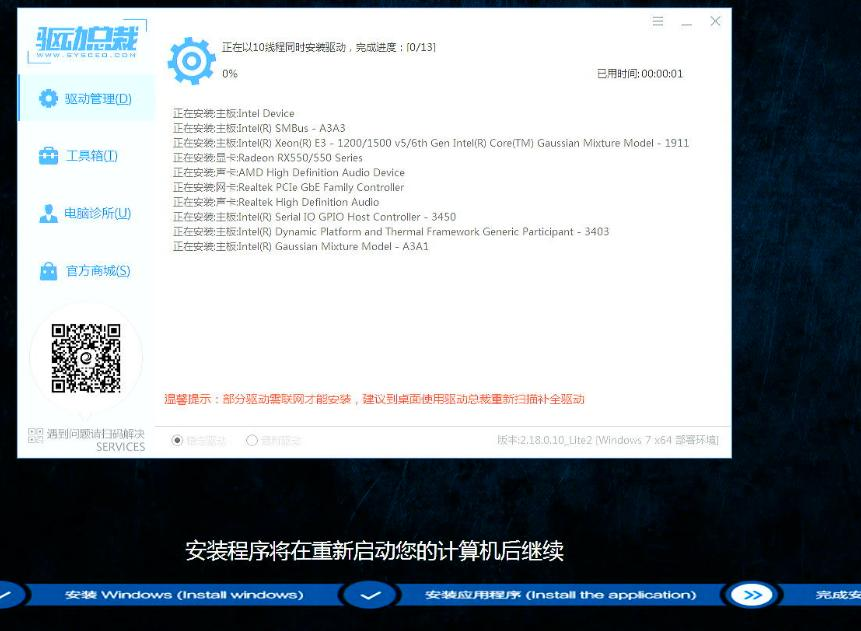

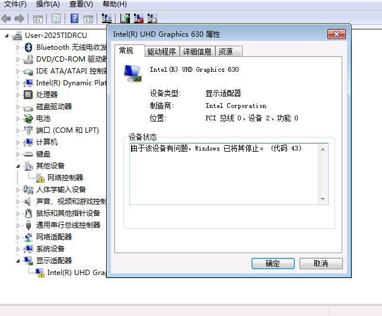

Not OK with 21.20.16.5164:    

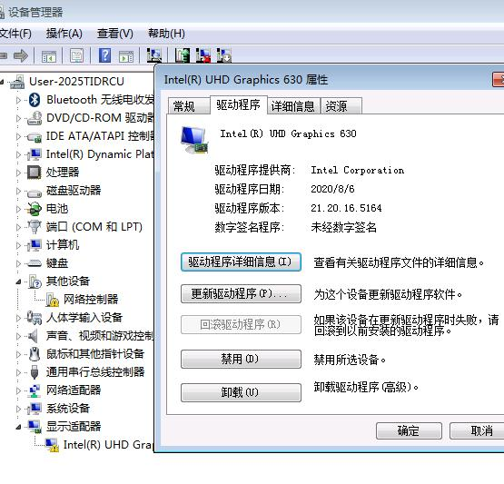

### 5. 8100 verification
Use the same iso for installation.     

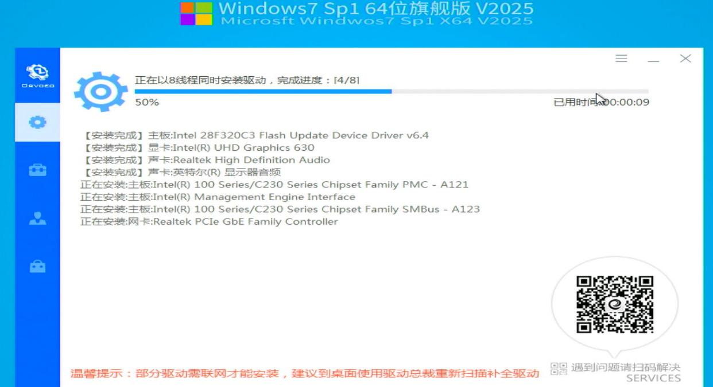

See this uhd630 could be activated or not?    

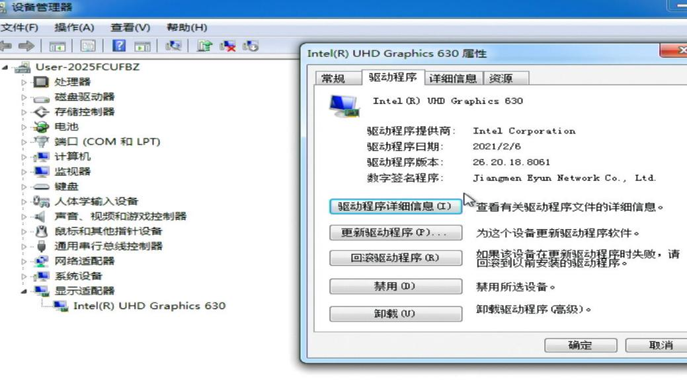

 
