# 20250915
### 1. 10400 verification
Windows 7: black screen.     

Install `idv 1.0.14`(10th version, deployed in rz):     

```
# uname -r
5.10.90-c1dc2c9a39ac
```
Import qcow2, first use qxl/spice for verification, then shutdown, add igpu/usb device:    

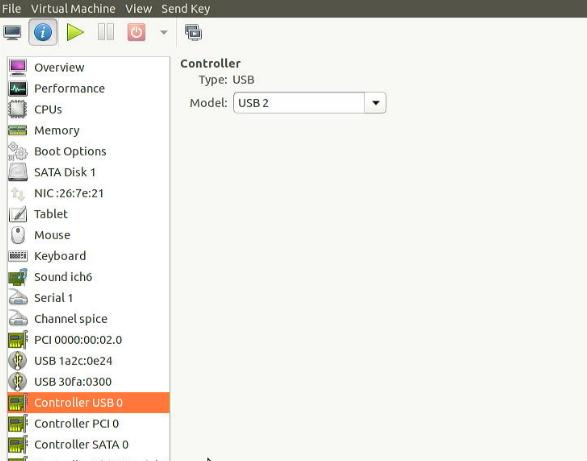

Edit the vm:     

```
# virsh edit win10
OVMF_CODE.fd->OVMF.fd
Add -set parameter
```

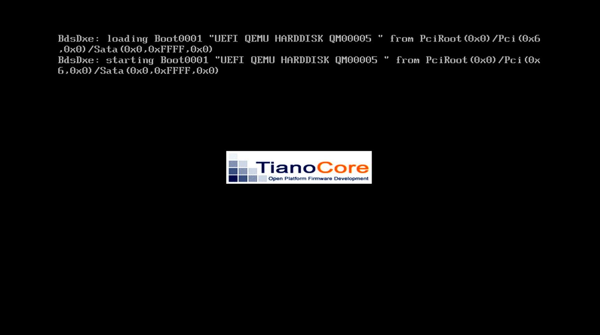

### 2. i7-10700 verification
Hardware info:   

```
root@idv-C5520V:~# lscpu | grep Model
Model:               165
Model name:          Intel(R) Core(TM) i7-10700 CPU @ 2.90GHz
root@idv-C5520V:~# uname -r
5.10.90-c1dc2c9a39ac

```
Import system:    

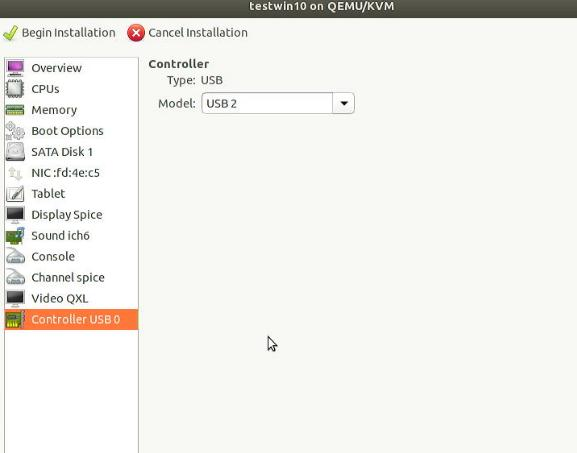


The effect are as listed as the i5-10400.   

### 3. i5-10400(tc-9073)
Hardware info:   

```
root@idv-TC-9073:/var/lib/libvirt/images# lscpu | grep 'Model'
Model:               165
Model name:          Intel(R) Core(TM) i5-10400 CPU @ 2.90GHz
root@idv-TC-9073:/var/lib/libvirt/images# uname -r
5.10.90-c1dc2c9a39ac
```
test vm:    

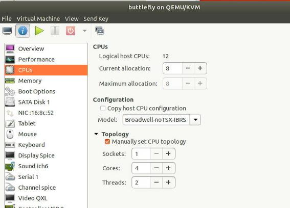

when start, the machine will remain black,       

dmesg output:   

```
[   60.862887] vfio-pci 0000:00:02.0: vgaarb: changed VGA decodes: olddecodes=io+mem,decodes=io+mem:owns=io+mem
[   60.884228] virbr0: port 2(vnet0) entered blocking state
[   60.884231] virbr0: port 2(vnet0) entered disabled state
[   60.884275] device vnet0 entered promiscuous mode
[   60.884402] virbr0: port 2(vnet0) entered blocking state
[   60.884404] virbr0: port 2(vnet0) entered listening state
[   60.933346] cgroup: cgroup: disabling cgroup2 socket matching due to net_prio or net_cls activation
[   62.048369] 8086:9bc8 set_gmbus_and_flr devfn=0x10 offset=0xc5100
[   62.048378] 8086:9bc8 set_gmbus_and_flr gmbus(0xc5100)=0x0 before wa
[   62.048404] 8086:9bc8 set_gmbus_and_flr gmbus=0x1 after wa before flr
[   62.156355] vfio-pci 0000:00:02.0: vfio_ecap_init: hiding ecap 0x1b@0x100
[   62.157317] vfio-pci 0000:00:02.0: Invalid PCI ROM header signature: expecting 0xaa55, got 0x0000
[   62.157324] vfio-pci 0000:00:02.0: Invalid PCI ROM header signature: expecting 0xaa55, got 0x0000
[   62.157330] vfio-pci 0000:00:02.0: Invalid PCI ROM header signature: expecting 0xaa55, got 0x0000
[   62.233223] 8086:9bc8 set_gmbus_and_flr devfn=0x10 offset=0xc5100
[   62.233231] 8086:9bc8 set_gmbus_and_flr gmbus(0xc5100)=0x0 before wa
[   62.233257] 8086:9bc8 set_gmbus_and_flr gmbus=0x1 after wa before flr
[   62.904335] virbr0: port 2(vnet0) entered learning state
[   64.920324] virbr0: port 2(vnet0) entered forwarding state
[   64.920336] virbr0: topology change detected, propagating
```
Effect:     

`i7verificationidv_510kernelofficial-2025-09-15_09.59.05.mp4`
### 4. kernel 6.6 on ubuntu1804
hw/os info:   

```
root@test-Standard-PC-Q35-ICH9-2009:~# uname -r
6.1.30-victory
root@test-Standard-PC-Q35-ICH9-2009:~# gcc --version
gcc (Ubuntu 11.4.0-2ubuntu1~18.04) 11.4.0
Copyright (C) 2021 Free Software Foundation, Inc.
```
Steps:     

```
mkdir Code
cd Code
wget https://github.com/facebook/zstd/releases/download/v1.5.6/zstd-1.5.6.tar.gz
tar -xzf zstd-1.5.6.tar.gz
cd zstd-1.5.6
make
sudo make install
cd ..
wget https://mirrors.ustc.edu.cn/kernel.org/linux/kernel/v6.x/linux-6.6.106.tar.xz
tar xJvf linux-6.6.106.tar.xz 
cd linux-6.6.106/
cp /boot/config-6.1.30-victory .config
scripts/config --disable SYSTEM_TRUSTED_KEYS
scripts/config --disable SYSTEM_REVOCATION_KEYS
vim .config
make menuconfig
 mkdir build
mv .config build/
make menuconfig O=./build
#make LOCALVERSION="-new66" -j `jproc` O=./build
ls
ls build/
ls -l -h -a build/
time make LOCALVERSION="-new66" -j `jproc` O=./build
echo ""| make ARCH=x86_64 olddefconfig O=./build
make ARCH=x86_64 mrproper
time make LOCALVERSION="-new66" -j `jproc` O=./build
cat /proc/cpuinfo
echo ""| make ARCH=x86_64 olddefconfig O=./build
free -g
make LOCALVERSION="-newnew" -j `nproc` O=./build
df -h
make LOCALVERSION="-newnew" -j `nproc` O=./build V=1
```
Change to tsinghua git:     

```
time make LOCALVERSION="-th66" -j `nproc` O=./build deb-pkg
```
### 5. kernel verification
Kernel verification:   

| Kernel Version | Qemu Version | Result |
| ----------- | ---------- |----------- |
| 5.10.90 | 4.2.0 | Succeed |
| 6.1.109-paragon | 4.2.0 | Succeed |

### 6. libvirt based
Create vm:    

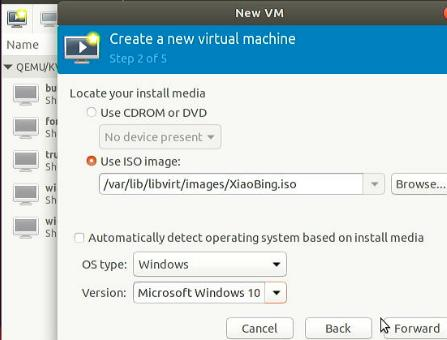

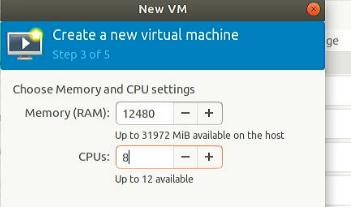

specify qcow2:     

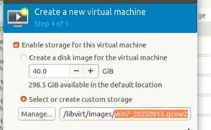

specify name:    

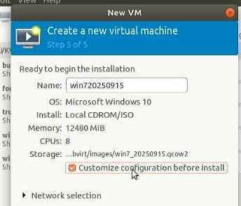

Hypervisor details:    

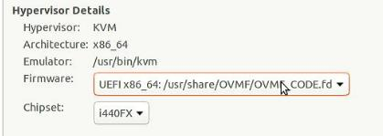

rtl8139:     

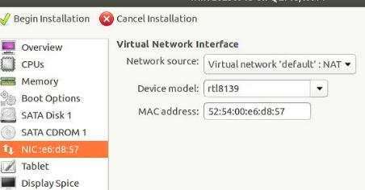

add another iso:     

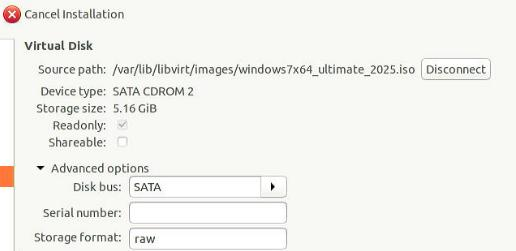

Remove `Display Spice` and `QXL`:    

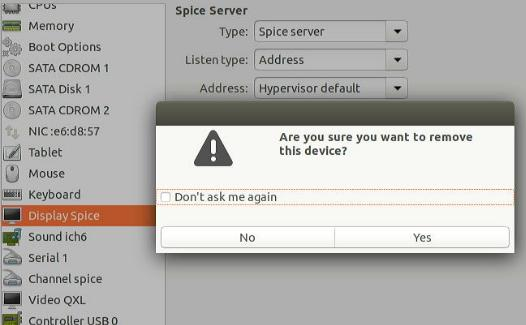

4Core 2 threads:    

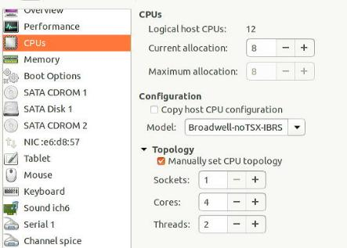

Add igpu/usb host:    

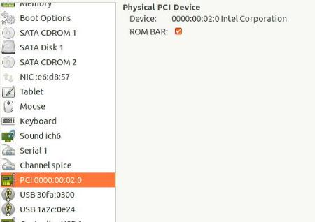

```
# virsh edit win720250915
<domain type='kvm' xmlns:qemu='http://libvirt.org/schemas/domain/qemu/1.0'>

...

  <cpu mode='host-passthrough' check='none'>
    <topology sockets='1' cores='4' threads='2'/>
  </cpu>

...

    <hostdev mode='subsystem' type='pci' managed='yes'>
      <driver name='vfio'/>
      <source>
        <address domain='0x0000' bus='0x00' slot='0x02' function='0x0'/>
      </source>
      <alias name='hostdev0'/>
      <rom bar='on' file='/usr/share/OVMF/igpu.rom'/>
      <address type='pci' domain='0x0000' bus='0x00' slot='0x02' function='0x0'/>
    </hostdev>
...

  <qemu:commandline>
    <qemu:arg value='-set'/>
    <qemu:arg value='device.hostdev0.x-igd-gms=2'/>
    <qemu:arg value='-set'/>
    <qemu:arg value='device.hostdev0.x-igd-opregion=on'/>
    <qemu:arg value='-set'/>
    <qemu:arg value='device.hostdev0.multifunction=on'/>
  </qemu:commandline>
</domain>

```

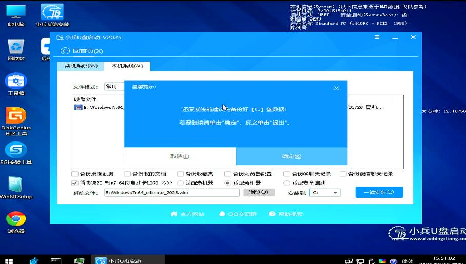

