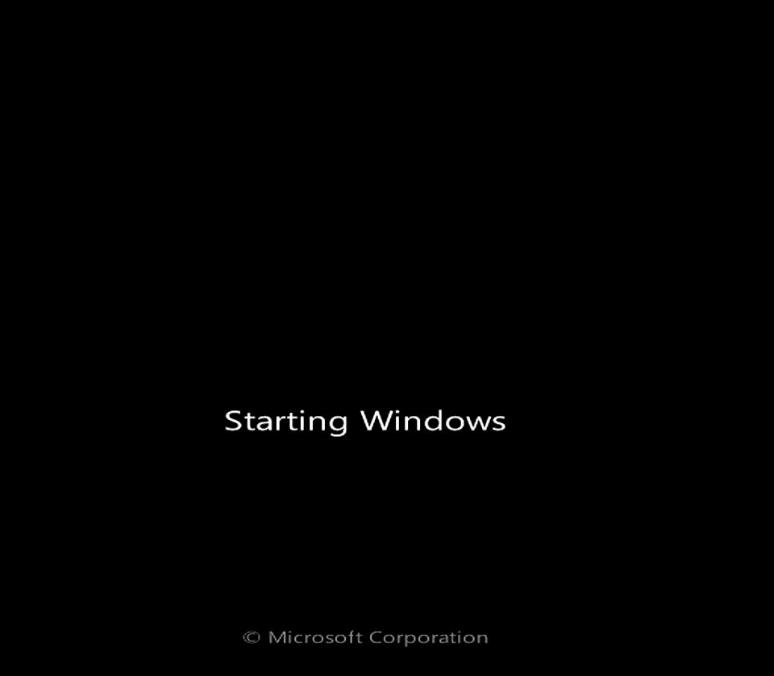
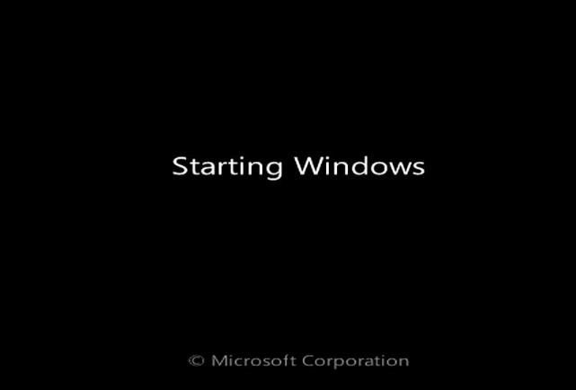
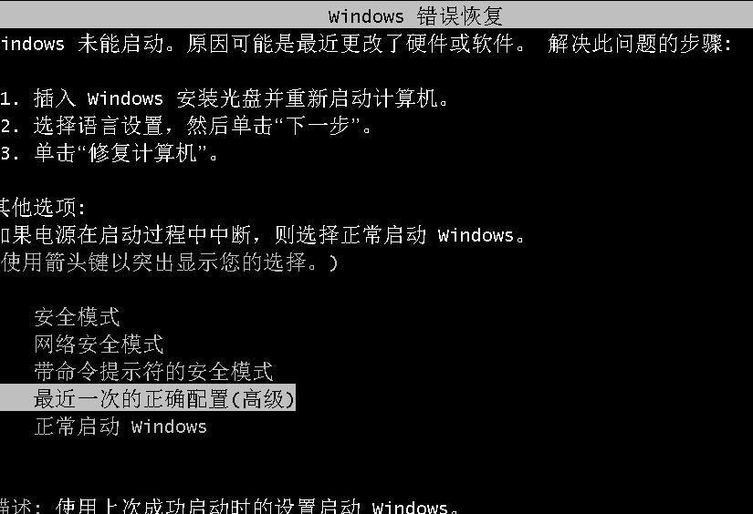
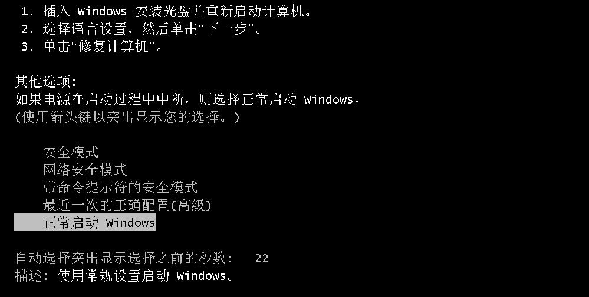
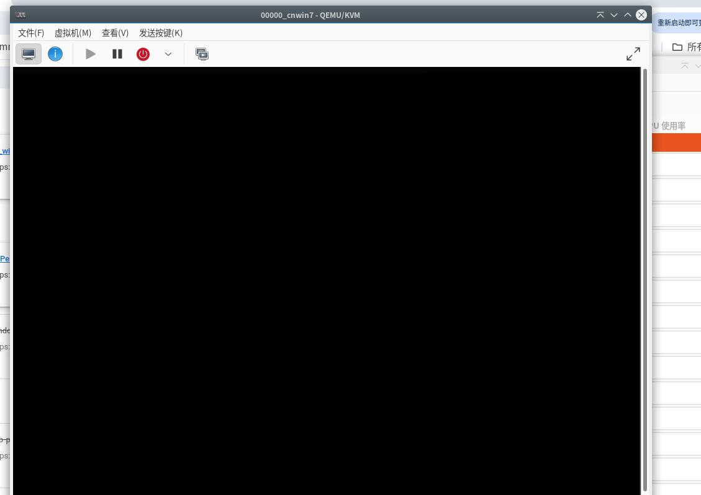
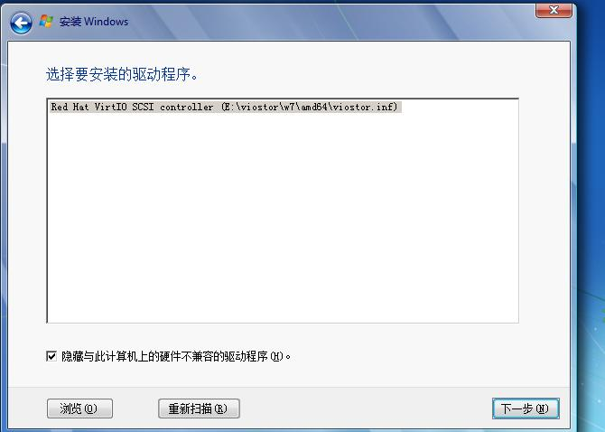
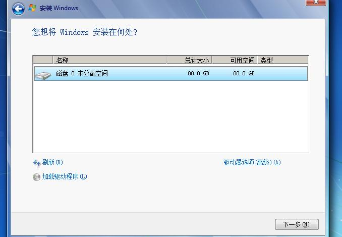
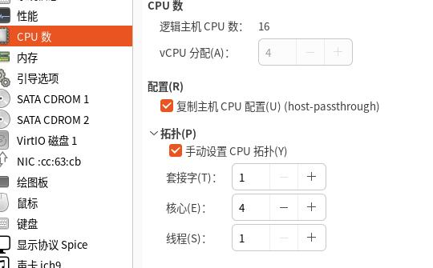
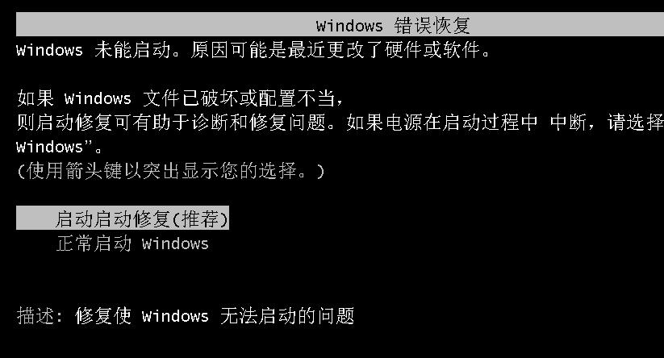

# 20250916
### 1. on win7 installation
`cn_windows_7_ultimate_with_sp1_x64_dvd_u_677408.iso`, stuck on `Starting Windows`:     

`en_windows_7_ultimate_with_sp1_x64_dvd_u_677332.iso`, stuck on `Starting Windows`:      

### 2. virt-manager installation
Secure boot should be disabled.    

(uefi/virtio)`7601.27166.windows7_professional_with_sp1_vl_x64_zh-cn_fix240713.iso`+virtio, After installation(1st step):     

(uefi/sata)`7601.27166.windows7_professional_with_sp1_vl_x64_zh-cn_fix240713.iso`+virtio, After installation(1st step):     

(uefi/virtio)`cn_windows_7_ultimate_with_sp1_x64_dvd_u_677408.iso`+virtio:    

black screen after(Starting Windows):   

(sata/virtio)`cn_windows_7_ultimate_with_sp1_x64_dvd_u_677408.iso`+virtio:    

then same as the above black screen .   

Changes to `en_windows_7_ultimate_with_sp1_x64_dvd_u_677332.iso` , the effect is the same as `cn+677408`.    

Use 1core for installation, then switches to 8 core, failed.    

`cn_windows_7_ultimate_with_sp1_x64_dvd_u_677408` re-install under 1 core:    

change to 4 core:    

### 3. gen10 win7 issue
`https://zhuanlan.zhihu.com/p/5502585523`:    

十代i5 10400存在着两个不同的步进版本，一个是Q0，一个是G1,Q0版本是基于完整的10核心芯片(面积约200平方毫米)，屏蔽其中4个核心。而另一个G1版本，则是原生的6核心芯片，与此前的九代6核心几乎一致。所以支持10代集显驱动。    
i5-10400和i5-10400F了，该产品既有Q0步进（编号分别为SRH79、SRH78）又有G1步进（编号分别为SRH3D、SRH3C），购买的时候要仔细。    
10代以后的处理器的机器不支持传统模式了，只能在uefi模式下安装win7，有独显的情况一定记得开启csm兼容模式安装WIN7，如果uefi模式没有csm兼容模式采用小兵PE勾选解决卡LOGO方案处理。  
i3 10100和i3 10105安装win7采用集显需要搭配400系列主板，500系列主板搭配i3 10100和i3 10105也是不能采用集显安装win7的，也需要搭配独立显卡驱动。注：如果支持集显的CPU，可以在安装时采用小兵PE勾选卡LOGO处理。    
10代以上处理器的机器如果出现I219-v或i219-lm网卡(intel 219-V，219分21版本 1-7版本可以，8-21版本不行,如果出现I219-V的网卡安装win7后出现感叹号或X的，可以采用小兵PE中的适配i219-v功能更新固件后再安装安装网卡驱动。     

—有Win7刚需的朋友，可以考虑放弃睡眠（Suspend toRAM）的功能，休眠（Suspend to Disk，即S4）是正常的。    
