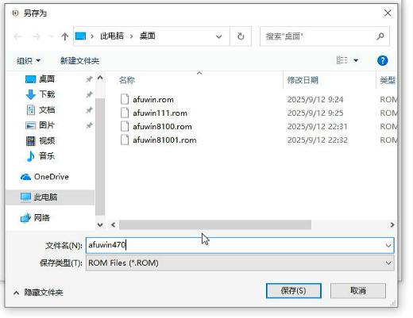

# 20250923
### 1. i5-10400+470board verification


hardinfo:    

```
# lscpu | grep -i model
Model:               165
Model name:          Intel(R) Core(TM) i5-10400 CPU @ 2.9
# dmidecode | grep -i 470  -A10 -B10
Handle 0x0002, DMI type 2, 15 bytes
Base Board Information
	Manufacturer: W
	Product Name: SDNS-H470A1-D248
	Version: 1.0
	Serial Number:  
	Asset Tag: Default string
	Features:
		Board is a hosting board
		Board is replaceable
	Location In Chassis: Default string
	Chassis Handle: 0x0003
	Type: Motherboard
	Contained Object Handles: 0

```
win7, blue screen.    


### 2. i3-10100+460board verification
hard info:  

```
# dmidecode | grep "Base Board" -A20
Base Board Information
	Manufacturer: Y
	Product Name: B46T1
	Version: Default string
	Serial Number: B46T1022308S0012
	Asset Tag: Default string
	Features:
		Board is a hosting board
		Board is replaceable
	Location In Chassis: Default string
	Chassis Handle: 0x0003
	Type: Motherboard
	Contained Object Handles: 0
# lscpu | grep -i model
Model:               165
Model name:          Intel(R) Core(TM) i3-10100 CPU @ 3.60GHz
```
vm info:    


gpu and cpu info:    


### 3. i5-10400+470board installation
Using sata disk for installation.     


qxl:     


### 4. i5-10400+470board verify
qxl workable xml for vfio-gpu:     


### 5. extrace rom





press 2, s:    


### 6. win7 verification
#### 6.1 legacy rom
csm configuration, rom为legacy:   


install win7 in host(Xiaobing):    


Partition:    


restore system:    


Install driver:    


Activate:     


After reboot:    


#### 6.2 uefi rom
如果打开csm, 而后rom选择为uefi呢？

蓝屏.    
#### 6.3 close csm
如果关闭csm, 则安装会失败。    

### 7. ubuntu installation
csm(Boot option filter: "legacy only"), ubuntu22.04 installed but cannot startup.     
csm(Boot option filter: "uefi/legacy"), ubuntu18.04 installed,can startup.   

#### 7.1 video(legacy)
启动虚机时无GOP.    
#### 7.2 video(uefi)
启动虚机时有GOP.    

系统信息：    


安装信息:    


安装到即将进入系统时(安装第二步)，切换为video（legacy).    

但是切换为video(legacy)后，无法显示画面。    
### 7.3 video(legacy)/guest bios
也是解决uefi卡log, 也是适配新机器。     
没有用, 一样存在问题,guest bios。      


### 8. proxmox verification
Refers:    

```
6-10代：如果你的机器可以bios开csm并把核显设置为Legacy模式。那你就虚拟机seabios+i440fx或者q35直接用就是，都不需要加载什么rom，即使要加载也是从机器里面提取的而已（具体请参考网上一大堆成功案例。也不需要我这里提供的什么6-14-qemu10.rom这货）。
```
Extract the rom:    


