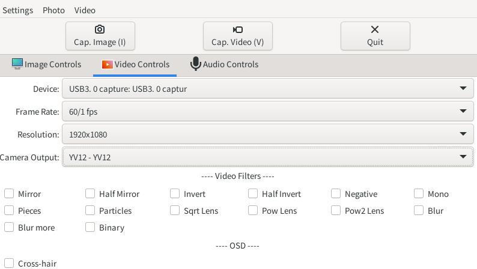
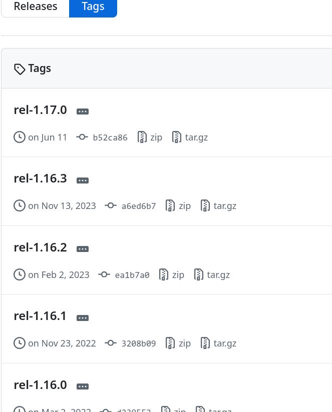

# 20250925
### 1. nixos guvcview
Install guvcview then could get the capture pictures.     

Be sure to make this configuration:     



### 2. pve windows
Qemu parameters:     

```
/usr/bin/kvm -id 103 -name seabioszt,debug-threads=on -no-shutdown -chardev socket,id=qmp,path=/var/run/qemu-server/103.qmp,server=on,wait=off -mon chardev=qmp,mode=control -chardev socket,id=qmp-event,path=/var/run/qmeventd.sock,reconnect-ms=5000 -mon chardev=qmp-event,mode=control -pidfile /var/run/qemu-server/103.pid -daemonize -smbios type=1,uuid=d9457600-5acd-47cd-9782-5b2d8976cda4 -smp 8,sockets=1,cores=8,maxcpus=8 -nodefaults -boot menu=on,strict=on,reboot-timeout=1000,splash=/usr/share/qemu-server/bootsplash.jpg -vga none -nographic -cpu qemu64,+aes,enforce,+kvm_pv_eoi,+kvm_pv_unhalt,+pni,+popcnt,+sse4.1,+sse4.2,+ssse3 -m 8192 -global PIIX4_PM.disable_s3=1 -global PIIX4_PM.disable_s4=1 -device pci-bridge,id=pci.1,chassis_nr=1,bus=pci.0,addr=0x1e -device pci-bridge,id=pci.2,chassis_nr=2,bus=pci.1,addr=0x1e -device pci-bridge,id=pci.3,chassis_nr=3,bus=pci.0,addr=0x5 -device vmgenid,guid=7e6d2221-038a-428f-9db0-c28e44ba3282 -device piix3-usb-uhci,id=uhci,bus=pci.0,addr=0x1.0x2 -device qemu-xhci,p2=15,p3=15,id=xhci,bus=pci.1,addr=0x1b -device usb-tablet,id=tablet,bus=uhci.0,port=1 -device vfio-pci,host=0000:00:02.0,id=hostpci0,bus=pci.0,addr=0x2 -device usb-host,bus=xhci.0,port=1,vendorid=0x30fa,productid=0x0300,id=usb0 -device usb-host,bus=xhci.0,port=2,vendorid=0x1a2c,productid=0x0e24,id=usb1 -chardev socket,path=/var/run/qemu-server/103.qga,server=on,wait=off,id=qga0 -device virtio-serial,id=qga0,bus=pci.0,addr=0x8 -device virtserialport,chardev=qga0,name=org.qemu.guest_agent.0 -device virtio-balloon-pci,id=balloon0,bus=pci.0,addr=0x3,free-page-reporting=on -iscsi initiator-name=iqn.1993-08.org.debian:01:dcb1c95a9a20 -device ahci,id=ahci0,multifunction=on,bus=pci.0,addr=0x7 -drive file=/dev/pve/vm-103-disk-0,if=none,id=drive-sata0,format=raw,cache=none,aio=io_uring,detect-zeroes=on -device ide-hd,bus=ahci0.0,drive=drive-sata0,id=sata0,bootindex=100 -drive file=/var/lib/vz/template/iso/XiaoBing.iso,if=none,id=drive-sata1,media=cdrom,format=raw,aio=io_uring -device ide-cd,bus=ahci0.1,drive=drive-sata1,id=sata1,bootindex=101 -drive file=/var/lib/vz/template/iso/windows7x64_ultimate_2025.iso,if=none,id=drive-sata2,media=cdrom,format=raw,aio=io_uring -device ide-cd,bus=ahci0.2,drive=drive-sata2,id=sata2,bootindex=103 -drive file=/var/lib/vz/template/iso/virtio-win-0.1.248.iso,if=none,id=drive-sata3,media=cdrom,format=raw,aio=io_uring -device ide-cd,bus=ahci0.3,drive=drive-sata3,id=sata3,bootindex=104 -netdev type=tap,id=net0,ifname=tap103i0,script=/usr/libexec/qemu-server/pve-bridge,downscript=/usr/libexec/qemu-server/pve-bridgedown -device e1000,mac=BC:24:11:78:C1:B4,netdev=net0,bus=pci.0,addr=0x12,id=net0,bootindex=102 -machine smm=off,type=pc+pve1 -set device.hostpci0.addr=02.0 -set device.hostpci0.x-igd-gms=1 -set device.hostpci0.x-igd-opregion=on
```
configs:     

```
agent: 1
args: -set device.hostpci0.addr=02.0 -set device.hostpci0.x-igd-gms=1 -set device.hostpci0.x-igd-opregion=on
boot: order=sata0;sata1;net0;sata2;sata3
cores: 8
cpu: host
hostpci0: 0000:00:02.0
machine: pc-i440fx-4.2
memory: 8192
meta: creation-qemu=9.2.0,ctime=1758763682
name: seabioszt
net0: e1000=BC:24:11:78:C1:B4,bridge=vmbr0,firewall=1
numa: 0
ostype: l26
sata0: local-lvm:vm-103-disk-0,size=50G
sata1: local:iso/XiaoBing.iso,media=cdrom,size=1568244K
sata2: local:iso/windows7x64_ultimate_2025.iso,media=cdrom,size=5409024K
sata3: local:iso/virtio-win-0.1.248.iso,media=cdrom,size=715188K
scsihw: virtio-scsi-single
smbios1: uuid=d9457600-5acd-47cd-9782-5b2d8976cda4
sockets: 1
usb0: host=30fa:0300
usb1: host=1a2c:0e24
vga: none
vmgenid: 7e6d2221-038a-428f-9db0-c28e44ba3282
```
### 3. rebuild seabios(ubuntu18.04)
Step:     

```
mkdir seabios
cd seabios/
sudo docker run -it -v /home/dash/seabios:/seabios ubuntu:18.04 /bin/bash
### following steps were executed under docker instance
root@22eb710b7452:/# apt update
### uncomment all of the deb-src items under /etc/apt/sources.list
cd /seabios
apt install -y vim  build-essential devscripts debhelper git python quilt
apt source seabios
cd seabios-1.10.2/
apt build-dep seabios
```
Rebuild, not OK.     

proxmox seabios version(1.16.3):     


Release 1.16.3:     



Download 1.16.3.tar.gz, and transfer it into the docker build instance.     

```
make menuconfig
make
root@22eb710b7452:/seabios/newseabios/seabios-rel-1.16.3# scp out/bios.bin root@192.168.1.71:/home/idv/Desktop/bios_1.16.bin
```

### 4. qemu rebuild(8.0.1)
Fix sync:    

```
cd roms
git clone https://gitlab.com/qemu-project-mirrors/u-boot u-boot
cd u-boot
git -C ../.. submodule status | grep 'u-boot'
git checkout 328747974a0620d0996113fe2b3906b06e96de00
cd ..
git clone https://gitlab.com/qemu-project-mirrors/u-boot-sam460ex u-boot-sam460ex
cd u-boot-sam460ex/
git checkout 60b3916f33e617a815973c5a6df77055b2e3a588
cd .../../
git submodule update --recursive


apt install -y ninja-build pkg-config libgbm1 libglib2.0-dev bridge-utils libfdt-dev libpixman-1-dev libssl-dev libsdl1.2-dev libspice-server-dev autoconf libtool xtightvncviewer tightvncserver x11vnc uuid-runtime uuid uml-utilities liblzma-dev libc6-dev libdrm-dev libgbm-dev spice-client-gtk libgtk2.0-dev libusb-1.0-0-dev libepoxy-dev libaio-dev libgtk-3-dev ovmf libsdl2-dev  libegl-mesa0
slirp should be use an old version.    
libslirp-v4.2.0.tar.gz
```
