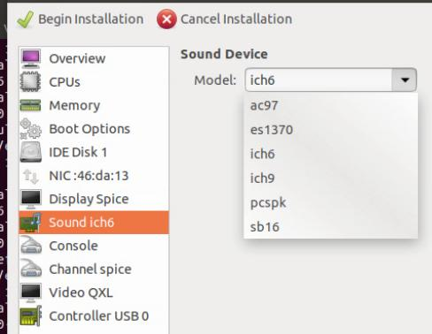
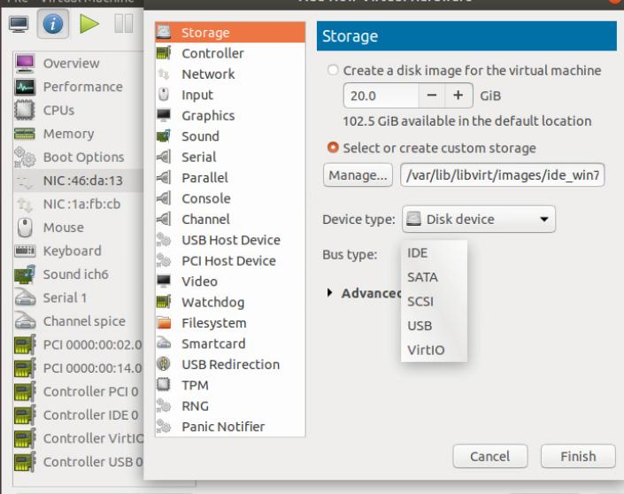
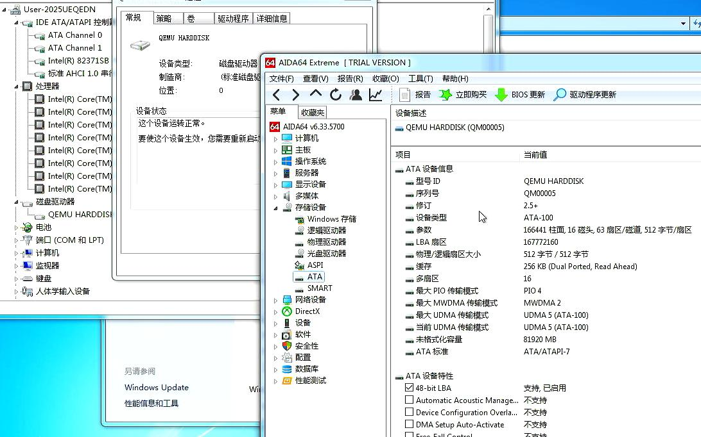
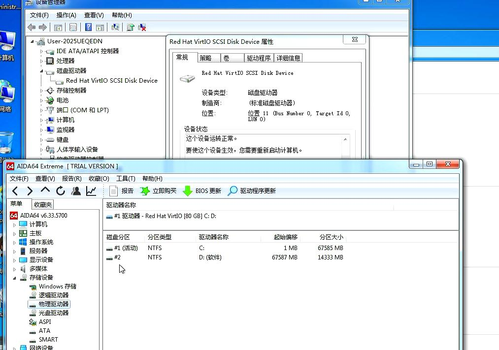

# 20250926
### 1. libvirt(legacy seabios)
Use ide for startup:     

```
root@idv-TC-9073:/var/lib/libvirt/images# cp win7_test.qcow2 ide_win7_test.qcow2
```
sound:    



### 2. sata verification
Change to sata:    



OK:     



### 3. virtio verification
Also OK.   



Add configuration:     

```
  <features>
    <acpi/>
    <apic/>
+    <hyperv>
+      <relaxed state='on'/>
+      <vapic state='on'/>
+      <spinlocks state='on' retries='8191'/>
+    </hyperv>
    <vmport state='off'/>
  </features>
  <clock offset='localtime'>
    <timer name='rtc' tickpolicy='catchup'/>
    <timer name='pit' tickpolicy='delay'/>
    <timer name='hpet' present='no'/>
+    <timer name='hypervclock' present='yes'/>
  </clock
```
Also OK.   

### 4. Add seabios pic
Add items:    

```
  <qemu:commandline>
    <qemu:arg value='-set'/>
    <qemu:arg value='device.hostdev0.x-igd-gms=1'/>
    <qemu:arg value='-set'/>
    <qemu:arg value='device.hostdev0.x-igd-opregion=on'/>
    <qemu:arg value='-set'/>
    <qemu:arg value='device.hostdev0.x-vga=on'/>
    <qemu:arg value='-boot'/>
    <qemu:arg value='menu=on,strict=on,splash=/usr/share/seabios/tyyidv.jpg'/>
    <qemu:arg value='-bios'/>
    <qemu:arg value='/usr/share/seabios/bios_1.16.bin'/>
  </qemu:commandline>
``` 
Generated jpg:     

```
 convert tianyiidv.jpg -resize 640x480! tyidv.jpg
 convert tyidv.jpg -channel-fx 'red<=>blue' tyyidv.jpg
```
