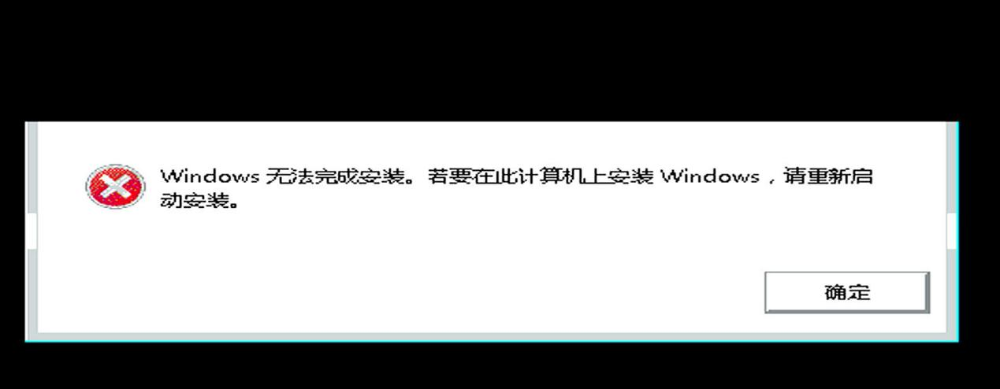

# 20250928
### 1. Install win7 rawly     



```
您好，您遇到的这个问题比上一个更深入，并且是PCI直通（Passthrough）中一个非常经典和微妙的“陷阱”。您观察到的现象完全符合预期，我来为您解释这其中的原因。

核心原因：虚拟机固件 (SeaBIOS) 和操作系统引导加载程序 (Bootloader) 使用的驱动环境不同。

简单来说：

    SeaBIOS 阶段：您能操作菜单，是因为键盘输入由QEMU的 模拟键盘 处理。

    "Press any key..." 阶段：此时控制权已交给Windows安装光盘的 引导程序，它没有您直通的USB控制器的驱动，因此无法识别插在上面的物理键盘。

详细分步解析

阶段一：SeaBIOS 启动选单 (键盘可用)

    环境：这个阶段运行的是虚拟机的固件，即SeaBIOS（或OVMF/UEFI）。这是由QEMU/KVM提供的、在虚拟机内部运行的一个模拟的BIOS程序。

    输入设备：默认情况下，为了保证基本的兼容性，QEMU会为虚拟机创建一个模拟的PS/2键盘或模拟的USB键盘。当您在宿主机上敲击键盘时，virt-manager或QEMU会将这些按键事件传递给虚拟机内的这个模拟键盘。

    直通设备的状态：此时，您通过 vfio-pci 直通的那个物理USB控制器（位于 00:14.0）虽然已经被分配给虚拟机，但SeaBIOS本身通常不会主动去加载它的驱动并用它来作为输入设备。SeaBIOS会优先使用它“天生”就知道如何使用的标准模拟键盘。

    结论：所以，您在SeaBIOS菜单里能够进行选择，是因为您在使用QEMU提供的“公用”模拟键盘，而不是您那个“私有”的直通物理键盘。

阶段二：Windows Bootloader 提示 "Press any key..." (键盘失效)

    环境交接：当您在SeaBIOS菜单中选择从DVD/CD启动后，SeaBIOS的任务就完成了。它会将执行权交给光盘镜像里的Windows引导加载程序（Bootloader）。这是一个非常小、非常底层的程序，它的唯一任务就是加载Windows安装环境的核心文件。

    驱动缺失：这个引导加载程序为了做到最小化和最快启动，只内置了对最标准、最古老的硬件的支持。它能识别模拟的PS/2键盘，或者由QEMU模拟的标准XHCI/EHCI USB控制器上的模拟键盘。但是，它绝对没有内置您宿主机上那个具体的、物理的Intel/AMD/ASMedia USB控制器（00:14.0）的驱动程序。

    直通设备的困境：因为您已经将物理USB控制器直通给了虚拟机，所以您真实的键盘是插在这个控制器上的。当Windows引导加载程序请求键盘输入时，它尝试在它认识的设备里寻找键盘，但一无所获。它完全不知道如何与您直通的那个PCI设备沟通，因此无法检测到您按下的任何键。

    结论：您的按键之所以无效，是因为负责监听按键的程序（Windows Bootloader）不认识您的键盘所连接的“插座”（直通的USB控制器）。

一个比喻：

    SeaBIOS 就像酒店大堂，有公用电话（模拟键盘），谁都可以用。

    Windows Bootloader 就像您的房间，您带了自己的私人手机（物理键盘），但房间里没有这个手机品牌的充电器（没有驱动），所以手机开不了机，无法使用。
```
### 2. attach pci devices to running pc
Steps are listed as following:    

```
root@idv-TC-9073:~# cat igpu_devices.xml 
    <hostdev mode='subsystem' type='pci' managed='yes'>
      <source>
        <address domain='0x0000' bus='0x00' slot='0x02' function='0x0'/>
      </source>
    </hostdev>
root@idv-TC-9073:~# cat pci_devices.xml 
    <hostdev mode='subsystem' type='pci' managed='yes'>
      <source>
        <address domain='0x0000' bus='0x00' slot='0x14' function='0x0'/>
      </source>
    </hostdev>

root@idv-TC-9073:~# history| grep pci_device
  128  virsh attach-device win10 pci_devices.xml 
```
Before attach:      

```
echo 0000:00:14.0 > /sys/bus/pci/drivers/xhci_hcd/unbind && echo 8086 06ed > /sys/bus/pci/drivers/vfio-pci/new_id
```
After vm shutdown:     

```
 echo 0000:00:14.0 > /sys/bus/pci/drivers/vfio-pci/unbind && echo 8086 06ed >/sys/bus/pci/drivers/vfio-pci/remove_id && echo 0000:00:14.0 >/sys/bus/pci/drivers/xhci_hcd/bind
```


