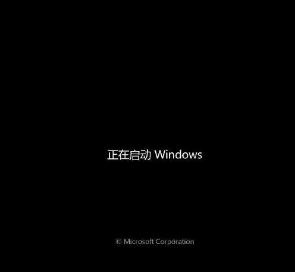

# 20251009
### 1. bios startup speed
Using newer qemu/libvirt for verification.    

environment info:     

```
test@test-TC-9070:~$ qemu-system-x86_64 --version
QEMU emulator version 8.2.2 (Debian 1:8.2.2+ds-0ubuntu1.10)
Copyright (c) 2003-2023 Fabrice Bellard and the QEMU Project developers
test@test-TC-9070:~$ libvirtd --version
libvirtd (libvirt) 10.0.0
test@test-TC-9070:~$ uname -a
Linux test-TC-9070 6.14.0-33-generic #33~24.04.1-Ubuntu SMP PREEMPT_DYNAMIC Fri Sep 19 17:02:30 UTC 2 x86_64 x86_64 x86_64 GNU/Linux
test@test-TC-9070:~$ cat /etc/issue
Ubuntu 24.04.3 LTS \n \l
```
cannot use vfio gpu, reason:     

```
[    0.271622] pci 0000:00:02.0: DMAR: Disabling IOMMU for graphics on this chipset

root@test-TC-9070:/home/test# uname -a
Linux test-TC-9070 6.8.0-85-generic #85-Ubuntu SMP PREEMPT_DYNAMIC Thu Sep 18 15:26:59 UTC 2025 x86_64 x86_64 x86_64 GNU/Linux
root@test-TC-9070:/home/test# virsh start win7
error: Failed to start domain 'win7'
error: internal error: Invalid device 0000:00:02.0 iommu_group file /sys/bus/pci/devices/0000:00:02.0/iommu_group is not a symlink
```
Changed to 5.15, could continue the testing.   

```
  <qemu:commandline>
    <qemu:arg value='-boot'/>
    <qemu:arg value='menu=on,strict=on,splash=/usr/share/seabios/tyyidv.jpg'/>
    <qemu:arg value='-bios'/>
    <qemu:arg value='/usr/share/seabios/bios_1.16.bin'/>
  </qemu:commandline>
  <qemu:override>
    <qemu:device alias='hostdev0'>
      <qemu:frontend>
        <qemu:property name='x-igd-gms' type='unsigned' value='1'/>
        <qemu:property name='x-igd-opregion' type='bool' value='true'/>
        <qemu:property name='multifunction' type='bool' value='true'/>
      </qemu:frontend>
    </qemu:device>
  </qemu:override>
</domain>

```
### 2. Rebuild 5.15 for ubuntu2404
Steps:     

```
cp config-5.15.113-lts2021-iotg .

docker run -it -v `pwd`:/build ubuntu:24.04 /bin/bash

apt install -y build-essential curl wget git fakeroot build-essential ncurses-dev xz-utils libssl-dev bc flex libelf-dev bison liblz4-tool rsync kmod cpio wget
wget https://mirrors.ustc.edu.cn/kernel.org/linux/kernel/v5.x/linux-5.15.194.tar.xz
tar xJvf linux-5.15.194.tar.xz
cd linux-5.15.194
mkdir build
cp config-xxxxx build/.config
make menuconfig O=./build/
make LOCALVERSION="fff" -j `nproc` O=./build bindeb-pkg
ls *.deb
linux-headers-5.15.194fff_5.15.194fff-1_amd64.deb  linux-image-5.15.194fff_5.15.194fff-1_amd64.deb  linux-libc-dev_5.15.194fff-1_amd64.deb

```

### 3. time comparison
2404(usb disk):    

```
00:20, idv logo
00:30, windows logo
00:46, windows 
```
1804(ssd):   

```
00:15, idv logo
00:22, windows logo
00:33, windows ok
```
### 4. hygon win7
Stucked on :    



Use a 
