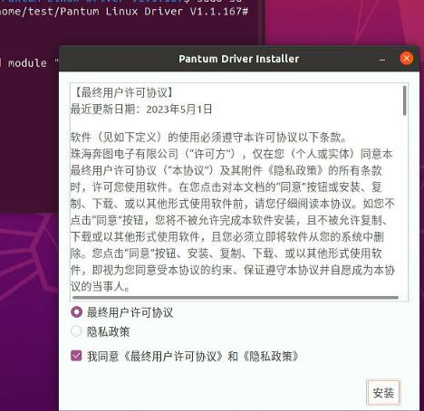
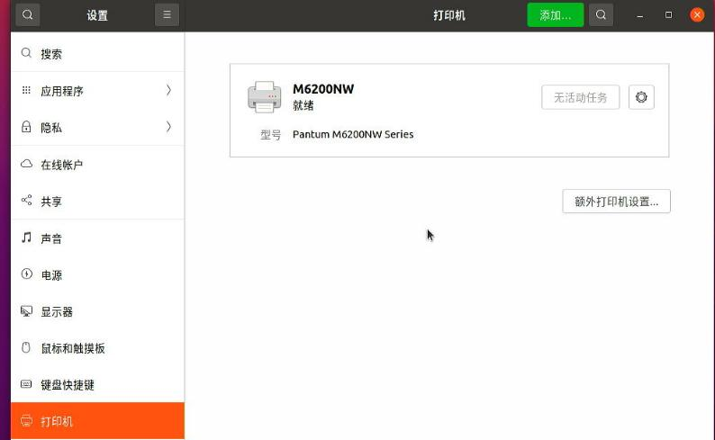
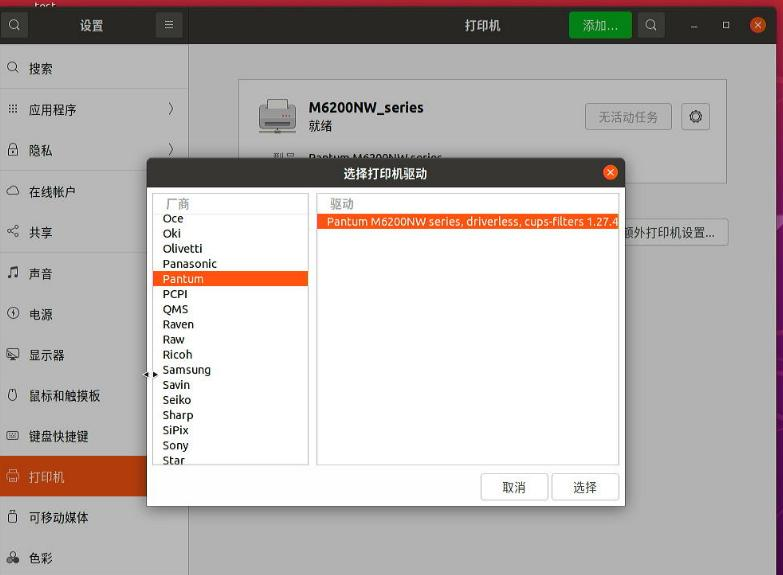
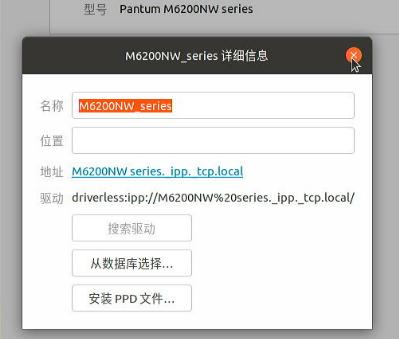

# 20251010
### 1. qemu audio on ubuntu2404
Get the username for running kvm:     

```
$ ps -eo pid,user:20,cmd -w | grep kvm
 3060 libvirt-qemu         /usr/bin/kvm -name guest=win720250915,d
```
### 2. Linux printer
dmesg output:     

```
[  195.482829] usb 1-4: new high-speed USB device number 4 using xhci_hcd
[  195.631639] usb 1-4: New USB device found, idVendor=03f0, idProduct=7312, bcdDevice= 1.00
[  195.631644] usb 1-4: New USB device strings: Mfr=1, Product=2, SerialNumber=3
[  195.631647] usb 1-4: Product: Officejet Pro 6230
[  195.631649] usb 1-4: Manufacturer: HP
[  195.631652] usb 1-4: SerialNumber: TH95K7N167
[  195.762329] usblp 1-4:1.0: usblp0: USB Bidirectional printer dev 4 if 0 alt 0 proto 2 vid 0x03F0 pid 0x7312
[  195.762354] usbcore: registered new interface driver usblp
```
ubuntu desktop output:    


### 3. Pantum Ltd. M6200NW series
Ubuntu24.04.2:     

```
$ lsusb | grep 6200
Bus 005 Device 002: ID 232b:8e10 Pantum Ltd. M6200NW series
$ sudo lpinfo -v
network socket
network beh
network lpd
serial serial:/dev/ttyS0?baud=115200
direct hp
network https
network ipp
network ipps
network http
direct hpfax
network ipp://Pantum%20M6200NW%20series%5B18523C%5D%20(USB)._ipp._tcp.local/
$ sudo lpstat -p -d
打印机 Pantum_M6200NW_series_18523C_USB 目前空闲。从 2025年10月11日 星期六 00时14分34秒 开始启用
无系统默认目标
$ sudo lpstat -t
调度器正在运行
无系统默认目标
用于 Pantum_M6200NW_series_18523C_USB 的设备：implicitclass://Pantum_M6200NW_series_18523C_USB/
Pantum_M6200NW_series_18523C_USB 自从 2025年10月11日 星期六 00时14分34秒 开始接受请求
打印机 Pantum_M6200NW_series_18523C_USB 目前空闲。从 2025年10月11日 星期六 00时14分34秒 开始启用
```
ubuntu20.04.6:    

```
test@test-Standard-PC-i440FX-PIIX-1996:~$ sudo lpstat -t
调度器正在运行
无系统默认目标
lpstat: 未添加目标。
lpstat: 未添加目标。
lpstat: 未添加目标。
lpstat: 未添加目标。
test@test-Standard-PC-i440FX-PIIX-1996:~$ sudo lpstat -p -d
lpstat: 未添加目标。
无系统默认目标
test@test-Standard-PC-i440FX-PIIX-1996:~$ sudo lpinfo -v
network ipps
file cups-brf:/
network beh
direct hp
network socket
serial serial:/dev/ttyS0?baud=115200
network ipp
network http
network lpd
network https
direct hpfax
network ipp://M6200NW%20series._ipp._tcp.local/
test@test-Standard-PC-i440FX-PIIX-1996:~$ sudo lsusb | grep 6200
Bus 005 Device 002: ID 232b:8e10 Pantum M6200NW series
test@test-Standard-PC-i440FX-PIIX-1996:~$ uname -r
5.15.0-139-generic
test@test-Standard-PC-i440FX-PIIX-1996:~$ cat /etc/issue
Ubuntu 20.04.6 LTS \n \l
```
Install:    



Need manually add:     



After install:    

```
# dpkg -l | grep -i pantum
ii  pantum                                     1.1.167-1                            amd64        CUPS and SANE drivers for Pantum series printer and scanner
test@test-Standard-PC-i440FX-PIIX-1996:~/Pantum Linux Driver V1.1.167$ sudo lpstat -p -d
打印机 M6200NW 目前空闲。从 2025年10月10日 星期五 16时38分47秒 开始启用
无系统默认目标
test@test-Standard-PC-i440FX-PIIX-1996:~/Pantum Linux Driver V1.1.167$ sudo lpstat -t
调度器正在运行
无系统默认目标
用于 M6200NW 的设备：usb://Pantum/M6200NW%20series?serial=CG9A090672
M6200NW 自从 2025年10月10日 星期五 16时38分47秒 开始接受请求
打印机 M6200NW 目前空闲。从 2025年10月10日 星期五 16时38分47秒 开始启用
```

### 5. ubuntu2004 info
`driverless:ipp://M6200NW%20series._ipp._tcp.local`    





### 6. ubuntu22.04 info
Auto detect.   

```
test@test-Standard-PC-i440FX-PIIX-1996:~$ uname -a
Linux test-Standard-PC-i440FX-PIIX-1996 6.8.0-85-generic #85~22.04.1-Ubuntu SMP PREEMPT_DYNAMIC Fri Sep 19 16:18:59 UTC 2 x86_64 x86_64 x86_64 GNU/Linux
test@test-Standard-PC-i440FX-PIIX-1996:~$ uname -r
6.8.0-85-generic
test@test-Standard-PC-i440FX-PIIX-1996:~$ cat /etc/issue
Ubuntu 22.04.5 LTS \n \l

test@test-Standard-PC-i440FX-PIIX-1996:~$ sudo lpinfo -v
serial serial:/dev/ttyS0?baud=115200
network lpd
direct hp
network socket
network ipp
network beh
file cups-brf:/
network https
network ipps
network http
direct hpfax
test@test-Standard-PC-i440FX-PIIX-1996:~$ sudo lpstat -p -d
打印机 Pantum_M6200NW_series_18523C_USB 目前空闲。从 2025年10月10日 星期五 17时16分06秒 开始启用
无系统默认目标
test@test-Standard-PC-i440FX-PIIX-1996:~$ sudo lpstat -t
调度器正在运行
无系统默认目标
用于 Pantum_M6200NW_series_18523C_USB 的设备：implicitclass://Pantum_M6200NW_series_18523C_USB/
Pantum_M6200NW_series_18523C_USB 自从 2025年10月10日 星期五 17时16分06秒 开始接受请求
打印机 Pantum_M6200NW_series_18523C_USB 目前空闲。从 2025年10月10日 星期五 17时16分06秒 开始启用
```

### 7. huaiyi
ubuntu22.04:    

```
root@test-Standard-PC-i440FX-PIIX-1996:/home/test# dpkg -l | grep ipp
ii  apt-config-icons                           0.15.2-2                                          all          APT configuration snippet to enable icon downloads
ii  apt-config-icons-hidpi                     0.15.2-2                                          all          APT configuration snippet to enable HiDPI icon downloads
ii  cups-ipp-utils                             2.4.1op1-1ubuntu4.12                              amd64        Common UNIX Printing System(tm) - IPP developer/admin utilities
ii  ipp-usb                                    0.9.20-1ubuntu0.22.04.1                           amd64        Daemon for IPP over USB printer support
ii  python3-zipp                               1.0.0-3ubuntu0.1                                  all          pathlib-compatible Zipfile object wrapper - Python 3.x

```
While in 20.04:    

```
test@test-Standard-PC-i440FX-PIIX-1996:~$ apt-cache search ipp | grep usb
ippusbxd - Daemon for IPP USB printer support
test@test-Standard-PC-i440FX-PIIX-1996:~$ apt-cache policy ippusbxd
ippusbxd:
  已安装：(无)
  候选： 1.34-2ubuntu1
  版本列表：
     1.34-2ubuntu1 500
        500 http://mirrors.ustc.edu.cn/ubuntu focal/main amd64 Packages

```
