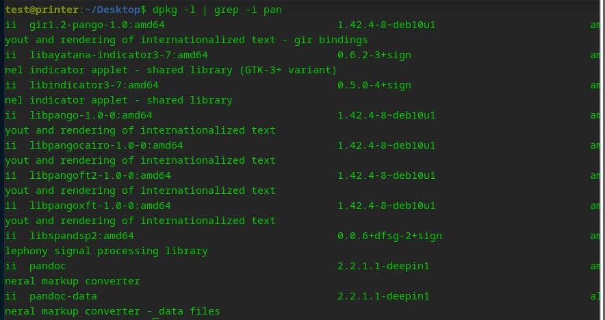

# 20251013
### 1. snap based printer
Connect ipp-usb and avahi:     

```
sudo snap connect ipp-usb:avahi-control avahi:avahi-control
sudo snap connect cups:avahi-control avahi:avahi-control
```
Possible configuration(manual):      

```
/var/snap/avahi/common/etc/avahi/avahi-daemon.conf)：ini

[server]
host-name=my-computer
domain-name=local
use-ipv4=yes
use-ipv6=no
publish-domain=yes
publish-workstation=yes
publish-a-records=yes

[publish]
disable-publishing=no
```
Test for printing:      

```
# cups.lp -d Pantum_M6200NW_series_18523C_USB test.txt 
request id is Pantum_M6200NW_series_18523C_USB-1 (1 file(s))
```
### 2. snap based printer(180406)
Not OK:      

```
$ sudo lsusb | grep 232b
Bus 005 Device 005: ID 232b:8e10
```
Install snap related software:     

```
sudo snap install ipp-usb cups avahi ipp
```
Configure:    

```
sudo snap connect ipp-usb:avahi-control avahi:avahi-control
sudo snap connect cups:avahi-control avahi:avahi-control
```
Test:    

```
sudo cp ./test.txt /var/snap/cups/common/
sudo cups.lp -d Pantum_M6200NW_series_18523C_USB /var/snap/cups/common/test.txt
```
All items:     

```
root@server1804:/home/test# snap list
Name     Version               Rev    Tracking       Publisher      Notes
avahi    0.8                   587    24/stable      ondra✪         -
core22   20250822              2133   latest/stable  canonical✓     base
core24   20250829              1196   latest/stable  canonical✓     base
cups     2.4.12-2              1112   latest/stable  openprinting✓  -
ipp      2023.09               776    latest/stable  michaelrsweet  -
ipp-usb  0.9.30+git27.257d039  399    latest/stable  openprinting✓  -
snapd    2.71                  25202  latest/stable  canonical✓     s
```
### 3. find ipp related:   
Use snap's avahi for browsering.   

```
# avahi.browse -rt _ipp._tcp
+     lo IPv4 Pantum M6200NW series[18523C] (USB)           _ipp._tcp            local
=     lo IPv4 Pantum M6200NW series[18523C] (USB)           _ipp._tcp            local
   hostname = [server1804.local]
   address = [127.0.0.1]
   port = [60000]
   txt = ["air=none" "mopria-certified=2.0" "rp=ipp/print" "priority=50" "kind=document,envelope" "PaperMax=legal-A4" "URF=CP1,IS1,OB10,PQ3-4-5,RS600,W8,V1.4" "UUID=3b7db374-eee4-f7aa-74c1-f15321d92797" "Color=F" "Duplex=F" "note=" "qtotal=1" "usb_MDL=M6200NW series" "usb_MFG=Pantum" "usb_CMD=ACL,CMD,scan,ZJS,PJL" "ty=M6200NW series" "product=(M6200NW series)" "pdl=image/urf,application/octet-stream,image/pwg-raster" "txtvers=1" "adminurl=http://localhost:60000/index.html?tab=airprint" "Fax=F" "Scan=T" "usb_SER=CG9A090672" "usb_HWID=232b&8e10"]

```
### 4. ubuntu1804desk related
Add manually:   


Print:    


no actions.   

print via command line:     

```
root@ubuntu1804desk:/home/test#  lpstat -p -d

打印机 M6200NW 目前空闲。从 2025年10月13日 星期一 19时26分44秒 开始启用
无系统默认目标
root@ubuntu1804desk:/home/test# 
root@ubuntu1804desk:/home/test# lp -d M6200NW test.txt 
请求 ID 为 M6200NW-1（1 个文件）
root@ubuntu1804desk:/home/test# lpstat -o
```
View device driver for printer:     

```
root@ubuntu1804desk:/home/test# lpstat -p
打印机 M6200NW 目前空闲。从 2025年10月13日 星期一 19时51分04秒 开始启用
root@ubuntu1804desk:/home/test# lpoptions -p M6200NW
copies=1 device-uri=usb://Pantum/M6200NW%20series?serial=CG9A090672 finishings=3 job-cancel-after=10800 job-hold-until=no-hold job-priority=50 job-sheets=none,none marker-change-time=0 number-up=1 printer-commands=none printer-info='Pantum M6200NW series' printer-is-accepting-jobs=true printer-is-shared=true printer-is-temporary=false printer-location printer-make-and-model='Generic Text-Only Printer' printer-state=3 printer-state-change-time=1760356264 printer-state-reasons=none printer-type=12292 printer-uri-supported=ipp://localhost/printers/M6200NW
```
Ai result:     

```
好的，我们来详细分析这行 lpoptions 命令的输出结果。

根据您提供的 lpoptions -p M6200NW 命令输出，您的打印机 正在使用一个名为 “Generic Text-Only Printer” 的驱动程序。

以下是详细的分析：

    核心证据:
    在输出信息中，最关键的一行是：

    printer-make-and-model='Generic Text-Only Printer'

    printer-make-and-model 这个字段直接指明了CUPS（Linux的打印系统）为这台打印机配置的驱动模式。这里的 'Generic Text-Only Printer' 翻译过来就是 “通用纯文本打印机”。

    这是什么驱动？:
    这并不是一个为奔图M6200NW专门设计的驱动程序。它是一个最基本、最通用的后备驱动，几乎所有Linux发行版都会内置。它的唯一功能就是以最原始的方式发送纯文本字符到打印机。

    使用此驱动意味着什么？:

        功能极其有限: 您的打印机目前只能正确打印纯文本文件（例如 .txt 文件）。

        无法打印图形和格式化文档: 您将无法打印任何包含图片、图表或复杂格式的文档，例如PDF文件、网页、Word文档等。如果尝试打印，结果很可能是打印出一堆乱码、代码或者直接打印失败。

        无法使用打印机高级功能: 打印机的所有特定功能，如不同的打印质量、分辨率设置、双面打印等，都无法使用。

    配置存在问题:
    输出中还有另一条重要信息：

    device-uri=usb://Pantum/M6200NW%20series?serial=CG9A090672

    这表明系统在硬件层面已经正确识别出这是一台通过USB连接的 “奔图M6200NW系列” 打印机。

    结论就是：系统知道它是一台奔图M6200NW，但为其加载的驱动却是“通用纯文本”驱动。这说明打印机在添加或配置时出现了问题，系统未能匹配到正确的驱动程序（例如现代的 "driverless" IPP驱动或奔图专用的PPD驱动），因此退而求其次选择了一个最基础的驱动。

总结：

您当前的打印机配置 不正确，导致其无法作为一台正常的文档打印机使用。您需要重新配置这台打印机，确保为其选择一个正确的驱动程序，例如系统自动推荐的 “driverless” (免驱) 选项或专门为 “Pantum M6200NW series” 设计的驱动，才能发挥其全部功能。
```
### 5. lxc related printer
ubuntu180406 host, make 2404 as the lxc instance:    

```
test@ubuntu1804desk:~$ sudo lxc exec desktop2404 bash
root@desktop2404:~# lpinfo -v
network ipps
network socket
network https
network beh
network lpd
network http
direct hp
network ipp
direct hpfax
root@desktop2404:~# lpstat -p -d
printer Pantum_M6200NW_series_18523C_USB is idle.  enabled since Mon Oct 13 14:52:34 2025
no system default destination
root@desktop2404:~# vim test.txt
root@desktop2404:~# lp -d Pantum_M6200NW_series_18523C_USB test.txt 
request id is Pantum_M6200NW_series_18523C_USB-1 (1 file(s))
```
Should make some modifications:     

```
vim /usr/lib/systemd/system/ipp-usb.service

disable this service
in one terminal, input following command
# ipp-usb
The other terminal, use lpstat -p -d for viewing the result
```
### 6. uos printer
Install via:     


```
root@printer:~# lsb_release -a
No LSB modules are available.
Distributor ID:	Uos
Description:	UOS Desktop 20 Professional
Release:	20
Codename:	eagle
root@printer:~# cat /etc/os-release
PRETTY_NAME="UOS Desktop 20 Professional"
NAME="uos"
VERSION_ID="20"
VERSION="20"
ID=uos
HOME_URL="https://www.chinauos.com/"
BUG_REPORT_URL="http://bbs.chinauos.com"
VERSION_CODENAME=eagle
root@printer:~# uname -a
Linux printer 4.19.0-amd64-desktop #7206 SMP Thu Nov 28 13:45:35 CST 2024 x86_64 GNU/Linu
```


Default pan:    



After installed version:    

```
root@printer:~# dpkg -l | grep -i pan
ii  gir1.2-pango-1.0:amd64                            1.42.4-8~deb10u1                         amd64        Layout and rendering of internationalized text - gir bindings
ii  libayatana-indicator3-7:amd64                     0.6.2-3+sign                             amd64        panel indicator applet - shared library (GTK-3+ variant)
ii  libindicator3-7:amd64                             0.5.0-4+sign                             amd64        panel indicator applet - shared library
ii  libpango-1.0-0:amd64                              1.42.4-8~deb10u1                         amd64        Layout and rendering of internationalized text
ii  libpangocairo-1.0-0:amd64                         1.42.4-8~deb10u1                         amd64        Layout and rendering of internationalized text
ii  libpangoft2-1.0-0:amd64                           1.42.4-8~deb10u1                         amd64        Layout and rendering of internationalized text
ii  libpangoxft-1.0-0:amd64                           1.42.4-8~deb10u1                         amd64        Layout and rendering of internationalized text
ii  libspandsp2:amd64                                 0.0.6+dfsg-2+sign                        amd64        Telephony signal processing library
ii  pandoc                                            2.2.1.1-deepin1                          amd64        general markup converter
ii  pandoc-data                                       2.2.1.1-deepin1                          all          general markup converter - data files
ii  pantum                                            1.1.129.3-1                              amd64        CUPS and SANE drivers for Pantum series printer and scanner.
```

cups related version:    

```
ii  cups                                              2.4.2.5-deepin1                          amd64        Common UNIX Printing System(tm) - PPD/driver support, web interface
ii  cups-bsd                                          2.4.2.5-deepin1                          amd64        Common UNIX Printing System(tm) - BSD commands
ii  cups-client                                       2.4.2.5-deepin1                          amd64        Common UNIX Printing System(tm) - client programs (SysV)
ii  cups-common                                       2.4.2.5-deepin1                          all          Common UNIX Printing System(tm) - common files
ii  cups-core-drivers                                 2.4.2.5-deepin1                          amd64        Common UNIX Printing System(tm) - driverless printing
ii  cups-daemon                                       2.4.2.5-deepin1                          amd64        Common UNIX Printing System(tm) - daemon
ii  cups-filters                                      1.21.6.16-deepin1                        amd64        OpenPrinting CUPS Filters - Main Package
ii  cups-filters-core-drivers                         1.21.6.16-deepin1                        amd64        OpenPrinting CUPS Filters - Driverless printing
ii  cups-ipp-utils                                    2.4.2.5-deepin1                          amd64        Common UNIX Printing System(tm) - IPP developer/admin utilities
ii  cups-ppdc                                         2.4.2.5-deepin1                          amd64        Common UNIX Printing System(tm) - PPD manipulation utilities
ii  cups-server-common                                2.4.2.5-deepin1                          all          Common UNIX Printing System(tm) - server common files
ii  libcups2:amd64                                    2.4.2.5-deepin1                          amd64        Common UNIX Printing System(tm) - Core library
ii  libcupsfilters1:amd64                             1.21.6.16-deepin1                        amd64        OpenPrinting CUPS Filters - Shared library
ii  libcupsimage2:amd64                               2.4.2.5-deepin1                          amd64        Common UNIX Printing System(tm) - Raster image library
ii  libfontembed1:amd64                               1.21.6.16-deepin1                        amd64        OpenPrinting CUPS Filters - Font Embed Shared library
ii  pantum                                            1.1.129.3-1                              amd64        CUPS and SANE drivers for Pantum series printer and scanner.
ii  printer-driver-gutenprint                         5.3.3.2-deepin1                          amd64        printer drivers for CUPS
ii  printer-driver-hpcups                             3.18.12+dfsg0-2+sign                     amd64        HP Linux Printing and Imaging - CUPS Raster driver (hpcups)
ii  python3-cups                                      1.9.73.1-1+deepin                        amd64        Python3 bindings for CUPS
ii  python3-cupshelpers                               1.5.11.3-1+deepin                        all          Python utility modules around the CUPS printing system
root@printer:~# dpkg -l | grep ipp
ii  cups-ipp-utils                                    2.4.2.5-deepin1                          amd64        Common UNIX Printing System(tm) - IPP developer/admin utilities
ii  dh-strip-nondeterminism                           1.1.2-1+sign                             all          file non-deterministic information stripper — Debhelper add-on
ii  ippusbxd                                          1.33-1                                   amd64        Daemon for IPP USB printer support
ii  libfile-stripnondeterminism-perl                  1.1.2-1+sign                             all          file non-deterministic information stripper — Perl module

```
### 7. kylinv11 printer


no apt, just use yum.    


```
银河麒麟系统V11安装过程V10无差别。各类工具的版本变高了，如gcc编译，已经到12版本了，但我工作中还使用4.8.5版本，限于时间，兼容性方面暂未进行测试，也未深入使用。
另外，官方发布V11版本至今已有1个月，但官网未提供桌面版本镜像下载，经笔者探索，发现网友在某度网盘上共享有，看文件名应是测试版本，镜像文件体积有8GB多，考虑到下载速度问题（官方下载速度10MB/s，网盘约100KB/s），再考虑到电脑硬盘容量问题，当前就不再下载安装体验了。
```
### 8.kylinv10 printer


```
root@kylinv10:~# uname -a
Linux kylinv10 5.4.18-142-generic #131-KYLINOS SMP Thu Mar 27 03:10:31 UTC 2025 x86_64 x86_64 x86_64 GNU/Linux
root@kylinv10:~# cat /etc/issue
Kylin V10 SP1 \n \l

root@kylinv10:~# lsb_release -a
No LSB modules are available.
Distributor ID:	Kylin
Description:	Kylin V10 SP1
Release:	v10
Codename:	kylin
root@kylinv10:~# dpkg -l | grep cups
ii  bluez-cups                                    5.62-0kylin3k2.15                         amd64        Bluetooth printer driver for CUPS
ii  cups                                          2.3.1-9kylin1.2k8.9                       amd64        Common UNIX Printing System(tm) - PPD/driver support, web interface
ii  cups-browsed                                  1.27.4-1kylin5k0.5                        amd64        OpenPrinting CUPS Filters - cups-browsed
ii  cups-bsd                                      2.3.1-9kylin1.2k8.9                       amd64        Common UNIX Printing System(tm) - BSD commands
ii  cups-client                                   2.3.1-9kylin1.2k8.9                       amd64        Common UNIX Printing System(tm) - client programs (SysV)
ii  cups-common                                   2.3.1-9kylin1.2k8.9                       all          Common UNIX Printing System(tm) - common files
ii  cups-core-drivers                             2.3.1-9kylin1.2k8.9                       amd64        Common UNIX Printing System(tm) - driverless printing
ii  cups-daemon                                   2.3.1-9kylin1.2k8.9                       amd64        Common UNIX Printing System(tm) - daemon
ii  cups-filters                                  1.27.4-1kylin5k0.5                        amd64        OpenPrinting CUPS Filters - Main Package
ii  cups-filters-core-drivers                     1.27.4-1kylin5k0.5                        amd64        OpenPrinting CUPS Filters - Driverless printing
ii  cups-ipp-utils                                2.3.1-9kylin1.2k8.9                       amd64        Common UNIX Printing System(tm) - IPP developer/admin utilities
ii  cups-pk-helper                                0.2.6-1kylin3                             amd64        PolicyKit helper to configure cups with fine-grained privileges
ii  cups-ppdc                                     2.3.1-9kylin1.2k8.9                       amd64        Common UNIX Printing System(tm) - PPD manipulation utilities
ii  cups-server-common                            2.3.1-9kylin1.2k8.9                       all          Common UNIX Printing System(tm) - server common files
ii  libcups2:amd64                                2.3.1-9kylin1.2k8.9                       amd64        Common UNIX Printing System(tm) - Core library
ii  libcupsfilters1:amd64                         1.27.4-1kylin5k0.5                        amd64        OpenPrinting CUPS Filters - Shared library
ii  libcupsimage2:amd64                           2.3.1-9kylin1.2k8.9                       amd64        Common UNIX Printing System(tm) - Raster image library
ii  printer-driver-cups-pdf                       3.0.1-6kylin0k0.1                         amd64        printer driver for PDF writing via CUPS
ii  printer-driver-hpcups                         3.20.3+dfsg0-2kylin0.1                    amd64        HP Linux Printing and Imaging - CUPS Raster driver (hpcups)
ii  python3-cups                                  1.9.73-3build1kylin0                      amd64        Python3 bindings for CUPS
ii  python3-cupshelpers                           1.5.12-0kylin27k0.19                      all          Python utility modules around the CUPS printing system
root@kylinv10:~# lpinfo -v
file cups-pdf:/
serial serial:/dev/ttyS0?baud=115200
network lpd
file cups-brf:/
network ipp
network ipps
network http
direct usb://Pantum/M6200NW%20series?serial=CG9A090672
network https
network beh
network socket
network smb
root@kylinv10:~# lpstat -p -d
lpstat: 未添加目标。
无系统默认目标
root@kylinv10:~# lpstat -t
调度器正在运行
无系统默认目标
lpstat: 未添加目标。
lpstat: 未添加目标。
lpstat: 未添加目标。
lpstat: 未添加目标。
```


After add:    


Using the downloaded driver:    


Re-Add the driver:   


```
root@kylinv10:~# dpkg -l | grep pantum
ii  pantum                                        1.1.167-1                                 amd64        CUPS and SANE drivers for Pantum series printer and scanner.
```
Re-add, still text-only.   

REboot the machine, this time we have the correct driver:    


This time ok.    


   
### 8. zkfd printer
Iso using:    


```

test@test-PC:~$ uname -a
Linux test-PC 6.2.16 #m4+1nfs5.6 SMP PREEMPT_DYNAMIC Fri Nov  1 12:58:14 CST 2024 x86_64 GNU/Linux
test@test-PC:~$ sudo dpkg -l | grep cups
ii  bluez-cups                             5.55-3.2+m3+1nfs5                    amd64        Bluetooth printer driver for CUPS
ii  cups                                   2.3.3op2-4+m3+1nfs5                  amd64        Common UNIX Printing System(tm) - PPD/driver support, web interface
ii  cups-browsed                           1.28.7-1+nfs5                        amd64        OpenPrinting CUPS Filters - cups-browsed
ii  cups-bsd                               2.3.3op2-4+m3+1nfs5                  amd64        Common UNIX Printing System(tm) - BSD commands
ii  cups-client                            2.3.3op2-4+m3+1nfs5                  amd64        Common UNIX Printing System(tm) - client programs (SysV)
ii  cups-common                            2.3.3op2-4+m3+1nfs5                  all          Common UNIX Printing System(tm) - common files
ii  cups-core-drivers                      2.3.3op2-4+m3+1nfs5                  amd64        Common UNIX Printing System(tm) - driverless printing
ii  cups-daemon                            2.3.3op2-4+m3+1nfs5                  amd64        Common UNIX Printing System(tm) - daemon
ii  cups-filters                           1.28.7-1+nfs5                        amd64        OpenPrinting CUPS Filters - Main Package
ii  cups-filters-core-drivers              1.28.7-1+nfs5                        amd64        OpenPrinting CUPS Filters - Driverless printing
ii  cups-ipp-utils                         2.3.3op2-4+m3+1nfs5                  amd64        Common UNIX Printing System(tm) - IPP developer/admin utilities
ii  cups-pk-helper                         0.2.6-1+nfs5                         amd64        PolicyKit helper to configure cups with fine-grained privileges
ii  cups-ppdc                              2.3.3op2-4+m3+1nfs5                  amd64        Common UNIX Printing System(tm) - PPD manipulation utilities
ii  cups-server-common                     2.3.3op2-4+m3+1nfs5                  all          Common UNIX Printing System(tm) - server common files
ii  libcups2:amd64                         2.3.3op2-4+m3+1nfs5                  amd64        Common UNIX Printing System(tm) - Core library
ii  libcupsfilters1:amd64                  1.28.7-1+nfs5                        amd64        OpenPrinting CUPS Filters - Shared library
ii  libcupsimage2:amd64                    2.3.3op2-4+m3+1nfs5                  amd64        Common UNIX Printing System(tm) - Raster image library
ii  printer-driver-hpcups                  3.21.12+dfsg0-1                      amd64        HP Linux Printing and Imaging - CUPS Raster driver (hpcups)
ii  python3-cups:amd64                     2.0.1-4+nfs5                         amd64        Python3 bindings for CUPS
ii  python3-cupshelpers                    1.5.14-2+m3+1nfs5                    all          Python utility modules around the CUPS printing system
root@test-PC:/home/test# lsb_release -a
No LSB modules are available.
Distributor ID:	Nfsdesktop
Description:	NFSDesktop 5.0-H220
Release:	5.0
Codename:	tiger
root@test-PC:/home/test# cat /etc/issue
方德桌面操作系统 5.0-H220 \n \l
```
Status:    

```
root@test-PC:/home/test# lpinfo -v
network https
network ipp
network beh
network socket
network http
file cups-brf:/
direct hp
network ipps
network lpd
serial serial:/dev/ttyS0?baud=115200
direct usb://Pantum/M6200NW%20series?serial=CG9A090672
network smb
direct hpfax
root@test-PC:/home/test# lpstat -p -d
lpstat: 未添加目标。
无系统默认目标
root@test-PC:/home/test# lpstat -v
lpstat: 未添加目标。
```


```
root@test-PC:/home/test# dpkg -l | grep ipp
ii  apt-config-icons                       0.14.4-1                             all          APT configuration snippet to enable icon downloads
ii  cups-ipp-utils                         2.3.3op2-4+m3+1nfs5                  amd64        Common UNIX Printing System(tm) - IPP developer/admin utilities
ii  dh-strip-nondeterminism                1.12.0-1+nfs5                        all          file non-deterministic information stripper — Debhelper add-on
ii  ipp-usb                                0.9.17-3+b4                          amd64        Daemon for IPP over USB printer support
ii  libfile-stripnondeterminism-perl       1.12.0-1+nfs5                        all          file non-deterministic information stripper — Perl module

root@test-PC:/home/test# systemctl status ipp-usb
● ipp-usb.service - Daemon for IPP over USB printer support
     Loaded: loaded (/lib/systemd/system/ipp-usb.service; static)
     Active: active (running) since Mon 2025-10-13 17:39:13 CST; 3min 7s ago
       Docs: man:ipp-usb(8)
   Main PID: 3243 (ipp-usb)
      Tasks: 13 (limit: 15834)
     Memory: 6.5M
        CPU: 88ms
     CGroup: /system.slice/ipp-usb.service
             └─3243 /sbin/ipp-usb udev

10月 13 17:39:13 test-PC systemd[1]: Started Daemon for IPP over USB printer support.
root@test-PC:/home/test# ls /var/log/ipp-usb/
232b-8e10-CG9A090672-Pantum-M6200NW-series.log       232b-8e10-CG9A090672-Pantum-M6200NW-series.log.0.gz  main.log
root@test-PC:/home/test# lpstat -p -d
打印机 Pantum_M6200NW_series_18523C_USB_ 目前空闲。从 2025年10月13日 星期一 17时42分37秒 开始启用
无系统默认目标
root@test-PC:/home/test# lpstat -v
用于 Pantum_M6200NW_series_18523C_USB_ 的设备：implicitclass://Pantum_M6200NW_series_18523C_USB_/
root@test-PC:/home/test# lpinfo -v
network https
network ipp
network socket
network http
network ipps
network beh
file cups-brf:/
direct hp
network lpd
serial serial:/dev/ttyS0?baud=115200
network smb
direct hpfax

```


