# 20251014
### 1. ipp scan
ubuntu24.04 for sanning:    

```
$ scanimage -L
device `escl:http://localhost:60000' is a ESCL Pantum M6200NW series[18523C] (USB) platen scanner
device `airscan:e0:Pantum M6200NW series[18523C] (USB)' is a eSCL Pantum M6200NW series[18523C] (USB) ip=127.0.0.1, ::1
$ sudo apt  install -y simple-scan
```


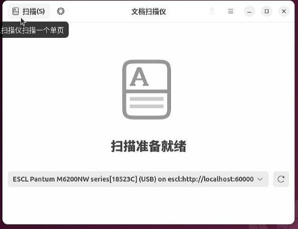

Result:    


### 2. nfs boot recovery
Steps:    

```
从Shell手动引导进入Linux系统
这是最关键的一步，我们将利用Shell手动找到并执行Linux的引导文件，从而先进入系统。
    切换到EFI分区：
    您的截图显示EFI分区是 FS0:。在 Shell> 提示符后输入：
    Shell> FS0:
    然后按回车。提示符会变成 FS0:\>。
    浏览文件：
    输入 ls (或者 dir) 命令查看当前目录下的文件和文件夹：
    FS0:\> ls
    您应该能看到一个名为 EFI 的文件夹。
    进入EFI目录：
    FS0:\> cd EFI
    再次浏览文件：
    FS0:\EFI\> ls
    现在，您应该能看到一个以您的Linux发行版命名的文件夹，比如 ubuntu、debian、centos 等，或者是一个通用的 BOOT 文件夹。
    进入发行版目录：
    假设您的发行版是Ubuntu，就进入 ubuntu 目录：
    FS0:\EFI\> cd ubuntu
    （如果不是ubuntu，请替换成您看到的对应目录名）
    查找并执行引导文件：
    再次用 ls 查看目录内容。您会看到一些 .efi 后缀的文件。最重要的两个可能是：
        grubx64.efi (GRUB引导程序)
        shimx64.efi (如果启用了Secure Boot，通常从这个启动)
    优先尝试执行 shimx64.efi，如果不行再尝试 grubx64.efi。输入文件名即可执行：
    FS0:\EFI\ubuntu> shimx64.efi
    或者
    FS0:\EFI\ubuntu> grubx64.efi
如果一切顺利，执行这个命令后，您应该能看到熟悉的GRUB引导菜单，然后就可以选择并进入您的Linux系统了。
```
Steps:     

```
root@test-PC:/home/test# efibootmgr -v
BootCurrent: 000B
Timeout: 0 seconds
BootOrder: 0008,0000,000B
Boot0000* UiApp	FvVol(7cb8bdc9-f8eb-4f34-aaea-3ee4af6516a1)/FvFile(462caa21-7614-4503-836e-8ab6f4662331)
Boot0008* UEFI Misc Device	PciRoot(0x0)/Pci(0x9,0x0)N.....YM....R,Y.
Boot000B* EFI Internal Shell	FvVol(7cb8bdc9-f8eb-4f34-aaea-3ee4af6516a1)/FvFile(7c04a583-9e3e-4f1c-ad65-e05268d0b4d1)
root@test-PC:/home/test# efibootmgr --create --disk /dev/vda --part 1 --label "nfs" --loader "\EFI\NFS\grubx64.efi"
BootCurrent: 000B
Timeout: 0 seconds
BootOrder: 0001,0008,0000,000B
Boot0000* UiApp
Boot0008* UEFI Misc Device
Boot000B* EFI Internal Shell
Boot0001* nfs
root@test-PC:/home/test# reboot
```
then everything will be OK.    
### 3. nfs scan
Install sane-airscan for scanning :     

```
apt install sane-airscan
$ scanimage -L
device `escl:http://127.0.0.1:60000' is a ESCL Pantum M6200NW series[18523C] (USB) flatbed scanner
device `airscan:e0:Pantum M6200NW series[18523C] (USB)' is a eSCL Pantum M6200NW series[18523C] (USB) ip=127.0.0.1
$ scanimage --device-name "airscan:e0:Pantum M6200NW series[18523C] (USB)" --format=png > test_scan.png
$ ls -l -h test_scan.png 
-rw-r--r-- 1 test test 6.0M 10月 14 09:22 test_scan.png
```
Select the second one in graphical window:   

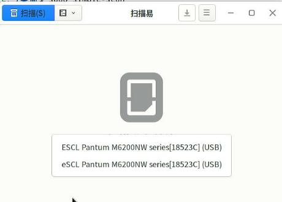

scanning:   


result:   


### 4. HP OfficeJet Pro 6230
Function:     

```
    标配端口:
        1个 高速 USB 2.0 端口
        1个 以太网 (10/100 Base-TX) 端口
        1个 Wi-Fi 802.11b/g/n 无线网络端口
    移动打印能力:
        HP ePrint 云打印
        Apple AirPrint™
        Mopria™ 认证
        无线直连打印 (Wi-Fi Direct)
```
Get the detailed info:    

```
root@idv-TC-9073:~# lsusb | grep Hewlett
Bus 001 Device 005: ID 03f0:7312 Hewlett-Packard 
root@idv-TC-9073:~# lsusb -v -s 001:005
```
ipp-usb support:    

```
从文件中可以看到两个支持此协议的接口描述：

    第一个证据：在接口 0 的备用设置 1 (AlternateSetting 1) 中，明确列出了：
        bInterfaceClass 7 Printer 
bInterfaceSubClass 1 Printer 
bInterfaceProtocol 4 

第二个证据：在接口 1 的备用设置 1 (AlternateSetting 1) 中，同样也列出了：
    bInterfaceClass 7 Printer 
bInterfaceSubClass 1 Printer 
bInterfaceProtocol 4 

这两个接口配置都清楚地表明该设备遵循 IPP-over-USB 协议标准，因此支持通过 USB 进行基于 IPP 的现代无驱动打印。
```
### 5. zkfd erification
Steps:    

```
test@test-PC:~$ sudo lpinfo -v
network https
file cups-brf:/
network ipp
network beh
direct hp:/usb/Officejet_Pro_6230?serial=TH95K7N167
network lpd
network ipps
serial serial:/dev/ttyS0?baud=115200
network http
network socket
network smb
direct hpfax
test@test-PC:~$ sudo lpstat -p -d
打印机 HP_Officejet_Pro_6230_606FF3_USB_ 目前空闲。从 2025年10月14日 星期二 10时03分14秒 开始启用
无系统默认目标
test@test-PC:~$ sudo lpstat -t
调度器正在运行
无系统默认目标
用于 HP_Officejet_Pro_6230_606FF3_USB_ 的设备：implicitclass://HP_Officejet_Pro_6230_606FF3_USB_/
HP_Officejet_Pro_6230_606FF3_USB_ 自从 2025年10月14日 星期二 10时03分14秒 开始接受请求
打印机 HP_Officejet_Pro_6230_606FF3_USB_ 目前空闲。从 2025年10月14日 星期二 10时03分14秒 开始启用
test@test-PC:~$ ps -ef | grep ipp
root         974       1  0 10:02 ?        00:00:00 /sbin/ipp-usb udev
test        2387    2231  0 10:03 pts/0    00:00:00 grep ipp
```
### 6. kylin verification
Find the right driver for printer:     

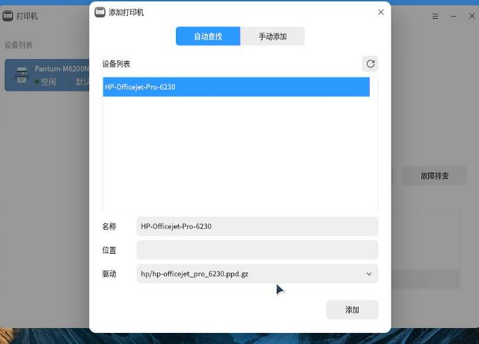

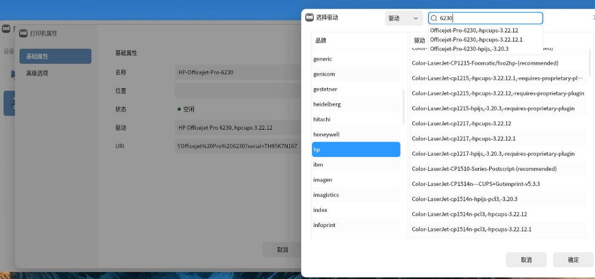

using `lpinfo -m` for getting all of the printer drivers.  

Get the device driver for printer.   

```
$ LANG=C sudo lpstat -l -p HP-Officejet-Pro-6230
printer HP-Officejet-Pro-6230 is idle.  enabled since Tue Oct 14 10:14:07 2025
	Form mounted:
	Content types: any
	Printer types: unknown
	Description: HP-Officejet-Pro-6230
	Alerts: none
	Location: 
	Connection: direct
	Interface: /etc/cups/ppd/HP-Officejet-Pro-6230.ppd
	On fault: no alert
	After fault: continue
	Users allowed:
		(all)
	Forms allowed:
		(none)
	Banner required
	Charset sets:
		(none)
	Default pitch:
	Default page size:
	Default port settings:
``` 
### 7. uos verification
device driver for printer:     

```
root@printer:~# lpstat -l -p Officejet-Pro-6230
打印机 Officejet-Pro-6230 目前空闲。从 2025年10月14日 星期二 19时01分45秒 开始启用
	已挂载表单：
	内容类型：任意
	打印机类型：未知
	描述：HP Officejet Pro 6230
	警告：none
	位置：printer
	连接：直接
	界面：/etc/cups/ppd/Officejet-Pro-6230.ppd
	发生错误时：无警告
	发生错误时：继续
	允许的用户：
		（全部）
	已允许表单：
		（无）
	需要横幅
	字符集：
		（无）
	默认字间距：
	默认页面尺寸：
	默认端口设置：
```
### 8. ubuntu verification
device driver info:     

```
$ sudo lpstat -l -p Officejet-Pro-6230
printer Officejet-Pro-6230 is idle.  enabled since 2025年10月14日 星期二 10时09分55秒
	Form mounted:
	Content types: any
	Printer types: unknown
	Description: HP Officejet Pro 6230
	Alerts: none
	Location: 180406
	Connection: direct
	Interface: /etc/cups/ppd/Officejet-Pro-6230.ppd
	On fault: no alert
	After fault: continue
	Users allowed:
		(all)
	Forms allowed:
		(none)
	Banner required
	Charset sets:
		(none)
	Default pitch:
	Default page size:
	Default port settings:
```
pkg info:     

```
test@180406:~$ sudo dpkg -l | grep hplip
ii  hplip                                      3.17.10+repack0-5                               amd64        HP Linux Printing and Imaging System (HPLIP)
ii  hplip-data                                 3.17.10+repack0-5                               all          HP Linux Printing and Imaging - data files
```

### 9. network printer(canon)
uos add:    


no driver for c3826:    

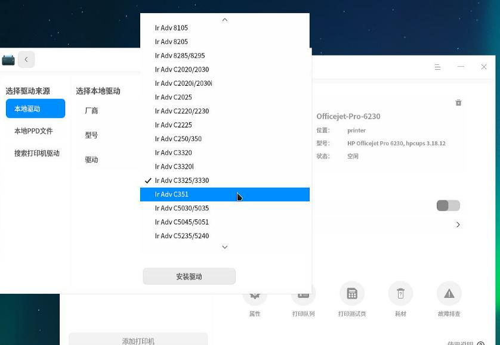

uos, disable security center:    


```
cd linux-UFRII-drv-v620-m17n/
./install.sh
```


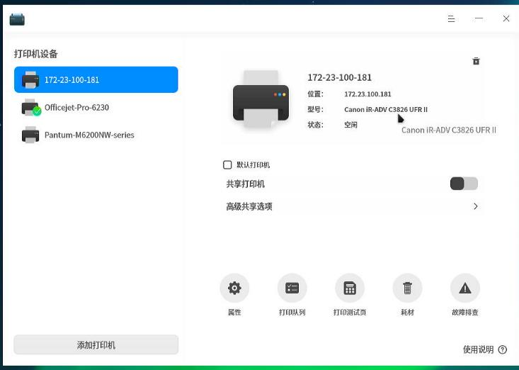


### 10. network printer(zkfd)
Add new printer:    

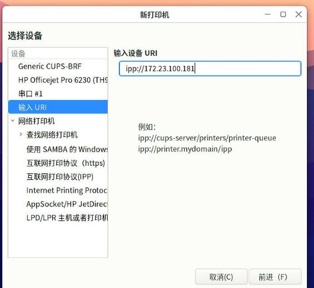

Still with no driver, should install UFRII driver:    

```
 tar xzvf linux-UFRII-drv-v620-m17n-20.tar.gz 
 cd linux-UFRII-drv-v620-m17n/
 sudo ./install.sh 
 sudo systemctl restart cups
```

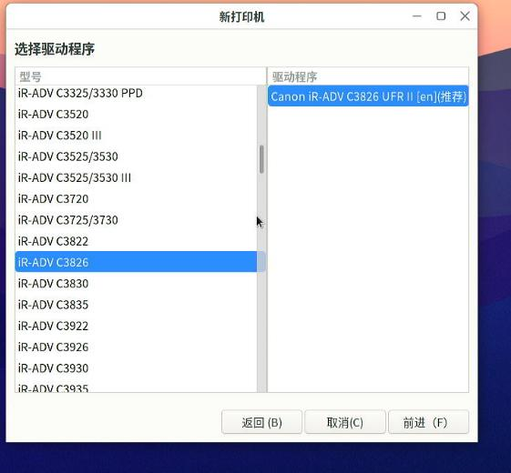

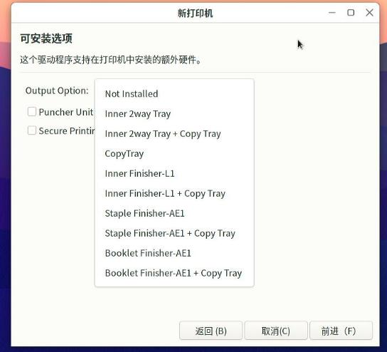

Result:    

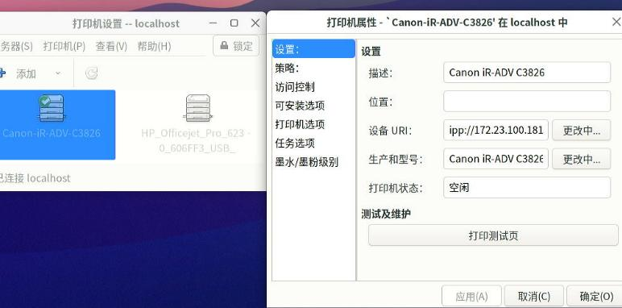

```
# lpstat -l -p Canon-iR-ADV-C3826
打印机 Canon-iR-ADV-C3826 目前空闲。从 2025年10月14日 星期二 11时51分24秒 开始启用
	已挂载表单：
	内容类型：任意
	打印机类型：未知
	描述：Canon iR-ADV C3826
	警告：none
	位置：
	连接：直接
	界面：/etc/cups/ppd/Canon-iR-ADV-C3826.ppd
	发生错误时：无警告
	发生错误时：继续
	允许的用户：
		（全部）
	已允许表单：
		（无）
	需要横幅
	字符集：
		（无）
	默认字间距：
	默认页面尺寸：
	默认端口设置：
```
### 11. hp officejet pro6230(win10/ubuntu2404)
Get the ip addr: 192.168.1.68.    

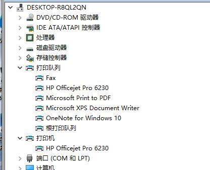

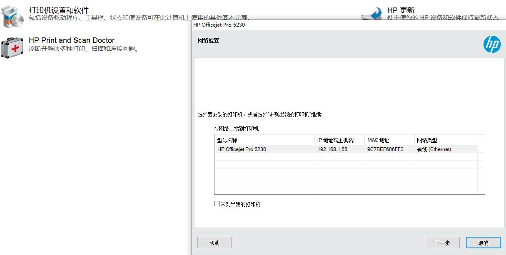

under ubuntu2404:    

```
test@test-Standard-PC-i440FX-PIIX-1996:~$ nmap -p 631 192.168.1.68
Starting Nmap 7.94SVN ( https://nmap.org ) at 2025-10-14 14:42 CST
Nmap scan report for 192.168.1.68
Host is up (0.0017s latency).

PORT    STATE SERVICE
631/tcp open  ipp

Nmap done: 1 IP address (1 host up) scanned in 0.03 seconds
test@test-Standard-PC-i440FX-PIIX-1996:~$ driverless list "ipp://192.168.1.68"
DEBUG: Started ippfind (PID 3015)
DEBUG: ippfind (PID 3015) exited with no errors.
```
Ip addr not in the same cidr.    

```
2: ens3: <BROADCAST,MULTICAST,UP,LOWER_UP> mtu 1500 qdisc fq_codel state UP group default qlen 1000
    link/ether 52:54:00:e6:d8:57 brd ff:ff:ff:ff:ff:ff
    altname enp0s3
    inet 192.168.123.2/24 brd 192.168.123.255 scope global dynamic noprefixroute ens3
       valid_lft 3379sec preferred_lft 3379sec
    inet6 fe80::5054:ff:fee6:d857/64 scope link 
       valid_lft forever preferred_lft forever
test@test-Standard-PC-i440FX-PIIX-1996:~$ sudo lpstat -p -d
lpstat: 未添加目标。
无系统默认目标
```
the script for adding the ipp-everywhere printer in different cidr:     

```
#!/bin/bash

# ==============================================================================
# 脚本名称: setup_remote_ipp_printer.sh
# 脚本功能: 直接添加一台位于不同网段、已知IP地址且支持IPP的网络打印机。
# ==============================================================================

# --- 请在此处配置您的打印机IP地址 ---
PRINTER_IP="192.168.1.68"
# ------------------------------------

# 设置颜色变量用于输出
GREEN='\033[0;32m'
YELLOW='\033[1;33m'
RED='\033[0;31m'
NC='\033[0m' # No Color

# 检查是否以root权限运行
if [ "$EUID" -ne 0 ]; then
  echo -e "${RED}*** 错误: 此脚本需要管理员权限。请使用 'sudo' 来运行。${NC}"
  exit 1
fi

echo -e "${YELLOW}>>> 目标打印机IP地址:${NC} ${PRINTER_IP}"

# --- 步骤 1: 检查网络连通性 ---
echo -e "${YELLOW}>>> 正在检查与打印机的网络连通性 (ping)...${NC}"
# -c 3: 发送3个包, -W 2: 等待2秒超时
ping -c 3 -W 2 "${PRINTER_IP}" > /dev/null 2>&1

if [ $? -ne 0 ]; then
    echo -e "${RED}*** 错误: 无法 ping 通打印机 ${PRINTER_IP}。${NC}"
    echo -e "${RED}*** 请检查IP地址是否正确，以及网络路由/防火墙是否允许ICMP协议。${NC}"
    exit 1
fi
echo -e "${GREEN}>>> Ping 测试成功!${NC}"

# --- 步骤 2: 检查IPP端口(631)是否可访问 ---
echo -e "${YELLOW}>>> 正在检查打印机IPP端口(631)是否开放...${NC}"
# 使用 nc (netcat) 工具探测端口，设置5秒超时
nc -z -w 5 "${PRINTER_IP}" 631

if [ $? -ne 0 ]; then
    echo -e "${RED}*** 错误: 无法连接到打印机 ${PRINTER_IP} 的 631 端口。${NC}"
    echo -e "${RED}*** 请检查您和打印机之间的路由器或防火墙是否阻止了 TCP 631 端口的通信。${NC}"
    exit 1
fi
echo -e "${GREEN}>>> 端口 631 可访问!${NC}"


# --- 步骤 3: 添加打印机 ---
# 根据IP地址生成一个友好的打印机名称
PRINTER_NAME="IPP_Printer_$(echo "${PRINTER_IP}" | tr '.' '_')"
# 构建打印机的设备URI
PRINTER_URI="ipp://${PRINTER_IP}/ipp/print"

echo -e "${YELLOW}>>> 准备添加打印机，名称为:${NC} ${PRINTER_NAME}"
echo -e "    ${YELLOW}设备地址 (URI):${NC} ${PRINTER_URI}"

# 使用 lpadmin 命令添加打印机
# -p: 指定打印机名称
# -E: 启用打印机并接受任务
# -v: 指定设备URI
# -m everywhere: 告诉CUPS使用IPP Everywhere协议自动配置，无需驱动
echo -e "${YELLOW}>>> 正在执行添加命令...${NC}"
lpadmin -p "${PRINTER_NAME}" -v "${PRINTER_URI}" -m everywhere -E

# 检查 lpadmin 命令是否成功执行
if [ $? -eq 0 ]; then
    echo -e "\n${GREEN}=====================================================${NC}"
    echo -e "${GREEN}✓ 打印机 '${PRINTER_NAME}' 已成功配置并启用!${NC}"
    echo -e "${GREEN}✓ 您现在可以从打印对话框中选择它进行打印。${NC}"
    echo -e "${GREEN}=====================================================${NC}"
else
    echo -e "\n${RED}*** 错误: 添加打印机失败。${NC}"
    echo -e "${RED}*** 请检查CUPS服务是否正常 (systemctl status cups) 或查看系统日志。${NC}"
fi

exit 0
```
Script execution log:     

```
$ sudo ./setupprinter.sh 
>>> 目标打印机IP地址: 192.168.1.68
>>> 正在检查与打印机的网络连通性 (ping)...
>>> Ping 测试成功!
>>> 正在检查打印机IPP端口(631)是否开放...
Connection to 192.168.1.68 631 port [tcp/ipp] succeeded!
>>> 端口 631 可访问!
>>> 准备添加打印机，名称为: IPP_Printer_192_168_1_68
    设备地址 (URI): ipp://192.168.1.68/ipp/print
>>> 正在执行添加命令...

=====================================================
✓ 打印机 'IPP_Printer_192_168_1_68' 已成功配置并启用!
✓ 您现在可以从打印对话框中选择它进行打印。
=====================================================
test@test-Standard-PC-i440FX-PIIX-1996:~$ sudo lpstat -p -d
打印机 IPP_Printer_192_168_1_68 目前空闲。从 2025年10月14日 星期二 15时12分25秒 开始启用
无系统默认目标
```
Remove/reboot/verification:     

```
test@test-Standard-PC-i440FX-PIIX-1996:~$ sudo lpstat -p -d
打印机 IPP_Printer_192_168_1_68 目前空闲。从 2025年10月14日 星期二 15时12分25秒 开始启用
无系统默认目标
test@test-Standard-PC-i440FX-PIIX-1996:~$ sudo lpadmin -x IPP_Printer_192_168_1_68
test@test-Standard-PC-i440FX-PIIX-1996:~$ sudo lpstat -p -d
lpstat: 未添加目标。
无系统默认目标
test@test-Standard-PC-i440FX-PIIX-1996:~$ sudo reboot
After reboot
test@test-Standard-PC-i440FX-PIIX-1996:~$ sudo lpstat -p -d
lpstat: 未添加目标。
无系统默认目标
```
`Pantum_M6200NW` is also ok for ethernet discovery

### 10. avahi-daemon
Host side:    

```
# vim /etc/avahi/avahi-daemon.conf
[server]
allow-interfaces=eno1,vnet0,virbr0
...
[reflector]
enable-reflector=yes
# systemctl restart avahi-daemon
```
In guest:    

```
$ sudo apt install -y avahi-utils
$ sudo avahi-browse -a
+   ens3 IPv6 Pantum M6200NW series[18523C]                 Secure Internet Printer local
+   ens3 IPv4 Pantum M6200NW series[18523C]                 Secure Internet Printer local
+   ens3 IPv6 Pantum M6200NW series[18523C]                 Internet Printer     local
+   ens3 IPv4 Pantum M6200NW series[18523C]                 Internet Printer     local
+   ens3 IPv4 Pantum M6200NW series[18523C]                 PDL Printer          local
+   ens3 IPv4 Pantum M6200NW series[18523C]                 _uscans._tcp         local
+   ens3 IPv4 Pantum M6200NW series[18523C]                 _uscan._tcp          local
+   ens3 IPv4 Pantum M6200NW series[18523C]                 _privet._tcp         local
+   ens3 IPv4 Pantum M6200NW series[18523C]                 _scanner._tcp        local
+   ens3 IPv4 Pantum M6200NW series[18523C]                 UNIX Printer         local
+   ens3 IPv4 Pantum M6200NW series[18523C]                 Web Site             local
+   ens3 IPv6 Pantum M6200NW series[18523C]                 PDL Printer          local
+   ens3 IPv6 Pantum M6200NW series[18523C]                 _uscans._tcp         local
+   ens3 IPv6 Pantum M6200NW series[18523C]                 _uscan._tcp          local
+   ens3 IPv6 Pantum M6200NW series[18523C]                 _privet._tcp         local
+   ens3 IPv6 Pantum M6200NW series[18523C]                 _scanner._tcp        local
+   ens3 IPv6 Pantum M6200NW series[18523C]                 UNIX Printer         local
+   ens3 IPv6 Pantum M6200NW series[18523C]                 Web Site             local
$ sudo lpstat -p -d
打印机 Pantum_M6200NW_series_18523C 目前空闲。从 2025年10月14日 星期二 17时25分46秒 开始启用
无系统默认目标

```
The scanner:    

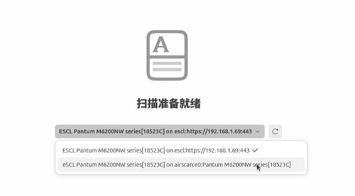

output:   


