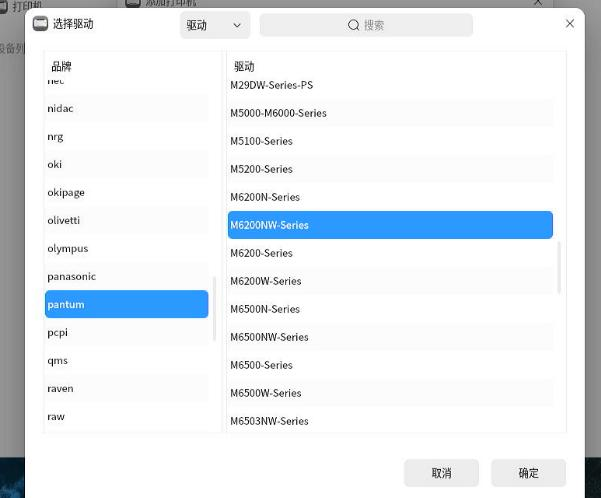
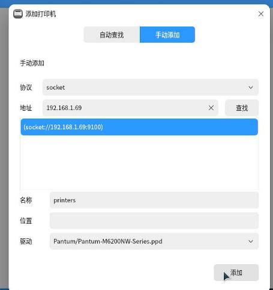
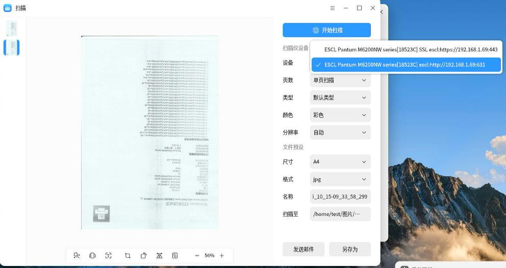
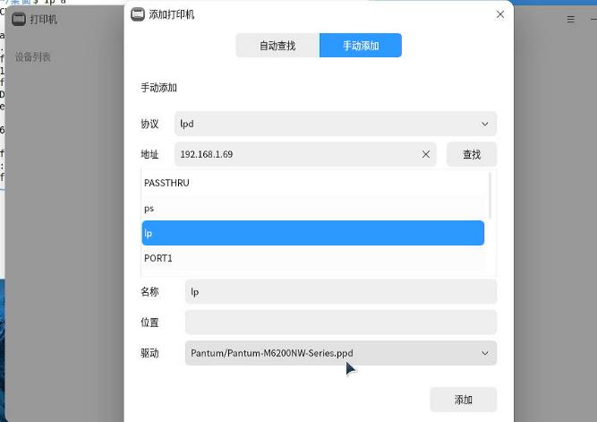
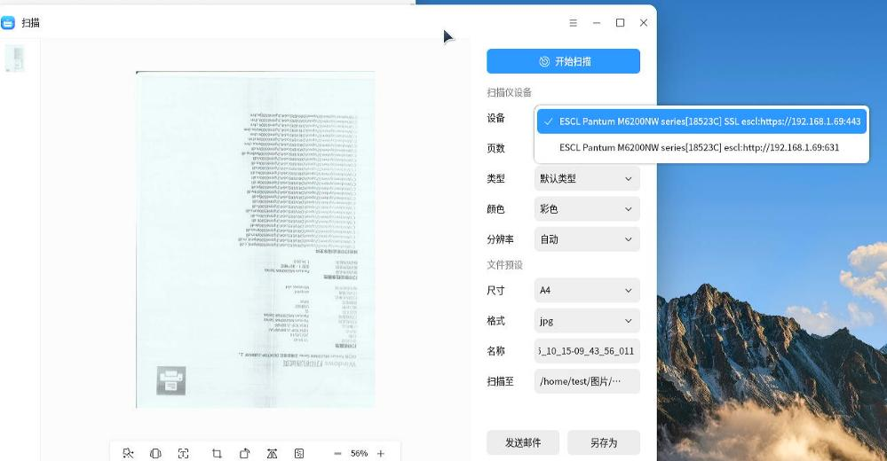
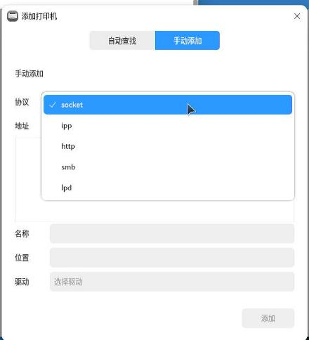
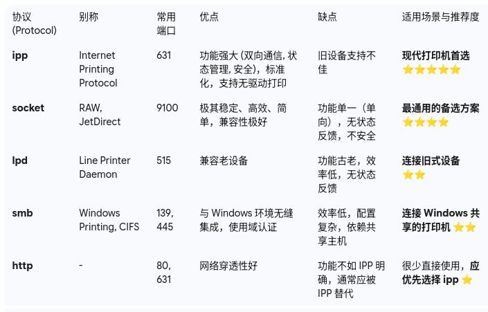

# 20251015
### 1. lpp ethernet based
ipp everywhere configured 
```
~$ sudo lpstat -l -p Pantum_M6200NW_series_18523C
打印机 Pantum_M6200NW_series_18523C 目前空闲。从 2025年10月15日 星期三 08时51分41秒 开始启用
	已挂载表单：
	内容类型：任意
	打印机类型：未知
	描述：Pantum_M6200NW_series_18523C
	警告：none
	位置：
	连接：直接
	界面：/etc/cups/ppd/Pantum_M6200NW_series_18523C.ppd
	发生错误时：无警告
	发生错误时：继续
	允许的用户：
		 (全部)
	已允许表单：
		 (无)
	需要横幅
	字符集：
		 (无)
	默认字间距：
	默认页面尺寸：
	默认端口设置：
test@test-Standard-PC-i440FX-PIIX-1996:~$ sudo dpkg -l | grep -i pantum
$ sudo ls -l -h /etc/cups/ppd/
总计 12K
-rw-r----- 1 root lp 8.4K 10月 15 08:51 Pantum_M6200NW_series_18523C.ppd
```
### 2. raw printer config
Difference between raw/lpd:    

```
协议	端口	连接地址/URI 格式	优点
RAW	9100	socket://<IP地址>:9100	非常简单，通用，高效，是目前的主流选择。
LPD	515	lpd://<IP地址>/<队列名>	兼容性好，尤其是在一些旧设备或混合环境中。
```

Kylin v10:    


Select the driver:     






Scanning via raw:    



### 3. lpd printer config
Kylin v10:    

```
通常 LPD 还需要一个“队列 (Queue)”名称。对于大多数打印机，队列名可以是 raw、lp、print 或者留空。您可以先尝试 raw。
最终生成的设备 URI 应该是类似这样的格式: lpd://192.168.1.100/raw
```



Detect printer:    


Scanner config, seems the same as the raw config:    



### 4. different kinds of printer





### 5. arm64 based printer verification

