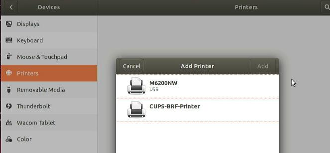
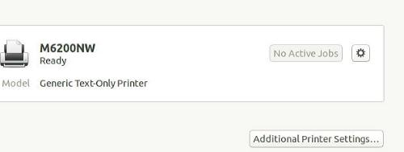
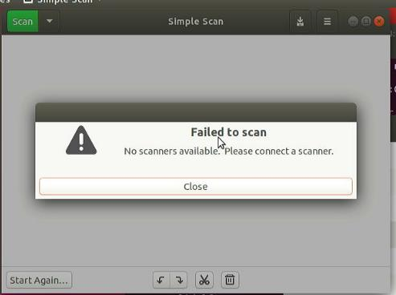

# 20251016
### 1. lxc based cups server
#### 1. ubuntu180406 installed pure
Ubuntu180406 pure installed, in a new ethernet network:    


Insert usb:    



Generic Text-Only printer:    



Simple Scan:    



#### 2. lxc/lxd based desktop
Create br0(for bridge networking):     

```
 nmcli con add type bridge ifname br0
 nmcli con modify bridge-br0 bridge.stp no
 nmcli con modify bridge-br0 ipv4.method manual ipv4.address "10.171.172.111/24" ipv4.gateway "10.171.172.1" ipv4.dns 223.5.5.5
 nmcli con add type bridge-slave ifname eth0 master bridge-br0
```
Install lxd/create instance:    

```
apt install -y lxd vim
sudo lxd init --auto
lxc launch ubuntu:24.04 cups-container
```
privileges config and add usb bus to container:     

```
lxc config set cups-container security.privileged true
lxc config device add cups-container dev-bus-usb disk source=/dev/bus/usb path=/dev/bus/usb recursive=true
```
Re-connect eth0 to br0:     

```
lxc network attach br0 cups-container eth0
lxc restart cups-container

```
