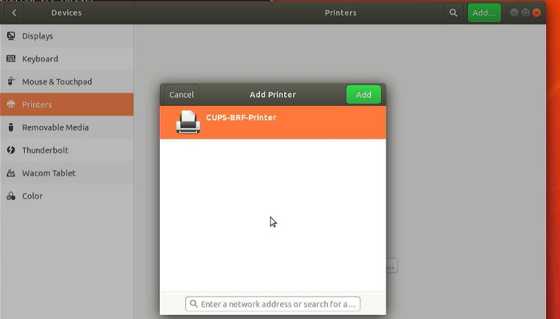

# 20251016
### 1. lxc based cups server
#### 1. ubuntu180406 installed pure
Ubuntu180406 pure installed, in a new ethernet network:    



Insert usb:    


Generic Text-Only printer:    


Simple Scan:    


#### 2. lxc/lxd based desktop
Create br0(for bridge networking):     

```
 nmcli con add type bridge ifname br0
 nmcli con modify bridge-br0 bridge.stp no
 nmcli con modify bridge-br0 ipv4.method manual ipv4.address "10.171.172.111/24" ipv4.gateway "10.171.172.1" ipv4.dns 223.5.5.5
 nmcli con add type bridge-slave ifname eth0 master bridge-br0
```
Install lxd/create instance:    

```
apt install -y lxd vim
sudo lxd init --auto
lxc launch ubuntu:24.04 cups-container
```
privileges config and add usb bus to container:     

```
lxc config set cups-container security.privileged true
lxc config device add cups-container dev-bus-usb disk source=/dev/bus/usb path=/dev/bus/usb recursive=true
```
Re-connect eth0 to br0:     

```
lxc network attach br0 cups-container eth0
lxc restart cups-container

```
### 3. workable lxc config
workable.    

```
# lxc config show cups-proxy
architecture: x86_64
config:
  image.architecture: amd64
  image.description: ubuntu 24.04 LTS amd64 (release) (20251001)
  image.label: release
  image.os: ubuntu
  image.release: noble
  image.serial: "20251001"
  image.version: "24.04"
  security.nesting: "true"
  security.privileged: "true"
  volatile.base_image: 22b3bd8a5d4842f1955ffbaeb8e02900019c28758a6e7b7b27869172652202e9
  volatile.eth0.hwaddr: 00:16:3e:d5:93:d4
  volatile.idmap.base: "0"
  volatile.idmap.next: '[]'
  volatile.last_state.idmap: '[]'
  volatile.last_state.power: RUNNING
devices:
  cups-tcp:
    connect: tcp:127.0.0.1:631
    listen: tcp:127.0.0.1:631
    type: proxy
  myprinter:
    productid: 8e10
    type: usb
    vendorid: 232b
  usb-bus:
    path: /dev/bus/usb
    recursive: "true"
    source: /dev/bus/usb
    type: disk
ephemeral: false
profiles:
- default
stateful: false
description: ""

```
