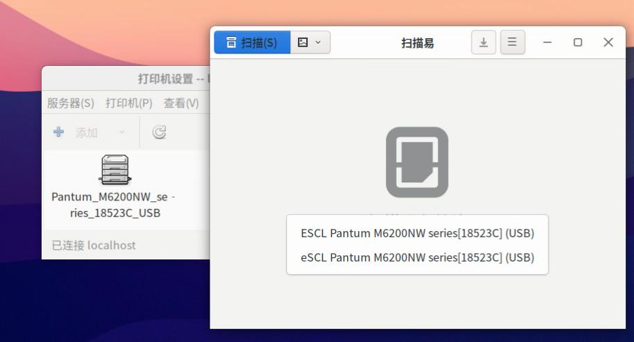
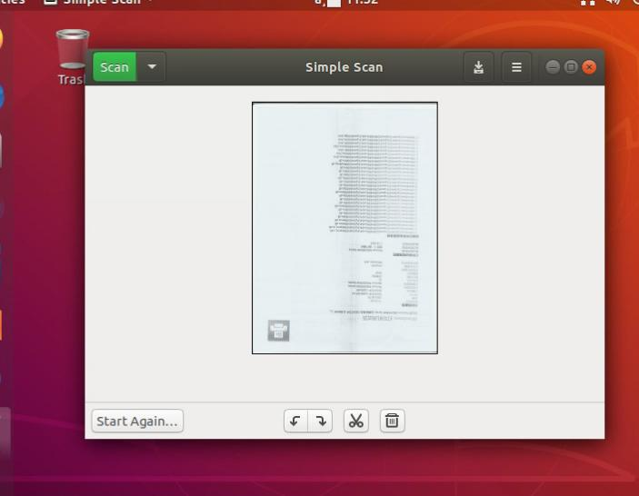

# 20251022
### 1. zkfd fupan
Install docker-ce, then insert usb lp:     

```
$ sudo dmesg -w
...
[  306.810396] usb 2-1: Device is not authorized for usage
$ sudo ls /dev/usb/lp0 
/dev/usb/lp0
$ sudo systemctl mask nfs-device-disable-daemon.service
$ sudo systemctl mask cups-browsed.service cups.service cups.socke
Now reboot
```
kernel output:    

```
[   49.066707] usblp 2-1:1.0: usblp0: USB Bidirectional printer dev 3 if 0 alt 0 proto 2 vid 0x232B pid 0x8E10
[   49.071346] usb 2-1: authorized to connect
[   49.071727] usblp0: removed
[   49.079291] usblp 2-1:1.0: usblp0: USB Bidirectional printer dev 3 if 0 alt 0 proto 2 vid 0x232B pid 0x8E10
^C
test@zkfdfupan:~$ ls /dev/usb/lp0 
/dev/usb/lp0
```
Run docker instance.    

```
test@zkfdfupan:~$ sudo docker ps
CONTAINER ID   IMAGE                COMMAND                  CREATED         STATUS         PORTS     NAMES
67256a887d44   printmaster:latest   "/bin/sh -c 'ipp-usb…"   3 seconds ago   Up 3 seconds             cups-server1
test@zkfdfupan:~$ sudo lpstat -p -d
打印机 Pantum_M6200NW_series_18523C_USB 目前空闲。从 2025年10月22日 星期三 08时47分36秒 开始启用
无系统默认目标
test@zkfdfupan:~$ sudo scanimage -L
Created directory: /var/lib/snmp/cert_indexes
device `escl:http://127.0.0.1:60000' is a ESCL Pantum M6200NW series[18523C] (USB) flatbed scanner
test@zkfdfupan:~$ sudo scanimage -d 'escl:http://127.0.0.1:60000' --format=png>1.png
scanimage: open of device escl:http://127.0.0.1:60000 failed: Out of memory
test@zkfdfupan:~$ sudo docker exec -it cups-server1 bash
root@zkfdfupan:/# scanimage -L
Created directory: /var/lib/snmp/cert_indexes
device `escl:http://localhost:60000' is a ESCL Pantum M6200NW series[18523C] (USB) platen scanner
device `airscan:e0:Pantum M6200NW series[18523C] (USB)' is a eSCL Pantum M6200NW series[18523C] (USB) ip=127.0.0.1, ::1
root@zkfdfupan:/# exit
exit
test@zkfdfupan:~$ sudo scanimage -L
device `escl:http://127.0.0.1:60000' is a ESCL Pantum M6200NW series[18523C] (USB) flatbed scanner
test@zkfdfupan:~$ apt-cache search airscan
sane-airscan - SANE backend for AirScan (eSCL) and WSD document scanner
test@zkfdfupan:~$ sudo apt install sane-airscan
test@zkfdfupan:~$ sudo scanimage -L
device `escl:http://127.0.0.1:60000' is a ESCL Pantum M6200NW series[18523C] (USB) flatbed scanner
device `airscan:e0:Pantum M6200NW series[18523C] (USB)' is a eSCL Pantum M6200NW series[18523C] (USB) ip=127.0.0.1
test@zkfdfupan:~$ sudo scanimage -d 'airscan:e0:Pantum M6200NW series[18523C] (USB)' --format=png>1.png
test@zkfdfupan:~$ ls -l -h 1.png 
-rw-r--r-- 1 test test 6.7M 10月 22 08:56 1.png
test@zkfdfupan:~$ sudo systemctl mask ipp-usb
Reboot

$ sudo scanimage -L
device `escl:http://127.0.0.1:60000' is a ESCL Pantum M6200NW series[18523C] (USB) flatbed scanner
device `airscan:e0:Pantum M6200NW series[18523C] (USB)' is a eSCL Pantum M6200NW series[18523C] (USB) ip=127.0.0.1
```
Verify scan in docker:     

```
sudo scanimage -d 'escl:http://127.0.0.1:60000' --format=png>1.png
scanimage: open of device escl:http://127.0.0.1:60000 failed: Out of memory
test@zkfdfupan:~$ sudo docker exec -it cups-server1 bash
root@zkfdfupan:/# scanimage -d 'escl:http://127.0.0.1:60000' --format=png>1.png
scanimage: rounded value of br-x from 215.9 to 215.9
scanimage: rounded value of br-y from 300.567 to 300.567
root@zkfdfupan:/# ls -l -h 1.png 
-rw-r--r-- 1 root root 326K Oct 22 01:02 1.png
root@zkfdfupan:/# scanimage --version
scanimage (sane-backends) 1.2.1-debian; backend version 1.2.1
root@zkfdfupan:/# exit
exit
test@zkfdfupan:~$ scanimage --version
scanimage (sane-backends) 1.0.31-debian; backend version 1.0.31
```

Two scanner could be found at host machine.    



### 2. ubuntu20.04 desktop verify
Step:     

```
apt install -y docker.io
systemctl disable apparmor
ufw disable
systemctl mask cups.path cups-browsed.service cups.service cups.socket saned.socket
apt remove ippusbxd
!!!NOW REBOOT!!!
```
After run docker instance, test the scanimage:     

```
root@ubuntu200406:~# scanimage -d 'escl:http://127.0.0.1:60000' --format=png>1.png
scanimage: open of device escl:http://127.0.0.1:60000 failed: Out of memory
root@ubuntu200406:~# docker exec -it cups-server1 bash
root@ubuntu200406:/# scanimage -d 'escl:http://127.0.0.1:60000' --format=png>1.png
scanimage: rounded value of br-x from 215.9 to 215.9
scanimage: rounded value of br-y from 300.567 to 300.567
root@ubuntu200406:/# ls -l -h 1.png
-rw-r--r-- 1 root root 326K Oct 22 02:36 1.png
root@ubuntu200406:/# lpstat -p -d
printer Pantum_M6200NW_series_18523C_USB is idle.  enabled since Wed Oct 22 02:35:30 2025
no system default destination
root@ubuntu200406:/# exit
exit
root@ubuntu200406:~# lpstat -p -d
printer Pantum_M6200NW_series_18523C_USB is idle.  enabled since 2025年10月22日 星期三 10时35分30秒
no system default destination
```
### 3. ubuntu1804 desktop verification
Steps:     

```
systemctl disable apparmor
ufw disable
systemctl mask cups.path cups-browsed.service cups.service cups.socket saned.socket
apt remove ippusbxd
```
scanimage won't find any scanner.     

after manually build `sane-airscan`:    

```
wget https://github.com/alexpevzner/sane-airscan/archive/refs/tags/0.99.29.tar.gz

root@ubuntu180406desktop:~# scanimage -L
device `airscan:e0:Pantum M6200NW series[18523C] (USB)' is a eSCL Pantum M6200NW series[18523C] (USB) ip=127.0.0.1, ::1
root@ubuntu180406desktop:~# scanimage -d 'airscan:e0:Pantum M6200NW series[18523C] (USB)' --format=png>1.png
root@ubuntu180406desktop:~# ls -l -h 1.png 
-rw-r--r-- 1 root root 6.7M 10月 22 11:21 1.png
```



