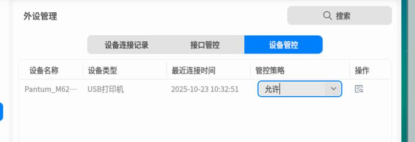
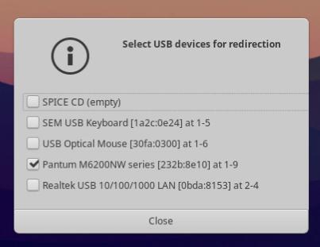
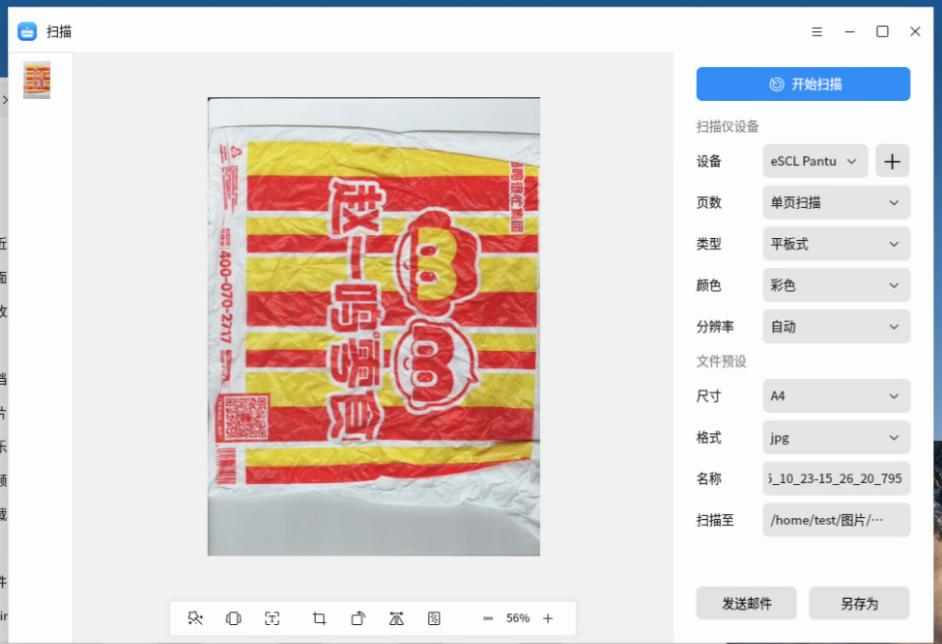
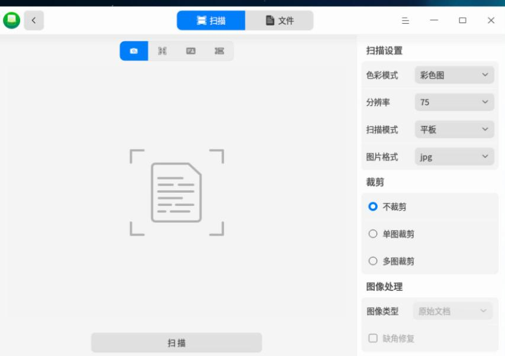
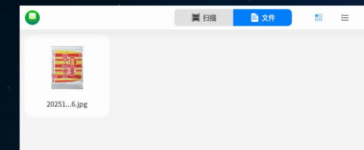

# 20251023
### 1. kylin own printer
Install ipp-usb which is fetched from zkfd, then:     

```
systemctl enable ipp-usb
sudo reboot

Then:   
root@kylin:/home/test/kkk# lpadmin -p "Pantum_M6200NW_USB" -E -v "ipp://Pantum%20M6200NW%20series%5B18523C%5D%20(USB)._ipp._tcp.local/" -m everywhere
root@kylin:/home/test/kkk# lpstat -p -d
打印机 Pantum_M6200NW_USB 目前空闲。从 2025年10月23日 星期四 09时28分50秒 开始启用
无系统默认目标
root@kylin:/home/test/kkk# lpadmin -x Pantum_M6200NW_USB
root@kylin:/home/test/kkk# lpstat -p -d
lpstat: 未添加目标。
无系统默认目标

```
Enable cups-browsed:     

```
sudo vim /etc/cups/cups-browsed.conf

grep -E -v '^#|^$' /etc/cups/cups-browsed.conf
......
CreateIPPPrinterQueues All

```

sane-airscan support:     

```
apt install -y libsane-dev
sudo apt-get install -y build-essential libavahi-client-dev libjpeg-dev libpng-dev zlib1g-dev
mkdir ~/airscan-build && cd ~/airscan-build
wget https://github.com/alexpevzner/sane-airscan/archive/refs/tags/0.99.29.tar.gz
tar -xzf 0.99.29.tar.gz
cd sane-airscan-0.99.29/
apt install libgnutls28-dev libtiff-dev libxml2-dev python3-pip
echo "nameserver 223.5.5.5">/etc/resolv.conf
apt install libgnutls28-dev libtiff-dev libxml2-dev python3-pip
pip3 install --upgrade meson -i https://pypi.tuna.tsinghua.edu.cn/simple
apt install -y ninja-build
meson setup build
ninja -C build install
sudo ln -s /usr/local/lib/x86_64-linux-gnu/sane/libsane-airscan.so /usr/lib/x86_64-linux-gnu/sane/
sudo ln -s /usr/local/etc/sane.d/dll.d/airscan /etc/sane.d/dll.d/
sudo ln -s /usr/local/lib/x86_64-linux-gnu/sane/libsane-airscan.so.1 /usr/lib/x86_64-linux-gnu/sane/libsane-airscan.so.1
sudo vim  /etc/ld.so.conf.d/usr-local-lib.conf
ldconfig
vim /etc/sane.d/dll.conf
scanimage -L
scanimage -d 'airscan:e0:Pantum M6200NW series[18523C] (USB)' --format=png>1.png
```
### 2. uos local printer
Open security related:    




Install ipp-usb and enable avahi-daemon:     

```
apt install ./ipp-usb_0.9.17-3+b4_amd64.deb
systemctl enable ipp-usb
systemctl enable avahi-daemon
apt install -y cups-browsed
systemctl start cups-browsed
vim /etc/ipp-usb/ipp-usb.conf
  interface = all # all | loopback
reboot
```
Enable airscan:     

```
apt install -y libsane-dev build-essential libavahi-client-dev libjpeg-dev libpng-dev zlib1g-dev libgnutls28-dev libtiff-dev libxml2-dev python3-pip ninja-build
pip3 install --upgrade meson -i https://pypi.tuna.tsinghua.edu.cn/simple
mkdir ~/airscan-build && cd ~/airscan-build
scp dash@192.168.1.208:~/0.99.29.tar.gz .
ls
tar xzvf 0.99.29.tar.gz 
cd sane-airscan-0.99.29/
meson setup build
ninja -C build install
sudo ln -s /usr/local/lib/x86_64-linux-gnu/sane/libsane-airscan.so /usr/lib/x86_64-linux-gnu/sane/
sudo ln -s /usr/local/etc/sane.d/dll.d/airscan /etc/sane.d/dll.d/
sudo ln -s /usr/local/lib/x86_64-linux-gnu/sane/libsane-airscan.so.1 /usr/lib/x86_64-linux-gnu/sane/libsane-airscan.so.1
sudo vim  /etc/ld.so.conf.d/usr-local-lib.conf
/usr/local/lib
ldconfig
vim /etc/sane.d/dll.conf 
...
airscan
```
### 3. zkfd local printer
Install ipp-usb and reboot.    

then `lpstat -p -d` will be OK.   

Install `sane-airscan`, then scan will be OK.   

```
$ sudo scanimage -L
Created directory: /var/lib/snmp/cert_indexes
device `escl:http://127.0.0.1:60000' is a ESCL Pantum M6200NW series[18523C] (USB) flatbed scanner
$ sudo apt install -y sane-airscan
$ sudo scanimage -L
device `escl:http://127.0.0.1:60000' is a ESCL Pantum M6200NW series[18523C] (USB) flatbed scanner
device `airscan:e0:Pantum M6200NW series[18523C] (USB)' is a eSCL Pantum M6200NW series[18523C] (USB) ip=127.0.0.1
```
If not install `sane-airscan`, but use the 0.99.29 sane-airscane, then the image will be:     

```
test@zkfdfupan:~$ sudo scanimage -L
device `airscan:e0:Pantum M6200NW series[18523C] (USB)' is a eSCL Pantum M6200NW series[18523C] (USB) ip=127.0.0.1, ::1
```
### 4. zkfd arm64
usb device redirection:    


In buiding airscan:     

```
ln -s /usr/local/lib/aarch64-linux-gnu/sane/libsane-airscan.so /usr/lib/aarch64-linux-gnu/sane/
sudo ln -s /usr/local/etc/sane.d/dll.d/airscan /etc/sane.d/dll.d/
ln -s /usr/local/lib/aarch64-linux-gnu/sane/libsane-airscan.so.1 /usr/lib/aarch64-linux-gnu/sane/libsane-airscan.so.1
```
Then:     

```
test@zkfd:~$ sudo systemctl unmask avahi-daemon
Removed /etc/systemd/system/avahi-daemon.service.
test@zkfd:~$ sudo systemctl enable avahi-daemon --now
test@zkfd:~$ lpstat -p -d
打印机 Pantum_M6200NW_series_18523C_USB_ 目前空闲。从 2025年10月23日 星期四 14时58分08秒 开始启用
无系统默认目标
test@zkfd:~$ sudo scanimage -L
device `airscan:e0:Pantum M6200NW series[18523C] (USB)' is a eSCL Pantum M6200NW series[18523C] (USB) ip=127.0.0.1, ::1
```
Get the ipp-usb package via:    

```
sudo apt install --reinstall --download-only ipp-usb
```
### 5. kylinv10 arm64
Install ipp-usb

```
scp dash@192.168.1.208:~/ipp-usb_0.9.17-3+b4_arm64.deb .
sudo apt install ./ipp-usb_0.9.17-3+b4_arm64.deb
```
Install cups-browsed:    

```
sudo apt install cups-browsed
sudo systemctl enable cups-browsed --now
test@kylin:~$ sudo vim /etc/cups/cups-browsed.conf 
CreateIPPPrinterQueues All
test@kylin:~$ sudo systemctl restart cups-browsed
test@kylin:~$ sudo lpstat -p -d
打印机 Pantum_M6200NW_series_18523C_USB_ 目前空闲。从 2025年10月23日 星期四 15时21分18秒 开始启用
无系统默认目标
test@kylin:~$ sudo scanimage -d escl:http://127.0.0.1:60000 --format=png>1.png
scanimage: open of device escl:http://127.0.0.1:60000 failed: Out of memory
```
Should also compile airscan.      

```
After compilation....
# scanimage -L
device `airscan:e0:Pantum M6200NW series[18523C] (USB)' is a eSCL Pantum M6200NW series[18523C] (USB) ip=127.0.0.1, ::1
```



### 6. uos arm64
old style:    

```
systemctl enable avahi-daemon
apt install avahi-utils
apt install ./ipp-usb_0.9.17-3+b4_arm64.deb
cat /etc/ipp-usb/ipp-usb.conf
  interface = all # all | loopback
apt install cups-browsed
vim /etc/cups/cups-browsed.conf
    CreateIPPPrinterQueues All
vim /usr/./lib/systemd/system/ipp-usb.service
    ...
    ExecStart=/sbin/ipp-usb
apt install -y simple-scan
```
From uos pure.    

```
systemctl enable avahi-daemon --now
apt install ./ipp-usb_0.9.17-3+b4_arm64.deb
 apt install -y avahi-utils
 vim /etc/ipp-usb/ipp-usb.conf

  interface = all # all | loopback

avahi-resolve-host-name uospur.local
apt install libnss-mdns
vim /etc/nsswitch.conf
... not configured
ping -c 3 uospur.local
vim /usr/./lib/systemd/system/ipp-usb.service
    ...
    ExecStart=/sbin/ipp-usb standalone
crontab -e
@reboot sleep 5 && systemctl restart ipp-usb

```





