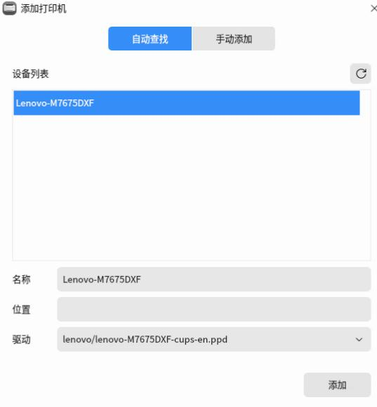

# 20251027
### 1. rebuilding of ipp-usb
Create a debian11's docker for fetching src package:       

```
mkdir debhelper
apt source debhelper
mkdir ronn
apt source ronn
mkdir goipp
apt source golang-github-openprinting-goipp-dev
mkdir ipp
apt source ipp-usb
```
Tar the directory, then transfer the tar.gz to kylin.    

Install some packages for building:     

```
sudo apt install build-essential devscripts fakeroot
```

Build ronn:    

```
tar xzvf ronn.tar.gz
cd ronn
sudo apt build-dep .
debuild -us -uc
cd ..
sudo  apt install ./ronn_0.9.1-2_all.deb ./ruby-ronn_0.9.1-2_all.deb
```
Build debhelper:     

```
cd debhelper
sudo apt build-dep .
debuild -us -uc
cd ..
sudo apt install ./debhelper_13.3.4_all.deb ./libdebhelper-perl_13.3.4_all.deb
```
Build golang-github-openprinting-goipp-1.0.0:     

```
sudo apt build-dep .
debuild -us -uc
cd ..
sudo apt install ./golang-github-openprinting-goipp-dev_1.0.0-1_all.deb
```
Build ipp-usb:     

```
sudo apt build-dep .
debuild -us -uc
cd ..
sudo apt install ./ipp-usb_0.9.17-3_amd64.deb
```
Verification:     

```
$ dpkg -l | grep ipp-usb
ii  ipp-usb                                       0.9.17-3                                  amd64        Daemon for IPP over USB printer support
```
### 2. rebuild ipp-usb for uos
should add gen2deb, also you have to edit the building steps:     

```
# vim gen2deb-1.4/debian/rules
......
$(ruby_versions):
ifeq (,$(filter nocheck,$(DEB_BUILD_OPTIONS)))
	# NO_PKG_MANGLE=1 only useful on Ubuntu buildds, to disable pkgbinarymangler
	#NO_PKG_MANGLE=1 $@ -S rake test:unit TESTOPTS=-v
	@echo "fuckfuckfuck"
else
	@echo "Skipping tests for $@ as DEB_BUILD_OPTIONS contains 'nocheck'"
endif
```
### 3. verification
kylin/uos, only install ipp-usb package, is enough for use ipp.    

### 4. lenovo old printer(uos)
Under UOS:    


lpstat -p -d result:     


scanner driver:     

```
root@uospure:~/lenovo/LJ24_LJ26_M74_M76系列/扫描驱动/UOS# apt install ./signed_com.lenovo.lenovoscan3_1.2.9-4_amd64.deb 
root@uospure:~/lenovo/LJ24_LJ26_M74_M76系列/扫描驱动/UOS# scanimage -L
device `lenovo3:bus1;dev1' is a Lenovo M7675DXF USB scanner
``` 


### 5. lenovo old printer(kylin)


Trying to add driver:   


Search result:    



After installed driver:     


Scanner is also installed along with printer driver.    


but with no scanner:   


using scanimage under command line:     

```
# scanimage -d 'lenovo3:bus1;dev1' --format=png>111.png
scanimage: rounded value of br-x from 215.9 to 215.88
scanimage: rounded value of br-y from 355.6 to 355.567
```
Which under the scence:     

```
root@kylin:/home/test# dpkg -l | grep -i lenovo
ii  com.lenovo.lenovoprints                       5.0.1-2                                   amd64        printer driver (lpd/cups)
ii  com.lenovo.lenovoscan3                        1.2.6-0                                   amd64        scanner driver
```
### 6. lenovo old printer(zkfd)
Automatically ask for installing driver:    


```
root@zkfdfupan:/home/test# lpstat -p -d
lpstat: 未添加目标。
无系统默认目标
root@zkfdfupan:/home/test# dpkg -l | grep -i lenovo
root@zkfdfupan:/home/test# lpstat -p -d
打印机 M7675DXF 从 2025年10月27日 星期一 17时30分58秒 开始被禁用 -
	未知原因
无系统默认目标
root@zkfdfupan:/home/test# sudo dpkg -l | grep -i lenovo
root@zkfdfupan:/home/test# sudo lpstat -p -d
打印机 M7675DXF 目前空闲。从 2025年10月27日 星期一 17时31分42秒 开始启用
```
Driver:    


Install via:     

```
root@zkfdfupan:/home/test/LJ24_LJ26_M74_M76系列/打印驱动/麒麟V10# apt install ./com.lenovo.lenovoprints_5.0.3-2_amd64.deb
```
Delete it and add it again.   


Add:   


Driver:    


scanner:      

```
root@zkfdfupan:/home/test/LJ24_LJ26_M74_M76系列/扫描驱动/麒麟v10 sp1# apt install ./com.lenovo.lenovoscan3_1.2.9-4_amd64.deb
```
examine:    

```
root@zkfdfupan:~# scanimage -L
device `lenovo3:bus2;dev1' is a Lenovo M7675DXF USB scanner
```
Simplescan cannot find it.    

```
# scanimage -d 'lenovo3:bus2;dev1' --format=png>111111.png
scanimage: rounded value of br-x from 215.9 to 215.88
scanimage: rounded value of br-y from 355.6 to 355.567
```

