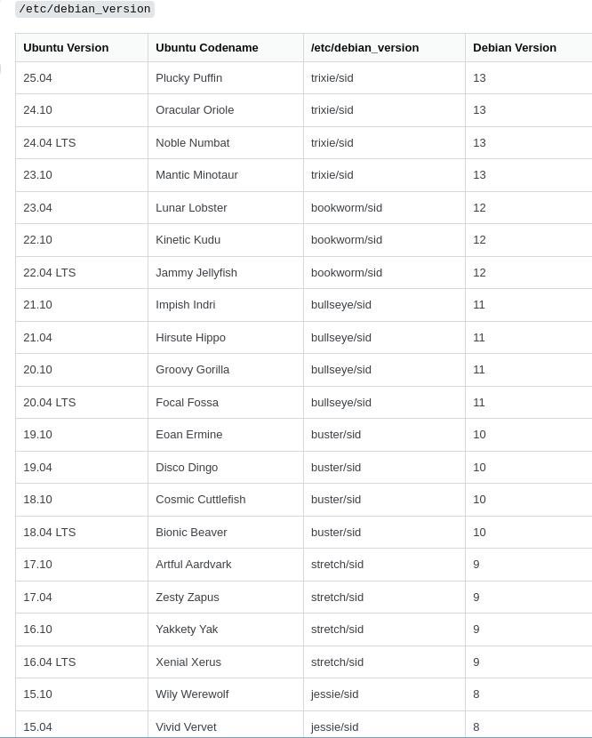

# 20251110
### 1. ubuntu23.04 installation
Should disable networking, or it will failed.    
After installation, re-enable the networking.    

### 2. ubuntu22.04 desktop use 5.15
Reason: under 5.15, could install dde.     
Step:     

```
sudo apt install -y linux-image-generic
sudo apt remove linux-generic-hwe-22.04 --purge
sudo apt remove linux-headers-6.8.0-40-generic linux-headers-6.8.0-87-generic linux-headers-generic-hwe-22.04 linux-hwe-6.8-headers-6.8.0-40 linux-hwe-6.8-headers-6.8.0-87 linux-hwe-6.8-tools-6.8.0-40 linux-hwe-6.8-tools-6.8.0-87 linux-image-6.8.0-40-generic linux-image-6.8.0-87-generic linux-image-generic-hwe-22.04 linux-modules-6.8.0-40-generic linux-modules-6.8.0-87-generic linux-modules-extra-6.8.0-40-generic linux-modules-extra-6.8.0-87-generic linux-tools-6.8.0-40-generic linux-tools-6.8.0-87-generic --purge
sudo apt install linux-headers-generic
sudo reboot

After rebooted:    

$ uname -a
Linux ubuntu220405desktopprinter 5.15.0-161-generic #171-Ubuntu SMP Sat Oct 11 08:17:01 UTC 2025 x86_64 x86_64 x86_64 GNU/Linux
``` 
### 3. debian version vs ubuntu version

from `https://askubuntu.com/questions/445487/what-debian-version-are-the-different-ubuntu-versions-based-on`



