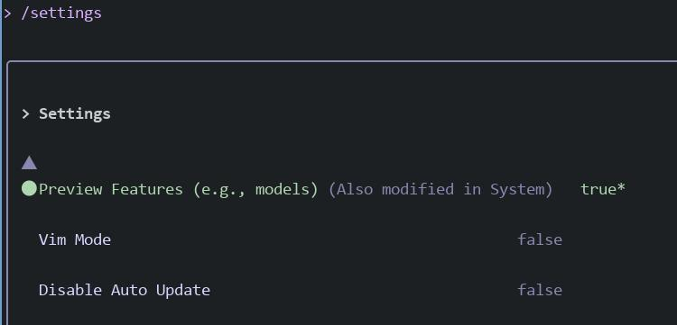

# 20251126
### 1. gemini 3
Settings, enable Preview features:     



Then choose the /model :    


### 2. 提示词

### 3. 抢回终端
问题描述:      

```
我通过ssh登陆到某机器上运行命令，运行了gemini,但不幸路由器断连了，重启路由器后，我无法找回原来的shell窗口，而root@claude:~# ps -ef | grep gemini
root        2066    1724  0 00:53 pts/0    00:00:01 node /usr/bin/gemini
root        2087    2066  0 00:53 pts/0    00:00:13 /usr/bin/node /usr/bin/gemini
root        2739    2727  0 01:19 pts/1    00:00:00 grep --color=auto gemini

 我如何回到之前的正常工作状态？
```
解决方案:    

```
虽然 pts/0 消失了，但进程还在运行，你可以暴力抢一个新的 pts 给它：
# 找 gemini 主进程的 PID，这里是 2066
ps -ef | grep gemini

# 用 reptyr 把进程偷到当前终端（需要安装 reptyr）
apt install reptyr -y    # Debian/Ubuntu
# 或者 yum install reptyr -y / dnf install reptyr

reptyr -T 2066
```
进入到gemini后， 直接save tag:     

```
chat save first
```
重新进入gemini, 这次可以使用tmux/byobu来长时间Hold住这个session.     
