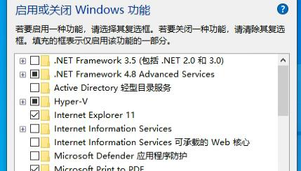
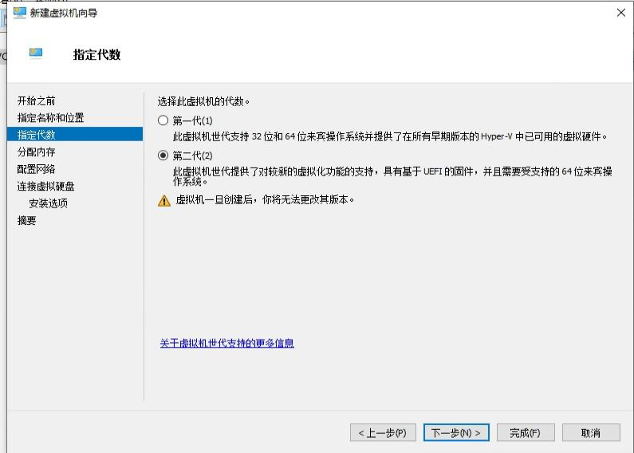
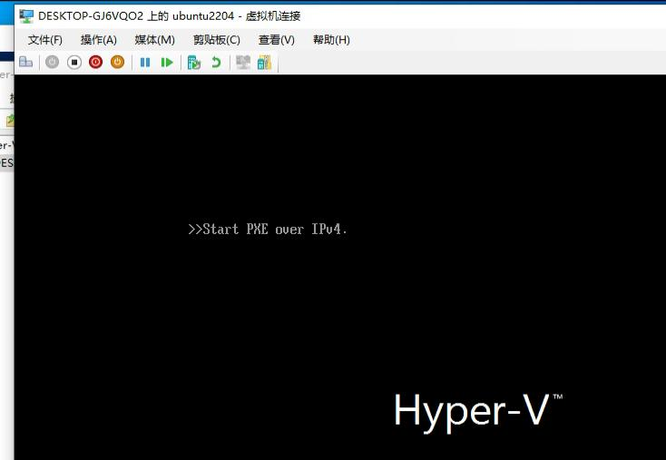
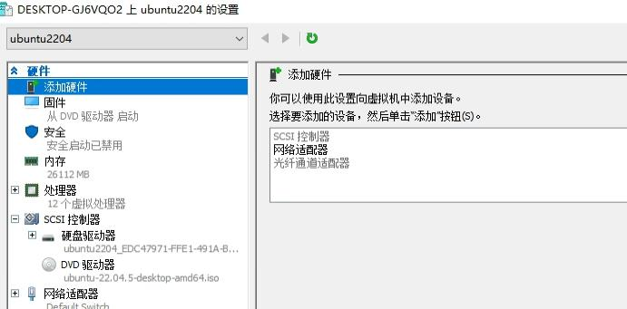

# 20251212
### 1. ubuntu install vmware tools
Installed via:    

```
sudo apt install -y open-vm-tools open-vm-tools-desktop
```

### 2. hyper-v
Install following functionalities:    




Create vm:    



disable dynamic memory:    


Enable nested virtualization:   


Install system:    



Disable secure boot:     



After installation:    


### 3. Nested kvm
结论：
0. 在现有IDV架构(Ubuntu+Qemu/KVM+Win/Linux<嵌套KVM>)下，不管如何伪装CPU及调整虚拟化参数，VMWare都拒绝启动VT-x/EPT使能的虚拟机。业界没有找到(Vmware-Nested-ON-KVM)成功的先例，常见的求助帖很多，没有跑通的先例。
1. 全链路KVM嵌套虚拟化是当前IDV下嵌套虚拟化算力的最优解。 
即：全部使用Linux,虚拟化全部使用KVM ---- 物理机(Linux+KVM)-->第一层虚拟机(Linux+KVM)->第二层虚拟机(Linux+KVM)。
2. 在第一层虚拟机不得不选择Windows的前提下，Hyper-V是嵌套虚拟化方案下最大化第二层算力功能(vt-x)和性能(各项跑分数据)的最优解。
物理机(Linux+KVM)-->第一层虚拟机(Windows+Hyper-V)->第二层虚拟机(Linux+KVM)。
3. VMWare Hypervisor的二层嵌套虚拟化的开启仅当"第一层也为VMWare Hypervisor"时可以被使能。
4. 即便是全链路VMWare Hypervisor嵌套虚拟化，第二层在开启vt-x后的性能损耗依然过大，尤其是内存及I/O跑分的下降极为明显。
5. 在现有IDV的技术架构下，如果客户(使用windows)有嵌套虚拟化的需求，IDV方案会推荐客户使用：
Hyper-V > VirtualBox > VMWare


5. 同构嵌套(如L0_VMWARE->L1_VMWARE)和异构嵌套(L0_KVM->L1_VMWARE)的考量：
虚拟化里可以套用“本是同根生”的概念。 如果是 L0 (VMware) -> L1 (VMware)，这属于同构嵌套 (Homogeneous Nesting)。VMware 对自家的 VMX 虚拟化实现非常了解，它知道如何完美地将物理 CPU 的 VT-x 特性透传给下一层。在VMware 上跑 VMware，就像俄罗斯套娃，契合度是 100% 的。

但如果线上的环境是 L0 (KVM) -> L1 (VMware)，这就形成了异构嵌套 (Heterogeneous Nesting)。 这就好比让说中文的人（KVM）去给说英文的人（VMware）当翻译。虽然 KVM 很强大，也支持标准 VMX，但在一些极其底层“方言”细节上（比如 VMX Preemption Timer, Shadow VMCS 的具体实现，特定的 MSR 寄存器行为），KVM 的模拟方式和 VMware 期待的“标准物理机”不一样。

VMware Workstation 是一个非常“傲娇”的软件，它在启动 VMX 引擎时通常会进行严格的环境自检。一旦它发现底层的 VMX 行为有不符合它对物理机的预期，它就会为了稳定性直接报错罢工。  

而因为VMWare WorkStation是闭源软件，对它行为的猜测只能是基于黑盒猜测。
未来VMWare将全面转向KVM, 届时其自用的vmmon模块可能就不再是必须具备的组件，届时才有可能实现真正的基于VMWARE的全链路KVM虚拟化。
现阶段因为vmmon和VMWare自己实现的hypervisor的闭源特性，大概率不能直接在KVM上直接运行。

																										
