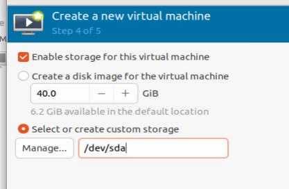

# 20251218
### 1. vmware optimization
Add a physical disk:    

Use Physical Driver 1:    

Select `Offline`:    

physicaldisk1.vmdk:   

Bios configuration:    

Configure the custom storage:    

