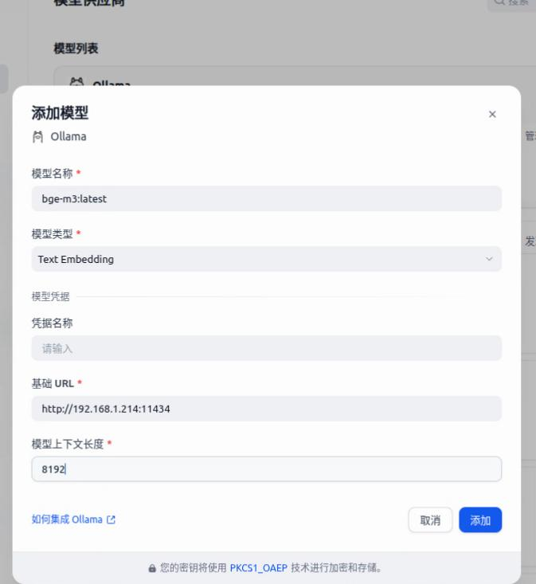
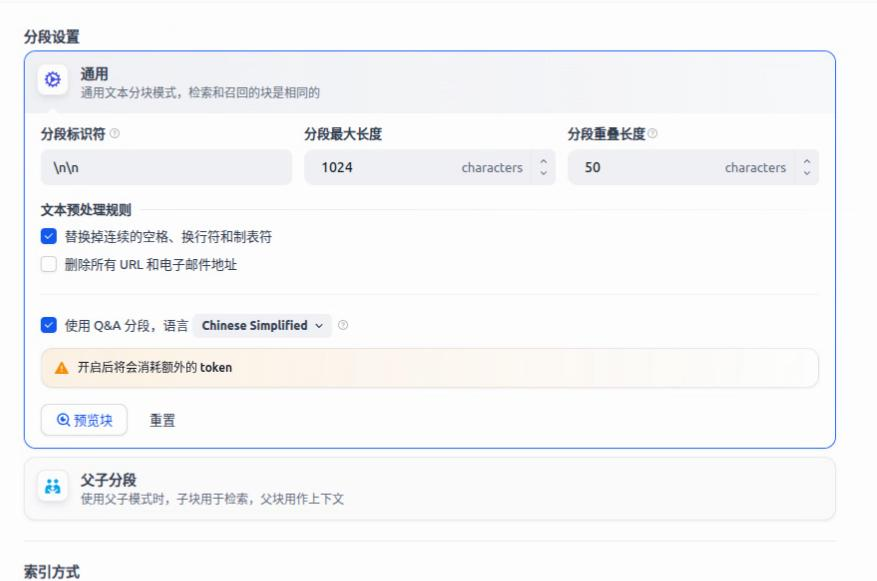

# 20260105
### 1. benchmark new node
Create new disk:     

```
qemu-img create -f qcow2 -b ubuntu2404benchmark.qcow2 -F qcow2 bench5.qcow2
qemu-img create -f qcow2 -b ubuntu2404benchmark.qcow2 -F qcow2 bench6.qcow2
```
Re-gen machine id:     

```
sudo rm -f /etc/machine-id
sudo rm -f /var/lib/dbus/machine-id
sudo systemd-machine-id-setup
```
Login to vm:      

```
sudo apt install -y nfs-kernel-server nfs-common
sudo mkdir -p /mnt/dbench
sudo mount 192.168.122.1:/data/dbench_test /mnt/dbench
cd ~
tar xzvf /mnt/dbench/parsec-benchmark_full.tar.gz
sudo apt install -y git fakeroot build-essential ncurses-dev xz-utils libssl-dev bc flex libelf-dev bison dwarves pkg-config gettext build-essential gcc-multilib libstdc++-14-dev-i386-cross

cd ~/parsec-benchmark
. env.sh
bin/parsecmgmt -a uninstall -p dedup
bin/parsecmgmt -a clean -p dedup
env AR=/usr/bin/ar bin/parsecmgmt -a build -p dedup


```
### 2. ollama 







