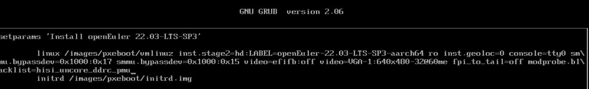
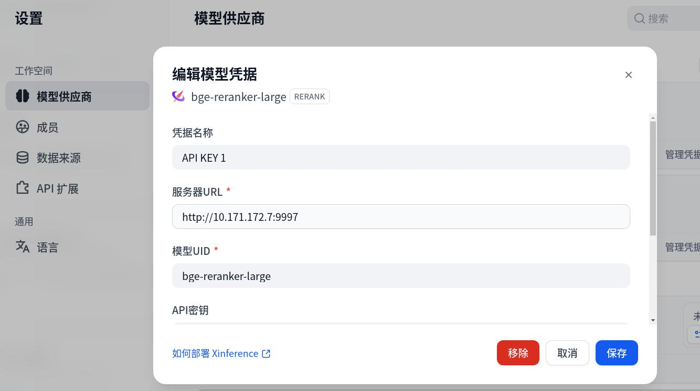

# 20260120
### 1. docker runtime(nvidia)
See if docker support nvidia runtime:      

```
 sudo docker info --format '{{.Runtimes}}' | grep -i nvidia
```
### 2. kbox related
解决安装卡死问题:   

```
安装/引导卡死（最常见）
modprobe.blacklist=hisi_uncore_ddrc_pmu
```



安装完毕后，第一次启动后需要指定参数。 而后通过grubby设置:      

```
grubby --update-kernel="/boot/vmlinuz-5.10.0-182.0.0.95.oe2203sp3.aarch64" --args="modprobe.blacklist=hisi_uncore_ddrc_pmu"
```
grub默认密码:      

```
用户名：root  
密码：openEuler#12
```
### 3. re-org dify
Load correspoding docker images:      

```
sudo docker load<dify.tar.xz
sudo docker load<dify1.tar.xz
cd ~/Code
tar xzvf ~/dify.tar.gz
tar xJvf ollama.tar.xz
$ ls ollama
_data  history  id_ed25519  id_ed25519.pub  models
sudo docker run -d --gpus=all   -v /home/dash/ollama:/root/.ollama   -p 11434:11434   --name ollama   --restart always   ollama/ollama
sudo docker exec ollama  nvidia-smi
$ sudo docker exec -it ollama ollama list
NAME                                ID              SIZE      MODIFIED    
qllama/bge-reranker-v2-m3:latest    06e0e64a6f61    635 MB    13 days ago    
deepseek-r1:14b                     c333b7232bdb    9.0 GB    13 days ago    
bge-m3:latest                       790764642607    1.2 GB    2 weeks ago    
qwen2.5vl:7b                        5ced39dfa4ba    6.0 GB    2 weeks ago    
nomic-embed-text:latest             0a109f422b47    274 MB    2 weeks ago    
qwen2.5:14b                         7cdf5a0187d5    9.0 GB    2 weeks ago 
$ sudo docker exec -it ollama ollama run qwen2.5:14b
$ cd ~/Code/dify
dash@ai:~/Code/dify/docker$ sudo docker compose up -d
[+] Running 12/12
 ✔ Container docker-redis-1             Running                                                                                                                                          0.0s 
 ✔ Container docker-web-1               Running                                                                                                                                          0.0s 
 ✔ Container docker-sandbox-1           Running                                                                                                                                          0.0s 
 ✔ Container docker-db_postgres-1       Healthy                                                                                                                                          0.5s 
 ✔ Container docker-weaviate-1          Running                                                                                                                                          0.0s 
 ✔ Container docker-ssrf_proxy-1        Running                                                                                                                                          0.0s 
 ✔ Container docker-worker-1            Running                                                                                                                                          0.0s 
 ✔ Container docker-worker_beat-1       Running                                                                                                                                          0.0s 
 ✔ Container docker-api-1               Running                                                                                                                                          0.0s 
 ✔ Container docker-plugin_daemon-1     Running                                                                                                                                          0.0s 
 ✔ Container docker-init_permissions-1  Exited                                                                                                                                           0.6s 
 ✔ Container docker-nginx-1             Started
$ sudo netstat -anp | grep 80
$  sudo docker run --name xinference -d -p 9997:9997   --gpus all   -e XINFERENCE_MODEL_SRC=modelscope   -v $PWD/model_data:/root/.xinference/cache   xprobe/xinference:latest xinference-local -H 0.0.0.0 --port 9997
$ curl -X POST "http://127.0.0.1:9997/v1/models" -H "Content-Type: application/json" -d '{
            "model_name": "bge-reranker-large",
            "model_type": "rerank"
          }'
$ curl http://localhost:9997/v1/models
{"object":"list","data":[{"id":"bge-reranker-large","object":"model","created":0,"owned_by":"xinference","model_type":"rerank","address":"0.0.0.0:44385","accelerators":["0"],"type":"normal","model_name":"bge-reranker-large","language":["en","zh"],"model_revision":"v0.0.1","replica":1}]}
```
配置模型的服务器URL:    



