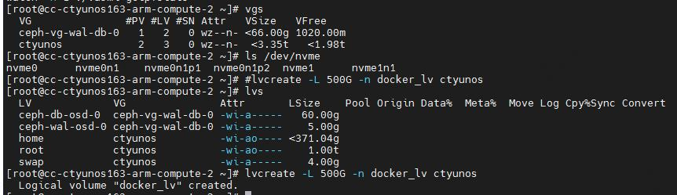
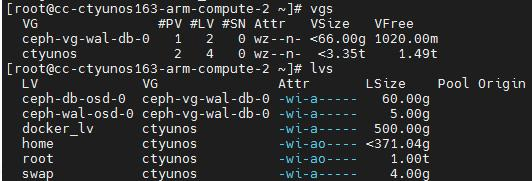

# 20260130
### 1. redroid mem
Origin:    


### 2. re disk



After create:     



```
# mkfs.xfs /dev/ctyunos/docker_lv
meta-data=/dev/ctyunos/docker_lv isize=512    agcount=16, agsize=8192000 blks
         =                       sectsz=4096  attr=2, projid32bit=1
         =                       crc=1        finobt=1, sparse=1, rmapbt=0
         =                       reflink=1    bigtime=1 inobtcount=0
data     =                       bsize=4096   blocks=131072000, imaxpct=25
         =                       sunit=32     swidth=32 blks
naming   =version 2              bsize=4096   ascii-ci=0, ftype=1
log      =internal log           bsize=4096   blocks=64000, version=2
         =                       sectsz=4096  sunit=1 blks, lazy-count=1
realtime =none                   extsz=4096   blocks=0, rtextents=0
Discarding blocks...Done.
```

### 3. re-generate

### 4. todo
nvidia free api:      

```
https://build.nvidia.com/explore/discover
```
