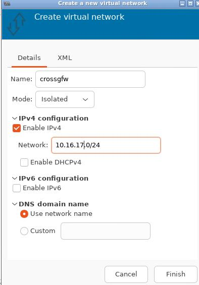
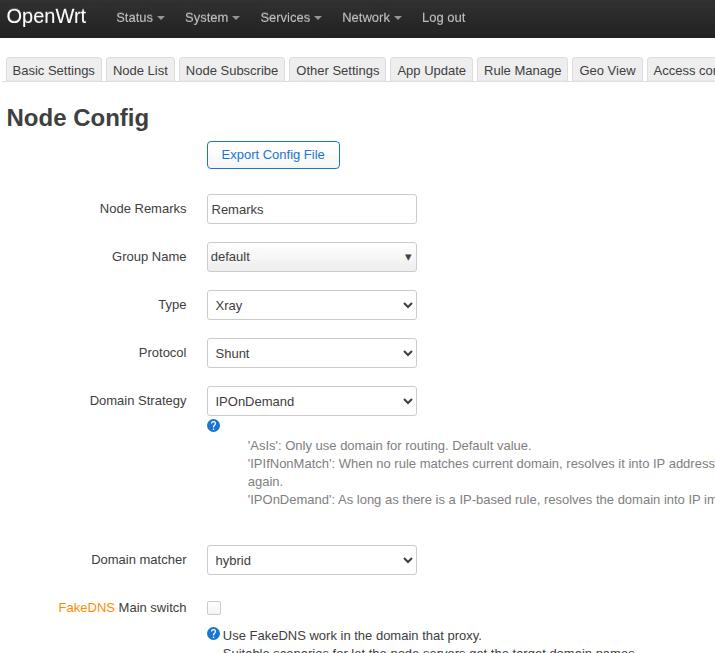
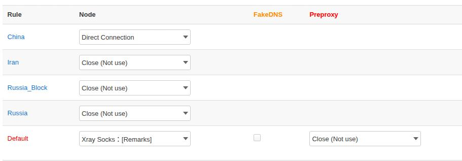
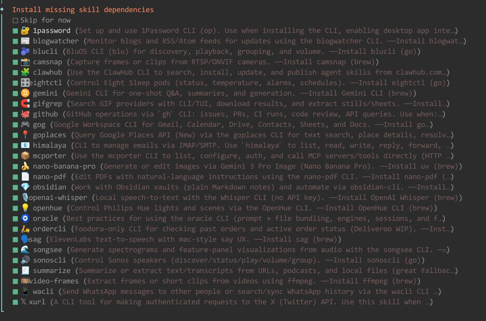

# 20260224
### 1. NIM models
Query via:      

```
NVIDIA_API_KEY=nvapi-xxxxx
curl -s https://integrate.api.nvidia.com/v1/models \
  -H "Authorization: Bearer $NVIDIA_API_KEY" \
  | jq .
```
### 2. tyy glm5 trial
`vim ~/opencode.json`:      

```
"ctyun-wishub": {
  "npm": "@ai-sdk/openai-compatible",
  "name": "天翼云 Wishub",
  "options": {
    "baseURL": "https://wishub-x6.ctyun.cn/v1",
    "apiKey": "xxxxxxxxxxxxxxxxxxxx"
  },
  "models": {
    "6d3a57c3a6fb465e968b604783b89eda": {
      "name": "Wishub 自定义模型"
    }
  }
}
```
### 3. dify usage


### 4. wake-on-lan
via:     

```
sudo ethtool -i eth0 | grep -i wake
```
### 5. crossgfw for libvirt
Virtual Network configuration:      



Download the openwrt image from ustc mirror:      

```
$ axel https://mirrors.ustc.edu.cn/openwrt/releases/24.10.5/targets/x86/generic/openwrt-24.10.5-x86-generic-generic-ext4-combined-efi.img.gz
$ gunzip openwrt-24.10.5-x86-generic-generic-ext4-combined-efi.img.gz
$ qemu-img info openwrt-24.10.5-x86-generic-generic-ext4-combined-efi.img 
image: openwrt-24.10.5-x86-generic-generic-ext4-combined-efi.img
file format: raw
virtual size: 120 MiB (126123520 bytes)
disk size: 120 MiB
```

Resize:      

```
qemu-img resize -f raw  openwrt-24.10.5-x86-generic-generic-ext4-combined-efi.img 512M
loop_device=$(losetup -f)
losetup $loop_device openwrt-24.10.5-x86-generic-generic-ext4-combined-efi.img
echo -e "OK\nFix" /usr/sbin/parted ---pretend-input-tty "$loop_device" print
parted /dev/loop31 resizepart 2 100%
parted /dev/loop31 print
```
Import the img, use bios, then add 2 nics:     


```
nable access luci from wan:

uci set firewall.wan_https_allow=rule
uci set firewall.wan_https_allow.name='Allow Luci from WAN'
uci set firewall.wan_https_allow.src='wan'
uci set firewall.wan_https_allow.proto='tcp'
uci set firewall.wan_https_allow.dest_port='80 443'
uci set firewall.wan_https_allow.target='ACCEPT'
uci commit firewall
/etc/init.d/firewall reload

Enable ssh from wan:


uci add firewall wan_ssh_allow
uci set firewall.wan_ssh_allow=rule
uci set firewall.wan_ssh_allow.name='Allow SSH from WAN'
uci set firewall.wan_ssh_allow.src='wan'
uci set firewall.wan_ssh_allow.proto='tcp'
uci set firewall.wan_ssh_allow.dest_port='22'
uci set firewall.wan_ssh_allow.target='ACCEPT'
uci commit firewall
/etc/init.d/firewall reload
```
use openssh instead of dropbear:     

```
# 1. 更新软件源
opkg update

# 2. 安装 openssh-server（建议连客户端和 sftp 一起装）
opkg install openssh-server openssh-client openssh-sftp-server

# 3. 强烈建议先把 dropbear 改端口或停用，避免冲突
uci set dropbear.@dropbear[0].Port='2222'
uci commit dropbear
/etc/init.d/dropbear restart
# 或者直接禁用 dropbear（小心不要把自己锁在外面）
# /etc/init.d/dropbear disable
# /etc/init.d/dropbear stop

# 4. 修改 sshd 配置（最重要一步！默认不允许 root 密码登录）
vi /etc/ssh/sshd_config

# 找到并修改这两行（去掉 # 注释，并改成 yes）
PermitRootLogin yes
PasswordAuthentication yes

# 保存退出

# 5. 启动并设置开机自启
/etc/init.d/sshd enable
/etc/init.d/sshd start
# 或重启
/etc/init.d/sshd restart
```

Configuration:      

```
config device
	option name 'br-lan'
	option type 'bridge'
	list ports 'eth1'

config interface 'lan'
	option device 'br-lan'
	option proto 'static'
	option ipaddr '10.16.17.2'
	option netmask '255.255.255.0'
	option ip6assign '60'

config interface 'wan'
	option device 'eth0'
	option proto 'static'
	option ipaddr '192.168.1.215'
	option netmask '255.255.255.0'
	option gateway '192.168.1.1'
```
dns configuration:       

```
uci set network.wan.peerdns='0'                # 关闭自动获取 peer DNS
uci add_list network.wan.dns='223.5.5.5'
uci add_list network.wan.dns='223.6.6.6'       # 可选，推荐
uci commit network
/etc/init.d/network reload
```

### 6. 64-bit openwrt

```
axel https://mirrors.ustc.edu.cn/openwrt/releases/24.10.5/targets/x86/64/openwrt-24.10.5-x86-64-generic-ext4-combined-efi.img.gz
unzip *.gz
qemu-img resize openwrt-24.10.5-x86-64-generic-ext4-combined-efi.img +1G
```
Use gparted for enlarge the partition:     


shunt:    





xray socks:    


Test/dns:     


### 7. openclaw installation
Install via:     

```
curl -fsSL https://openclaw.ai/install.sh | bash
```




```
 How do you want to hatch your bot?
│  Hatch in TUI (recommended)
 openclaw tui - ws://127.0.0.1:18789 - agent main - session main                                                              
 session agent:main:main                                                                                                      
 Wake up, my friend!                                                                                                          

 ⚠️ Agent failed before reply: No API key found for provider "anthropic". Auth store:                                         
 /home/test/.openclaw/agents/main/agent/auth-profiles.json (agentDir: /home/test/.openclaw/agents/main/agent). Configure auth 
 for this agent (openclaw agents add <id>) or copy auth-profiles.json from the main agentDir.                                 
 Logs: openclaw logs --follow                                                                                                 
 gateway connected | idle                                                                                                     
 agent main | session main (openclaw-tui) | anthropic/claude-opus-4-6 | think low | tokens ?/200k     
```
