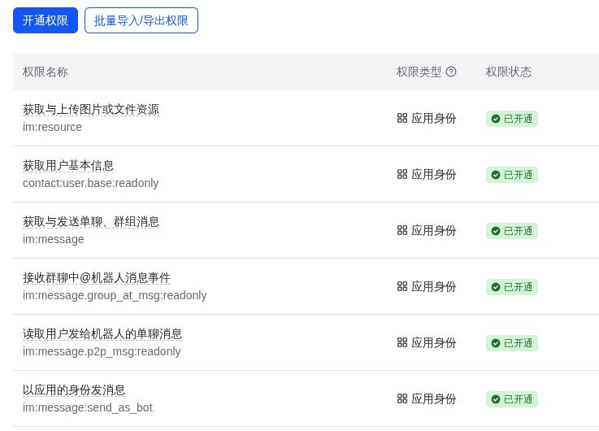
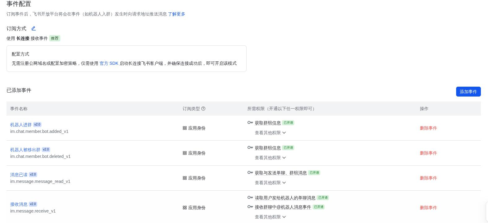

# 20260303
### 1. archlinux openclaw

feishu privilege:    




```
sudo pacman -S nodejs npm git base-devel
```



nixos install feishu, then everything will be OK .   

### 2. add channel:    
via command line :    

```
test@openclaw:~/.openclaw/workspace$  openclaw channels add --channel feishu --token qxxxxxx

🦞 OpenClaw 2026.2.23 (b817600) — Because the right answer is usually a script.

│
◇  Install Feishu plugin?
│  Download from npm (@openclaw/feishu)
Downloading @openclaw/feishu…
Extracting /tmp/openclaw-npm-pack-e2dNz4/openclaw-feishu-2026.3.2.tgz…
Plugin "feishu" has 1 suspicious code pattern(s). Run "openclaw security audit --deep" for details.
Installing to /home/test/.openclaw/extensions/feishu…
Installing plugin dependencies…
```


```

openclaw gateway restart

```

### 3. Qwen3.5-35B with graphical
Via:     

```
./build/bin/llama-server \
  -m /home/dash/models/Qwen3.5-35B-A3B-GGUF/Qwen3.5-35B-A3B-Q8_0.gguf \
   --mmproj /home/dash/models/Qwen3.5-35B-A3B-GGUF/mmproj-F32.gguf \
  --host 0.0.0.0 \
  --port 8080 \
  --n-gpu-layers -1 \
  --ctx-size 262144 \
  --flash-attn on \
  --cache-type-k q8_0 \
  --cache-type-v q8_0 \
  --threads $(nproc) \
  --parallel 1 --jinja --reasoning-format deepseek
```
Test via:     

```
curl http://192.168.1.60:8080/v1/chat/completions \
  -H "Content-Type: application/json" \
  -H "Authorization: Bearer lm-studio" \
  -d '{
    "model": "Qwen3.5-35B-A3B-Q8_0",
    "messages": [
      {
        "role": "user",
        "content": [
          {
            "type": "text",
            "text": "这张图片里是什么？请详细描述一下。"
          },
          {
            "type": "image_url",
            "image_url": {
              "url": "https://y.zdmimg.com/202402/04/65bee3b7654084905.jpg_e600.jpg"
            }
          }
        ]
      }
    ],
    "temperature": 0.7,
    "max_tokens": 512,
    "stream": false
  }'
```
